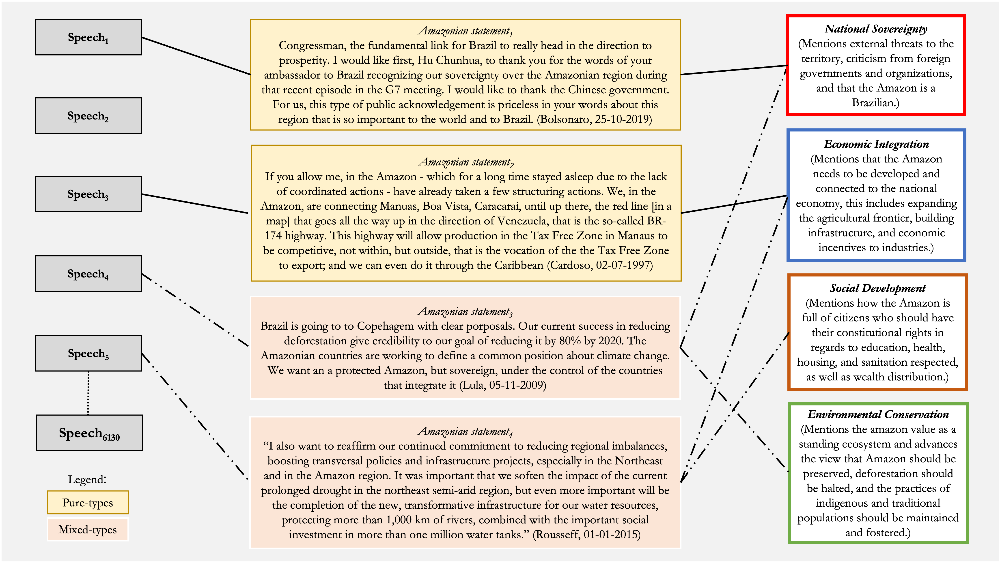

```{r setup, include=FALSE, warning=FALSE, message=FALSE}
knitr::opts_chunk$set(include = FALSE)
library(dplyr)
library(tidyr)
library(scales)
library(RColorBrewer)
library(stargazer)
library(kableExtra)
library(tibble)
library(readxl)
library(ggplot2)
library(gridExtra)
Sys.setlocale("LC_ALL", "C")
options(stringsAsFactors = FALSE, scipen = 999)
```

```{r data, message=FALSE, warning=FALSE, include=FALSE}
# Load data
##### We are missing many observations for Collor from late 1991 and 1992...
##### These are not in the repository for some reason, this is an issue not on our side.
##### We should we at least disclose these in a footnote.
pop <- readRDS("~/Documents/GitHub/amazondef/Replication_files/BR_presid_speeches_final.Rds")
pop <-  pop %>% select(-c(title, date, location))
ama <- readRDS("~/Documents/GitHub/amazondef/Replication_files/final_data_as.Rds")
ama <- ama %>% select(-c(title, date, text, false_positives)) %>% rename (ei= "EI", sd= "SD")
AAI <- readRDS("~/Documents/GitHub/amazondef/Replication_files//AAI.Rds")
location_km <- read_excel("~/Documents/GitHub/amazondef/Replication_Files/location_km.xlsx") %>% 
  select(-location_cat) %>%
  distinct()
ama <- left_join(ama, location_km, by = "location")
amazon_def_year <- readRDS("~/Documents/GitHub/amazondef/Replication_files//amazon_def_year.Rds")
adr <- data.frame(year = c(1985, 1986, 1987), def_year = c(21.050, 21.050, 21.050))
# Missing year data
amazon_def_year <- rbind(adr, amazon_def_year) 
hp = data.frame(beg = c(1985, 1990, 1993, 1994, 2002, 2010, 2016, 2018),
                end = c(1990, 1993, 1994, 2002, 2010, 2016, 2018, 2022),
                label = c(1987, 1991, 1993, 1998, 2006, 2013, 2017, 2020),
                presid = c("Sarney", "Collor", "Franco", "Cardoso", "Lula",
                           "Rousseff", "Temer", "Bolsonaro"))
# Prepare data for problem constructions
sov <- ama %>% 
  filter(sov==1) %>% 
  count(sov, year) %>%
  group_by(year) %>%
  select(-c(sov))%>%
  rename (sov = n)
ei <- ama %>% 
  filter(ei==1) %>% 
  count(ei, year) %>%
  group_by(year) %>%
  select(-c(ei))%>%
  rename (ei = n) %>%
  ungroup() %>%
  tibble::add_row(year = 2017, ei = 0) %>%
  tibble::add_row(year = 2018, ei = 0)
sd <- ama %>% 
  filter(sd==1) %>% 
  count(sd, year) %>%
  group_by(year) %>%
  select(-c(sd))%>%
  rename (sd = n)
con <- ama %>% 
  filter(con==1) %>% 
  count(con, year) %>%
  group_by(year) %>%
  select(-c(con))%>%
  rename (con = n)
other <- ama %>% 
  filter(other==1) %>% 
  count(other, year) %>%
  group_by(year) %>%
  select(-c(other))%>%
  rename (other = n)
temp <- ei %>% 
  left_join(other) %>% 
  left_join(con) %>% 
  left_join(sd) %>% 
  left_join(sov) %>% 
  replace(is.na(.), 0)
# Get mixed types in
ama_mx <-  ama %>%
  unite(mixed_type, sov:con, sep="_") %>%
  mutate(mx_cat = factor(case_when(mixed_type == '1_0_0_0' ~ "Pure Sovereignty",
                                   mixed_type == '0_1_0_0' ~ "Pure Economic Integration", 
                                   mixed_type == '0_0_1_0' ~ "Pure Social Development",
                                   mixed_type == '0_0_0_1' ~ "Pure Conservation",
                                   mixed_type == '0_0_0_0' ~ "Other",
                                   mixed_type == '0_1_0_1' ~ "Economic Conservation",
                                   mixed_type == '0_1_1_0' ~ "Social Economic",
                                   mixed_type == '1_0_0_1' ~ "Sovereign Conservation",
                                   mixed_type == '0_1_1_1' ~ "Economic, Social,\nand Conservation",
                                   mixed_type == '1_1_0_0' ~ "Economic Sovereignty",
                                   mixed_type == '0_0_1_1' ~ "Social Conservation",
                                   grepl("1_0_1_0|1_0_1_0|1_0_1_1|1_1_0_1|1_1_1_0|1_1_1_1",
                                         mixed_type) ~ "Other Mixed-types"),
         levels = c("Pure Economic Integration", "Pure Conservation", "Pure Social Development",
                    "Pure Sovereignty", "Other", "Economic Conservation", 
                    "Social Economic", "Sovereign Conservation",
                    "Economic, Social,\nand Conservation",
                    "Economic Sovereignty", "Social Conservation", "Other Mixed-types")),
         mx_cat2 = case_when(grepl("Pure Economic Integration|Pure Conservation|
                                   |Pure Social Development|Pure Sovereignty",
                                   mx_cat) ~ "Pure-types",
                             grepl("^Other$", mx_cat) ~ "Other",
                             grepl("Economic Conservation|Social Economic|Sovereign Conservation|
                                   |Economic, Social,\nand Conservation|Economic Sovereignty|
                                   |Social Conservation|Other Mixed-types",
                                   mx_cat) ~ "Mixed-types"),
         election_year = ifelse(grepl("1989|1994|1998|2002|2006|2010|2014|2018",
                                      year), 1, 0),
                  location_cat = ifelse(grepl("parana|paraiba|mato grosso|mato grosso do sul",
                                     location, ignore.case = TRUE), # minor coding issues to fix
                               "Non Amazonian States", location_cat),
         location_cat = ifelse(grepl("paraguay", location, ignore.case = TRUE),
                               "International", location_cat), # minor coding issues to fix
         location_cat = factor(ifelse(grepl("Bolivia|Peru|Ecuador|Colombia|Venezuela|Guyana|Suriname",
                                            location), "Amazonian Countries", location_cat),
                               levels = c("International", "Amazonian States",
                                          "Amazonian Countries", "Brasilia",
                                          "Non Amazonian States")))
# # Table of Amazonian speeches internationally vs. in Brazil
# amazon_in_out <- pop %>% select(amazon_speech, location_cat)
# table(amazon_in_out$amazon_speech, amazon_in_out$location_cat)
# amazon_in_out <- mutate(amazon_in_out,
#                         location_cat = ifelse(grepl("International|Non Identified",
#                                               location_cat), 0, 1))
# amazon_in_out <- table(amazon_in_out$amazon_speech, amazon_in_out$location_cat)
# rownames(amazon_in_out) <- c("Not Amazon Speech", "Amazon Speech")
# colnames(amazon_in_out) <- c("Outside of Brazil", "Within Brazil")
# amazon_in_out

amazon_in_out <- pop %>% select(amazon_speech, location_cat)
table(amazon_in_out$amazon_speech, amazon_in_out$location_cat)
amazon_in_out <- mutate(amazon_in_out,
                         location_cat = ifelse(grepl("International", location_cat), 0, 1))
amazon_in_out <- table(amazon_in_out$amazon_speech, amazon_in_out$location_cat)
rownames(amazon_in_out) <- c("Not Amazon Speech", "Amazon Speech")
colnames(amazon_in_out) <- c("Outside of Brazil", "Within Brazil")
amazon_in_out
```

\pagebreak

# 1 Introduction

We need to protect the Amazon from foreign interests. We need to exploit the Amazon's natural resources. We need to provide better living standards for the people in the Amazon. We need to preserve the Amazon as a standing ecosystem. Historically, the Brazilian government approached the Amazon region, forest and its people as a policy object. Different governmental programs contain an assumptions of what has to be solved in the Amazon, or in other words, it represents the Amazon, implicitly or explicitly, as a particular problem. These specific problems touch on shared imaginaries of the Amazon as part of the larger socio-cultural history of the country as, for example, in relation to issues of national sovereignty, economic integration, social development, or environmental conservation.

Different governments along Brazilian history have been described as proponents of a specific view of the Amazon [@drummond2006; @padua2012; @franchini2019; @capobianco2019; @pereira2021]. While the military dictatorship is associated with both national sovereignty and then economic integration, Sarney's and Lula's presidencies are often tied to environmental conservation. This monolithic representation advances a view that specific governments see the Amazon as an instance of one specific problem, hiding within government diversity of both policies and perspectives. Albeit the current calls to understand the environment as a social-cultural construction and to identify the effect of culture on environmental outcomes [@lepolaindewaroux2021], we lack empirical accounts of how the Brazilian Amazon has been constructed as a problem in discourses over time, by geographical location, and between, or within, governments.

In this article, we investigate how the Brazilian Amazon has been constructed as a problem in transnational political discourses. Building on @hirschman1963 concept of chosen problems and @bacchi2009 concept of problem-representation in policy, we propose a framework to identify problem-constructions. Although problem-construction takes place in a series of instances, we analyze the case of speeches by Brazilian presidents since 1985. Importantly, scholarly research about environmental policy in Brazil has focused on the role of the environmental bureaucracy[@abers2019, @silva-muller2022a], non-governmental organizations [@keck1998], legislation [@soares-filho2014], and international markets[@rajão2020, @assuncao2015], and many others. Nevertheless, the role of president remains understudied.

We opt for presidential speeches for two reasons. First, presidential discourses have the power to introduce and justify public policy, as well as shape its perception to broad audiences [@zarefsky2004; @gillion2016]. It legitimizes ways of thinking about the Amazon. In turn, policy perception is key for policy adoption and implementation [@alesina2009; @lopez2020]. This is especially pertinent to deforestation in Brazil as expectations of local actors, generated from material and discursive governmental practices [@assuncao2015; @capobianco2019; @capobianco2021], are a crucial factor in decisions to deforest at the ground [@campbell2015]. Second, we argue that presidents can employ specific problem-constructions that build objects as specific problems depending on who they speak to. Presidential discourses take place in different sites, from launching a new bridge in a small municipality in the middle of the Amazon to a keynote speech in a business association in São Paulo or at the UN general assembly in New York. Working with presidential discourses allows us to identify this variation in meaningful ways and better understand how the Amazon is socially constructed in trasnational politics.

To investigate how the Brazilian Amazon has been constructed as a problem in presidential speeches, we create a dataset containing 6130 official presidential speeches by all Brazilian presidents since 1985. We subset the dataset by identifying Amazonian related statements within these speeches. We find that 2014 sections in these discourses refer to the Amazon at least once. We then develop a codebook grounded on Amazonian historiography to code how each of these statements constructs the Amazon as a particular problem. We use this codebook to manually code a randomly selected training set of the Amazonian related statements. We train a supervised machine-learning model in the hand-coded set and automatically label the remaining set of Amazonian statements. We then conduct a descriptive and inferential analysis of this data, tying patterns in the data to Amazonian policies and deforestation outcomes along time.

Our empirical findings are threefold. First, we find that the frequency of the Amazon as a topic in speeches inside and outside Brazil is equally driven by domestic events (e.g. the assassination of Chico Mendes) as well as international events (UNFCCC Summits). Second, the same government adopts a diverse range of problem-constructions along time. While economic integration dominated discourse from 1985 to the mid-2000s, environmental conservation and social development constructions steadily grew in the 2000s, briefly surpassing economic integration as more common problem constructions from 2010 to 2015. Hence, there is an overall movement from only exploiting the Amazon for economic purposes to exploiting it and protecting it. In turn, constructing the Amazon as an issue of sovereignty became more pertinent after 2010. Finally, using a logit model, we find that presidents are more likely to construct the Amazon as a problem of environmental conservation, than economic integration or social development, as presidents move away from the Amazon region.Conceptually, we interpret this findings as evidence of presidents maximizing political outcomes in contradictory ways: talking to people domestically, boasting environmental policy internationally.

This article proceeds as follows: first, we propose a conceptual framework to understand problem-construction in discourses. We then review Amazonian historiography literature to identify the main phases and their underlying problem construction. In the methodology section, we explain how the framework is operationalized and present the codebook. We proceed to describe, visualize and interpret our findings in the analysis section. Finally, we conclude with a discussion connecting our findings to to Brazilian environmentalism.

# 2 Conceptual framework and contribution

We start this section by building our conceptual framework based on existing literature. We then moved to the specific problem-constructions that are embedded in Amazonian historiography.

## 2.1 Chosen problems, presidential discourse, and policy objects

Governments have a choice in how they construct problems and what policy solutions they implement. In "Journey towards Progress", @hirschman1963 draws a conceptual distinction between pressing problems (pressured from outside parties to the government) and chosen problems (chosen by the government at their own discretion). Pressing problems can be either privileged or neglected, depending on the degree of pressure exercised by the interested groups. Chosen problems are those governments select at their discretion. Problems can change from pressing to chosen across time and in space as a function of (a) solutions becoming available, (b) a change of level of government control in society, or (c) a shift of interests from top policymakers [@hirschman1963].

On the other hand, @bacchi2009 [p. 10] argues that policies have a cultural dimension as "it takes shape within specific historical and national or international contexts". The existence or proposal of a policy implies that there is a (public) problem that needs (governmental) action to be fixed. The alleged problem is not always explicitly stated in policy: policies are represented as solutions for implicit problems. Coming back to @hirschman1975 [p. 388], the author exemplifies chosen problems with the case of the construction of Brasilia. Nevertheless, building Brasilia (the policy) could solve a problem of regional inequality, a problem of a dormant economy without state investment, a problem of political representation, or all three depending on how governments speak about it. We argue that it is up to the discretion of the government to highlight or not the implicit problem a policy solves. A same policy object (e.g. Brasilia, the Amazon, criminality, poverty), thus, can be constructed as pressing or not depending on how a government represents it. Policies are socially constructed in governmental discourse.

What drives governmental choices of which underlying problem should be highlighted? Governments can choose to emphasize (or not) one or more implicit problems that a policy solves depending on which interest group they are in communication with. Relative to how the policy is represented to be, it can be a solution of problems that are considered pressing or not for different groups and it is up to the discretion of the political actor to construct a particular problem in a particular way given context. @putnam1988 seminal article on the two-level game can help us make sense of this variation conceptually. The author argues that the outcomes of international negotiations lie within the overlap between the agenda (and pressure) of domestic groups and international groups. If policies are socially constructed, and consequently their implicit problem can vary, governments can in theory constructed it to meet the expectations of both. Taking the example of the 2012 Forest Code and the Amazon, policy-makers could emphasize its rural character for environmentalists at the Paris Summit, or the amnesty for deforestation for agricultural elites. The same policy, then, can solve the problem of environmental conservation as well as economic integration.

This variation in problem-construction entails that governments are more diverse in their positions than the literature suggests. We conceptualize the Amazon region, forest, and people to be a policy object, this is a specific issue that deserves dedicated policy attention. Several scholars describe federal governments' as proponents of specific policies for the Amazon [see @drummond2006; @padua2012; @franchini2019; @capobianco2019; @pereira2021]. In this literature, the 1964 military dictatorship is associated with securing national sovereignty in the region by populating it and integrating it to the national economy [@drummond2006]. The governments from the late 1980s up to 2009, are more associated with environmental conservation. The presidencies of Dilma and Temer are connected to the decline of environmental policies, while Bolsonaro to the complete dismantling of environmental policies. While these works are important to understand how different governments acted towards the Amazon, the classification of specific governments into periods or policy cycles represents them as monolithic: they associate specific governments to one specific view of the Amazon. The presidency of Lula, often associated with environmental conservation because of the unprecedented decrease in deforestation. Nevertheless, during his terms governmental credits to agricultural expansion and the cattle industry were 20 times more than the budget of the Ministry of the Environment for this entire period [@capobianco2021, p. 106]. That is, there is more variation within governments than the literature suggests.

An interesting site to study the relationship between varied problem-construction and policy objects is presidential speeches as they legitimize ways of thinking about an issue. While the relationship between presidential speeches and policy is not causal, they have the power to introduce and justify public policy, as well as shape its perception to broad audiences [@zarefsky2004; @gillion2016]. Even if presidential discourse might not persuade public opinion regarding a proposed solution for a problem [@eshbaugh2010; @rottinghaus2009; @krebs2007], they direct the range of what is included in national debates [@druckman2004]. As presidents speak in varied locations to varied audiences, it is very likely that they chose to frame similar issues differently.

The possibility of different problem-constructions at the level of presidential speeches has important implications for democracy. With globalization and the increase of transnational processes, presidents have the opportunity of promoting different problem-constructions trasnnationally. It is important to understand, thus, to what extent the implemented agenda correlates with their local, federal, or international problem-constructions. Relatedly, the possibility of different problem-constructions has consequences for environmental outcomes as well. When Brazilian presidents speak about the Amazon it not only makes headlines, nationally and internationally [@brice2021; @harris2021; @miranda2021], but also incites responses, shapes expectations, and feeds into the behavior of many actors involved in the Amazon. Deforestation rates in Brazil are more responsive to the government's environmental policy, generated from material and discursive governmental practices, than exogenous factors as market fluctuations [@assuncao2015; @capobianco2019; @capobianco2021]. Specifically, Capobianco finds that that the perception of higher risk of being caught for deforestation in the Amazon is the main mechanism through which environmental policy is effective (2021). Relatedly, ethnographic research has also shown that expectations about governments' response are a crucial factor in decisions to deforest at the ground [@campbell2015]. Thus, understanding diversity in presidential speeches is a first step to connect it to concrete environmental outcomes.

The connection between presidential discourse and the environment has been studied in the case of the United States but remains conceptually underdeveloped. @calderwood2019, for instance, examines 2019 mentions of climate change in American official presidential speeches since 1989. Among various findings, one that stands out is that American presidents frequently side-step the environmental aspects of climate change. He also identifies a shift from economic to security framing of climate issues, side-lining its environmental aspects. @calderwood2020 also tests the effect of geographic location and type of communication regarding climate change. Building prominently on @putnam1988, he demonstrates that presidents are more likely to mention climate change in foreign locations, and that location influences the specific discursive approach and tone they adopt. Elsewhere, @bevitori2015 investigates how the 'environment' has been constructed in American presidential discourse since 1960 using a more automated approach. The author finds that mentions of the environment are typically co-selected with the pronoun 'our', as well as with 'economy', 'clean', and 'preserve'. These studies corroborate the possibilities of variation depending on the audience, but we are yet to tie vocabulary to specific problem-constructions based on wider shared meanings of environment and climate change. While these findings are US specific, they indicate that presidents raise different points about the environment at local, national, or international settings, depending on who they assume their audience is at that specific instance. Nevertheless, as @bacchi2009, we argue that problem-constructions touch on shared meanings about the region that are available to the speaker as part of larger social-cultural history. Mentions to the lexicon as 'environment', 'preserve', or 'climate change' should be tied to the larger meaning of policies in the United States and elsewhere.

On the other hand, there is also an empirical gap in terms of how the Amazon has been constructed as a problem along time and geographic location. While governmental discourses in Brazil have been studied for topics such as inflation or race relations[@malheiros1995, @htun2004, @silva2019], we only find one systematic analysis of Amazonian discourse. @barros2020 investigates Amazonian discourse in the Brazilian Congress with the objective of identifying the arguments put forth by congressmen. The main finding is that the economic value of the Amazon for the cattle industry is the most salient narrative, leading the author to conclude there is a mismatch between the international debate (which focuses on preservation) and the national debate (which focuses on economic development). We also find one analysis of Bolsonaro's rhetoric about the Amazon, but the study relies on a reduced sample without transparent explanations of how speeches were selected [@marquardt2022].

In sum, we propose a conceptual framework that accepts the possibility of varied problem-construction for the same policy issue and connects it to presidential speeches. Governments choose what problems to solve and what policies to implement. The same policies can be represented as solving different problems implying a degree of social construction [@bacchi2009]. Governments can choose to emphasize or not one or more implicit problems that a policy solves depending on which interest group they are in communication with. The variation in problem-construction suggests that Brazilian governments are more diverse in their positions as the literature suggests. An interesting site to study the relationship between varied problem-construction and policy is presidential speeches as they legitimize ways of thinking about an issue, matter for democracy, and for environmental outcomes. As presidents speak in different places and to different audiences, it is an empirical site prone to identify variation.

## 2.2 Problem-construction in Amazonian historiography

To identify possible problem-constructions and their connection to the wider socio-cultural history of the country, we build on Amazonian historiography. We understand Amazonian historiography as the body of research conducted by social and environmental scientists that tells the story of diverse governmental programs that approaches the Amazon region, forest, and its people as a policy object demanding dedicated action.

### National Sovereignty

In *The Fate of the Forest: Developers, Destroyers, and Defenders of the Amazon*, @hecht1990 [p. 1] write that all over the world tropical forests are destroyed, but "what imbues the case of the Amazon with such passion is the symbolic content of the dreams it ignites". These dreams of fortunes to be found in the Amazon are composed of the imaginaries of bandeirantes from the southeast of Brazil and colonizers from everywhere else. It rendered the territory the venue for aspiration and the object of an intense scramble in the subsequent centuries, defined as "a (...) form of nation building (...)" [hecht1990, preface]. The Portuguese empire and subsequently the Brazilian monarchy were concerned with establishing their territory. In the process of securing Amazonian borders, Brazil thwarted "the imperial ambitions of France, Britain, the United States, Belgium, Bolivia, and Peru" [@hecht2013, p. 8], and when the dust settled and the scramble was over, half of the Amazon emerged Brazilian. While Brazilian military diplomacy was very successful, the process did not come without its traumas. A significant experience was the negotiations with Bolivia in 1902 to secure the Amazonian state of Acre, during which they found out about American attempts to trick Brazil [@hecht1990]. This case was still part of the memory of the generals who led the country during the military dictatorship of 1964 and wanted to protect Brazil's sovereignty over the Amazon from the communist threat during the Cold War [@garfield2013].

As we move from a world where non-state actors gain importance in environmental governance and transnational politics generally [@silva-muller2022; @andonova2014; @keck1998], the sovereignty problem becomes more varied. Multiple non-state actors (NGOs, foundations, IOs, and so on) join the conversation about Amazonian policies more substantially as the military dictatorship starts to end [@hochstetler2021; @capobianco2019; @franchini2019]. Threads to national sovereignty, consequently, can be interpreted as coming from a different set of actors than before. Allegedly false claims about the Brazilian Amazon in international and domestic fora, for instance, are often tied to strategies of 'internationalizing' the Amazon. This might come both from foreign actors as well as domestic non-state actors. The sovereignty problem-construction advances the view that the Brazilian Amazon belongs to Brazil while any foreign or non-state presence in the region is part of a broad strategy to take the region. The policy solutions to the issue of sovereignty, included the monitoring of the borders, strict regimes related to entry in the region, assertions of ownership nationally and internationally, and combating alleged disinformation from actors perceived as a threat.

### Economic Integration

The Vargas dictatorship (1937-46) and the military dictatorship (1964-89) took over the task of modernizing the Amazon. In 1966, the Brazilian Military launched Operation Amazon, a policy to modernize the region based on a set of assumptions [@acker2014]. First, nature should be conquered by men. Second, exploiting natural resources would render the Amazon region a global powerhouse. Third, such a project would integrate the region with the rest of the country. Concretely, this meant a series of infrastructure projects, such as roads and dams, incentives for settlers to develop ranches and expand the agricultural frontier, and the establishment of tax-free zones to attract industry. The capital to conduct such changes, paradoxically, came from national and international sources [@acker2014], leading to a series of national and international enterprises settling in the Amazon region. @capobianco2019 describes the period from the 1950s to the 1980s in a similar fashion, referring to a wider range of policies of economic integration such as the establishment of the tax-free zone of Manaus in the 1970s. The economic integration problem-construction advances the view that the Brazilian Amazon needs to be developed and modernized. These policy solutions are often centralized by the federal government [@becker2005] and have at their core the development of the necessary infrastructure (physical, fiscal, or monetary) to integrate the region into the national and international economy.

### Social Development

Governments can emphasize the lack of hospitals, sanitation, and schools concerning peoples' dignity, standards of living, and other constitutional rights when speaking about the Amazon. This is not only relevant as a construction, but speaks, minimally, to democratic concerns over providing electorates, especially in the Amazonian region, with better standards of living than previously.While related to economic integration, social development is a problem-construction that focusses more on rights and citizenship. Importantly, though, the literature on policy cycles in the region is silent about social develop. This category was identified in speeches and constructed by the researchers inductively. This might be related to social policies being more geared towards the whole nation, rather than thought specifically for the Amazon region. Nevertheless, as it appeared quite frequently in discourse, we include it in our codebook.

### Environmental Conservation

The rapid economic changes in the region in the 1960s, 1970s, and 1980s were matched with the birth of environmental institutions [@drummond2006]. A common explanation for the creation of these institutions in the Amazonian literature is the impression of the lack of control over the market engendered years of centralized economic integration in the region [@acker2021; @capobianco2021; @hecht1990]. This process accelerated in the late 1980s, with the birth of modern environmentalism [@viola1987] in the 1980s, epitomized in the 1992 Earth Summit in Rio de Janeiro [@hochstetler2021; @capobianco2021]. @hochstetler2007 argue that during preparations for the summit, a new form of Brazilian environmentalism emerged: socio-environmentalism. They define it as an emphasis on the local livelihoods of people while protecting nature. @capobianco2019 argues in a similar line, establishing socio-environmentalism as the main government response in the 1990s and early 2000s in a series of policies as establishment of conservation units in the Amazon in 2001. The environmental conservation problem-constructions emphasizes the Amazon should be preserved, deforestation should be halted, and the sustainable practices of indigenous and local peoples should be maintained through the protection of their territories and rights to self-determination [@hochstetler2007]. The policy solution implies more investment in command-and-control infrastructure (as remote-sensing technology for environmental outcome measurement), more investment in the valuation of standing ecosystems through incentive schemes, and more policies facilitating indigenous environmental practices.

# 3 Methodology: operationalizing Amazonian problem-constructions

## 3.1 Codebook and Data

To analyze how presidents construct the Amazon as a problem in time, we build upon the dataset provided by [@cezar2020] which contains all official speeches by Brazilian Presidents from 1985 to 2019 scrapped from the archives of the Brazilian Presidential Library. We update the dataset by scraping and adding all official speeches from 2020 and 2021. The final dataset encompasses 6130 speeches for all the presidents of Brazil. Then, we proceed to identify all speeches that refer to the Amazon as a region, people, or forest in these speeches. We do so by detecting all speeches in which the stem "amazon" appears. In Portuguese, the stem captures terms such as "Amazonia", "Amazonica", "Amazonidas", "Amazonense(s)", "Amazonas", among others. We find that 946 speeches are, at least partially, about the Amazon from the 6130.

Using the poldis R package [@sposito2021], we proceed to extract two sentences before and two sentences after the sentence in which the stem "amazon" appears. We opt for picking two sentences before and two sentences after, rather than words, because sentences usually contain a cohesive idea. By doing so we create our unit of analysis: an Amazonian statement. We use Amazon statements as our unit of analysis for two main reasons. First, working at the level of statements allows us to identify only passages that are meaningful for our specific purpose. Second, it increases the number of our observations and its variety meaningfully, allowing for more specificity in our analysis. This process yields 2014 unique Amazonian statements across the 946 speeches about the Amazon identified. When an Amazonian statement contains two or more matches of the stem "amazon", we get two sentences before the first match and two sentences after the last match. On average, an Amazonian statement contains 123 words.

We follow the procedures outlined by @grimmer2022 for supervised classification.First, we develop a codebook to code Amazonian statements in one or more problem-constructions (see codebook in appendix). In their conceptualization, each problem-construction is mutually exclusive, meaning that they cover different forms of constructing the Amazon as a problem. Nevertheless, each Amazonian statement might be assigned to one or more codes. A statement can, for example, construct the Amazon as a problem of sovereignty and a problem of economic integration, or a problem of social development and conservation. Amazonian statements, thus, can be either coded as pure-types or mixed-types. Mixed-types are relevant as constructions and policies are often multifaceted while portraying the Amazon as a combination of these problem-constructions. Figure 1, below, portrays this operationalization strategy.

````{=tex}
\begin{landscape}

```{r figure1, echo=FALSE, fig.cap="Operationalization of problem-constructions", out.width = '100%', include=TRUE}

```

\end{landscape}
````

Second, with the codebook in hand, each one of the authors, separately, hand-coded the same set of 1007 randomly selected Amazonian statements. This amount refers to 50% of all the Amazon Statements identified. We chose to hand code half of the observations because since there are several nuances in discourse in how presidents talk about the amazon in time and as a problem, we conservatively code a relatively large training set for the subsequent automated machine learning. As well, this allows a robust validation set to verify the models. As the size of the training set should increase with the number of categories [@grimmer2022], we deemed four categories and 50% of the statements as reliable enough. Also, automating the coding of half of the observations saved the authors over one month of work in comparison to manual coding. Intercoder agreement for each of the four main categories was 85%, on average. For each non-matching coded observation, the co-authors discussed and sorted their disagreements.

Third, the hand-coded data is then randomly divided into a training set, containing 80% of the hand-coded observations (806 observations), and a validation set, containing the remaining 20% of the hand-coded data (201 observations). We chose to employ a support-vector machine (SVM) algorithm to label texts, that is, a non- probabilistic linear classifier that classifies documents by assigning points in mapped space to maximize the gap between binary categories [@meyer2021; @noble2006] . The SVM model is first trained using the hand coded training set and then employed to classify observations in the hand coded validation set. The trained SVM model was, on average 82%, accurate in classifying observations in the validation set before being tuned. After the SVM model is tuned, we use the model to automatically code the remaining 1007 Amazonian statements. The final dataset for analysis, excluding false positive matches, contains 1895 coded Amazonian statements. Finally, we extract locations for all speeches in the data. These locations represent the Brazilian state in which certain speech was given or an international country.

## 3.2 Analysis and Limitations

To analyze our data, we first present a series of different plots on proportions of Amazonian statements and problem-constructions over time and by presidents. To test whether different problem constructions change according to location, we run a logit model in which different problem constructions (as categories) are the dependent variable and location is the independent variable. Multinomial logit is an appropriate method for modeling data in which the dependent variable of interest is categorical, unordered, and has many categories, as is our case [@kwak2002]. In our model, we also control for annual deforestation rates, annual inflation rates, and election years in the model. We interpret the plots and model considering multiple Amazon related events and policies over the last 30 years, mostly with support of existing literature, as well as their correlations with different presidents and locations.

This approach also comes with limitations. Our codebook is developed using specific Amazon-related vocabulary. For example, a statement will be coded as economic integration if it is meaningful support to the tax-free zone of Manaus or a Dam in the Amazon. However, the economy is generally a topic that presidents speak about. Hence, the high incidence of economic integration in Amazonian statements can also be related to the higher importance of this problem-construction in Brazil in time. Moreover, we classify statements as Amazonian based on a dictionary composed of a single lexicon stem: "amazon". We chose to do so knowing that a few speeches about the Amazon might not contain the lexicon "Amazon", for example, when the president says, "the forest" or "deforestation". Hence, we might be missing statements about Amazon that do not refer to it. However, we consider this safer as we cannot be sure that mentions of the forest or deforestation do not correspond to other biomes such as the Cerrado or the Mata Atlantica. Nevertheless, our dataset covers only what is considered an official remark. Presidents, though, give interviews, appear in debates, talk at campaign rallies, and more recently started to appear on social media. Problem- construction within presidential discourse, thus, also happens in different sites for which we do not account for in this paper.

# 4 How has the Amazon been constructed as a problem?

We break down our analysis in three sub-sections. First, we describe when, where and how often do presidents speak about the Amazon or do not speak about the Amazon. Second, we zoom in speeches about the Amazon and demonstrate how they vary by problem-construction. Finally, we model which specific problem-constructions are more likely to appear in which locations using logistic regressions with multiple controls.

## 4.1 The rises and falls of the Amazon as a topic in presidential speeches

When, where, and how often do presidents speak about the Amazon? Figure 2, below, shows the proportion of speeches that mentions the Amazon in relation to all speeches in a year. On average, presidents speak about the Amazon in 15% of their speeches. Mentions to the Amazon outside of Brazil are slightly more frequent than mentions inside Brazil.The frequency in which the Amazon appears across presidential speeches (inside, outside, and overall), though, varies in time.

Globally, we observe five local maxima both inside and outside Brazil: 1989, 1992, 2009,2015, and 2019. These points coincide with events that help us explain the rises and falls of the Amazon in presidential discourse in time. In 1985 the Amazon appeared in about 4% of all the presidential speeches but by 1988 this had increased to around 14%. This is the period when the Brazilian Constitution was written. Indigenous and traditional populations were instrumental in advocating for constitutional environmental rights and the protection of their territories [@hecht1990]. These were eventually enshrined in article 225, which gives all Brazilians a right to a balanced environment, and in article 231, which grants indigenous and traditional populations a right over their territory. However, in 1989, the Amazon appeared in 32% of all speeches. This spike is likely explained by the brutal murder of Chico Mendes at the last days of 1988. An incident that caught unprecedented international attention and Sarney responded to this with a set of policies to address deforestation [@capobianco2021]. Importantly, one of the responses was Sarney's invitation to host the 1992 Earth Summit[@keck1998].

```{r Figure 2, fig.cap="Amazonian speeches by year", echo=FALSE, message=FALSE, warning=FALSE, paged.print=TRUE, include=TRUE}

perc1 <- pop %>%
  count(amazon_speech, year) %>%
  group_by(year) %>%
  mutate(perc = n / sum(n)) %>%
  filter(amazon_speech == 1) %>% 
  select(c(perc, amazon_speech, year))

perc_in <- pop %>%
   mutate(location_cat = ifelse(grepl("International|Non Identified",
                                      location_cat),
                                "Outside of Brazil", "In Brazil")) %>%
  filter(location_cat == "In Brazil") %>% 
  count(amazon_speech, year, location_cat) %>%
  group_by(year) %>%
  mutate(perc = n / sum(n)) %>%
  filter(amazon_speech == 1) %>%
  select(c(perc, amazon_speech, year, location_cat))
   
perc_out <- pop %>%
   mutate(location_cat = ifelse(grepl("International|Non Identified",
                                      location_cat),
                                "Outside of Brazil", "In Brazil")) %>%
  filter(location_cat == "Outside of Brazil") %>% 
  count(amazon_speech, year, location_cat) %>%
  group_by(year) %>%
  mutate(perc = n / sum(n)) %>%
  filter(amazon_speech == 1) %>%
  select(c(perc, amazon_speech, year, location_cat)) 

# Plot with All

Amazon_year <- perc1 %>% ggplot(., aes(x = year, y = perc)) +
  geom_line(color = "darkgreen") +
  geom_line(aes(y=mean(perc)), color="black", size=.5, linetype="dotted")+
  scale_y_continuous(labels = percent_format()) + 
  annotate("text", x = 1985, y = 0.16, label = "15.4%", size = 3.5)+
  annotate("text", x = 1988.7, y = 0.34, label = "Chico Mendes", size = 3)+
  annotate("text", x = 1992, y = 0.27, label = "Earth Summit", size = 3)+
  annotate("text", x = 2009, y = 0.24, label = "Copenhagen Summit", size = 3)+
  annotate("text", x = 2015, y = 0.21, label = "Paris Summit", size = 3)+
  annotate("text", x = 2019, y = 0.26, label = "August Fires", size=3) +
  labs(x = "", y = "",
       title = "Share of speeches that mention the Amazon per year (n=6130)",
       subtitle = "We annotate five local maxima with highest frequencies.",
       color='Y series') +
  theme(panel.background = element_rect("white", "black", .5, "solid"),
        panel.grid.major = element_line(color = "grey", size = 0.3, linetype = "solid"),
        axis.text = element_text(color = "black", size = 10),
        title = element_text(color = "black", size = 10, face = "bold"),
        legend.title = element_blank(),
        plot.subtitle = element_text(color = "black", size = 9, face = "plain"),
        legend.position = "bottom")

# location plots
Amazon_year_in <- perc_in %>%
  ggplot(., aes(x = year, y = perc))+
  geom_line(color="darkgreen")+
  geom_line(aes(y=mean(perc)), color="black", size=.5, linetype="dotted")+
  annotate("text", x = 1985, y = 0.17, label = "16.17%", size = 3.5)+
  scale_y_continuous(labels = percent_format())+
  labs(x = "", y = "",
       title = "Share of speeches inside Brazil that mention the Amazon per year",
       subtitle= " 4344 speeches out of 6130",
       color='Y series') +
  theme(panel.background = element_rect("white", "black", .5, "solid"),
        panel.grid.major = element_line(color = "grey", size = 0.3, linetype = "solid"),
        axis.text = element_text(color = "black", size = 10),
        title = element_text(color = "black", size = 10, face = "bold"),
        legend.title = element_blank(),
        plot.subtitle = element_text(color = "black", size = 9, face = "plain"),
        legend.position = "")

Amazon_year_out <- perc_out %>% 
  ggplot(., aes(x = year, y = perc))+
  geom_line(color="darkgreen")+
  geom_line(aes(y=mean(perc)), color="black", size=.5, linetype="dotted")+
  annotate("text", x = 1985, y = 0.165, label = "15.49%", size = 3.5)+  
  scale_y_continuous(labels = percent_format())+
  labs(x = "", y = "",
 title = "Share of speeches outside Brazil that mention the Amazon per year",
       subtitle= " 1786 speeches out of 6130",
       color='Y series') +
  theme(panel.background = element_rect("white", "black", .5, "solid"),
        panel.grid.major = element_line(color = "grey", size = 0.3, linetype = "solid"),
        axis.text = element_text(color = "black", size = 10),
        title = element_text(color = "black", size = 10, face = "bold"),
        legend.title = element_blank(),
        plot.subtitle = element_text(color = "black", size = 9, face = "plain"),
        legend.position = "")

grid.arrange(Amazon_year, arrangeGrob(Amazon_year_in, Amazon_year_out, ncol=2), nrow=2, top="Speeches mentioning the Amazon since 1985")

```

```{r comparison, eval=FALSE, include=FALSE}

# # comparison with inequality, crime and inflation in speeches
# pop <- pop %>%
#   mutate(desigual = ifelse(grepl("desigual", text, ignore.case = TRUE), 1, 0),
#          crime = ifelse(grepl("violencia|crime|criminalidade|seguranca publica",
#                               text, ignore.case = TRUE), 1, 0),
#          inf = ifelse(grepl("inflacao|inflaçao",
#                              text, ignore.case = TRUE), 1, 0),
#          unemploy = ifelse(grepl("desempreg",
#                              text, ignore.case = TRUE), 1, 0))
# perc2 <- pop %>%
#   count(desigual, year) %>%
#   group_by(year) %>%
#   mutate(perc=n / sum(n)) %>%
#   filter(desigual == 1) %>%
#   select(c(perc, desigual, year))
# perc3 <- pop %>%
#   count(crime, year) %>%
#   group_by(year) %>%
#   mutate(perc=n / sum(n)) %>%
#   filter(crime == 1) %>%
#   select(c(perc, crime, year))
# perc4 <- pop %>%
#   count(inf, year) %>%
#   group_by(year) %>%
#   mutate(perc=n / sum(n)) %>%
#   filter(inf == 1) %>%
#   select(c(perc, inf, year))
# perc5 <- pop %>%
#   count(unemploy, year) %>%
#   group_by(year) %>%
#   mutate(perc=n / sum(n)) %>%
#   filter(unemploy == 1) %>%
#   select(c(perc, unemploy, year))
# colors <- c("Amazon Speech" = "green", "Inequality Speech" = "red",
#             "Criminality Speech" = "yellow", "Inflation Speech" = "blue",
#             "Unemployment Speech" = "purple")
# Amazon_vs_other <- perc1 %>% ggplot(., aes(x = year, y = perc)) +
#   geom_line(aes(color = "Amazon Speech")) +
#   geom_line(data = perc2, aes(x = year, y = perc, color = "Inequality Speech")) +
#   geom_line(data = perc3, aes(x = year, y = perc, color = "Criminality Speech")) +
#   geom_line(data = perc4, aes(x = year, y = perc, color = "Inflation Speech")) +
#   geom_line(data = perc5, aes(x = year, y = perc, color = "Unemployment Speech")) +
#   scale_y_continuous(labels = percent_format()) +
#   scale_color_manual(values = colors) +
#   labs(x = "", y = "", title ="Share of speeches mentioning the Amazon in by year",
#        subtitle = "Sample composed by 6130 presidential speeches since 1985 and compared with mentions of other salient policy objects across the same speeches",
#        caption = "",
#        color = "Legend\n") +
#   theme(panel.background = element_rect("white", "black", .5, "solid"),
#         panel.grid.major = element_line(color = "grey", size = 0.3, linetype = "solid"),
#         axis.text = element_text(color = "black", size = 10),
#         title = element_text(color = "black", size = 10, face = "bold"),
#         legend.title = element_blank(),
#         plot.subtitle = element_text(color = "black", size = 9, face = "plain"),
#         legend.position = "bottom")
# Amazon_vs_other
# Amazon_vs_other_mean <- tibble::tibble("Policy Object" = c("Amazon", "Inequality",
#                                                            "Criminality", "Inflation",
#                                                            "Unemployment"),
#                                        "Mean share in time" = c(mean(perc1$perc),
#                                                                 mean(perc2$perc),
#                                                                 mean(perc3$perc),
#                                                                 mean(perc4$perc),
#                                                                 mean(perc5$perc)))
# Amazon_vs_other_mean
# #comparison with inequality, crime and inflation in speeches
# pop <- pop %>%
#   mutate(desigual = ifelse(grepl("desigual", text, ignore.case = TRUE), 1, 0),
#          crime = ifelse(grepl("violencia|crime|criminalidade|seguranca publica",
#                               text, ignore.case = TRUE), 1, 0),
#          inf = ifelse(grepl("inflacao|inflaçao",
#                              text, ignore.case = TRUE), 1, 0),
#          unemploy = ifelse(grepl("desempreg",
#                              text, ignore.case = TRUE), 1, 0))
# perc2 <- pop %>%
#   count(desigual, year) %>%
#   group_by(year) %>%
#   mutate(perc=n / sum(n)) %>%
#   filter(desigual == 1) %>%
#   select(c(perc, desigual, year))
# perc3 <- pop %>%
#   count(crime, year) %>%
#   group_by(year) %>%
#   mutate(perc=n / sum(n)) %>%
#   filter(crime == 1) %>%
#   select(c(perc, crime, year))
# perc4 <- pop %>%
#   count(inf, year) %>%
#   group_by(year) %>%
#   mutate(perc=n / sum(n)) %>%
#   filter(inf == 1) %>%
#   select(c(perc, inf, year))
# perc5 <- pop %>%
#   count(unemploy, year) %>%
#   group_by(year) %>%
#   mutate(perc=n / sum(n)) %>%
#   filter(unemploy == 1) %>%
#   select(c(perc, unemploy, year))
# colors <- c("Amazon Speech" = "green", "Inequality Speech" = "red",
#             "Criminality Speech" = "yellow", "Inflation Speech" = "blue",
#             "Unemployment Speech" = "purple")
# Amazon_vs_other <- perc1 %>% ggplot(., aes(x = year, y = perc)) +
#   geom_line(aes(color = "Amazon Speech")) +
#   geom_line(data = perc2, aes(x = year, y = perc, color = "Inequality Speech")) +
#   geom_line(data = perc3, aes(x = year, y = perc, color = "Criminality Speech")) +
#   geom_line(data = perc4, aes(x = year, y = perc, color = "Inflation Speech")) +
#   geom_line(data = perc5, aes(x = year, y = perc, color = "Unemployment Speech")) +
#   scale_y_continuous(labels = percent_format()) +
#   scale_color_manual(values = colors) +
#   labs(x = "", y = "", title ="Share of speeches mentioning the Amazon in by year",
#        subtitle = "Sample composed by 6130 presidential speeches since 1985 and compared with mentions of other salient policy objects across the same speeches",
#        caption = "",
#        color = "Legend\n") +
#   theme(panel.background = element_rect("white", "black", .5, "solid"),
#         panel.grid.major = element_line(color = "grey", size = 0.3, linetype = "solid"),
#         axis.text = element_text(color = "black", size = 10),
#         title = element_text(color = "black", size = 10, face = "bold"),
#         legend.title = element_blank(),
#         plot.subtitle = element_text(color = "black", size = 9, face = "plain"),
#         legend.position = "bottom")
# Amazon_vs_other
# Amazon_vs_other_mean <- tibble::tibble("Policy Object" = c("Amazon", "Inequality",
#                                                            "Criminality", "Inflation",
#                                                            "Unemployment"),
#                                        "Mean share in time" = c(mean(perc1$perc),
#                                                                 mean(perc2$perc),
#                                                                 mean(perc3$perc),
#                                                                 mean(perc4$perc),
#                                                                 mean(perc5$perc)))
# Amazon_vs_other_mean

```

In 1990 the Amazon appeared in 12% of all speeches and, by 1992, this increased to 25% of all speeches. The 1992 Earth Summit in Brazil brought international attention to environmental topics related to the Amazon. One of the big announcements, for example, was the consolidation of the first transnational partnership for the Amazon, the G7 Pilot Programme, which brought a high number of financial resources to the region for public policy implementation [@capobianco2021].Throughout the rest of 1990s and 2000s, during the Cardoso and Lula administrations, the Amazon as a topic did not diverge much from the average. In 2009 we see another spike in the Amazon appearing in official speeches. This spike coincides with the 2009 Copenhagen Summit as well as the steepest decrease in deforestation rates since data is available. Lula led the delegation to Copenhagen with a self-image of "we do not promise, we deliver" when the stakes about climate change were high [@franchini2019].

From 2010 to 2018, with the exception of 2015, we see a general decrease in mentions of the Amazon in all official presidential speeches. From 2010 to 2014, mentions of the Amazon went down from 18% to 8%. Disagreements related to the priority of environmental preservation over economic development, most notably in the case of Itaipu Dam, led the environmental minister Marina Silva to resign and run for the presidency on her agenda in 2010. In 2011, the New Forest Code, which regularized land ownership of many illegally deforested areas, was also approved. These are also the years when Brazil entered a long period of political and economic instability, which eventually led to the impeachment of Dilma Roussef. Though, in 2015, the Amazon appeared in 19% of speeches. This spike coincides with the Paris summit which became a key turn in climate politics after the failures of Copenhagen. Brazil went to the Paris Summit with deforestation numbers slightly higher than Copenhagen and a perception that there was a turn towards less conservation inside the country. By 2016 mentions of the Amazon in official speeches went down to 6%, the lowest share since 1985.

We subsequently observe a steady increase from 6% in 2016 to almost 24% in the first year of Bolsonaro's presidency, 2019. At the time, international and national media brought unprecedented attention to Brazilian environmental issues as the record burning of the Amazon, and of the red sky afternoon in São Paulo circulated on social media and international media outlets. Bolsonaro's dismantling of environmental governance, including threats to leave the Paris Agreement, gained strong media attention and the topic became prominent in his speeches. At the same time, President Bolsonaro retrieves Brazil's hosting status for COP25.

The frequency of the topic Amazon in domestic and international speeches is similar. High increases in the topic frequency, as well, are similar in domestic and international speeches. The aforementioned events that coincide with high frequencies are both of domestic and international nature. We interpret this as evidence that relevant events drive interest and alter how pressing the "Amazon problem" is perceived both nationally and internationally. This does not mean, though, that when presidents speak about the Amazon, they say similar things. In the next sub-section, we dissect the content of their speech and whether specific events and policies drive specific problem-constructions.

## 4.2 Problem-constructions in time

### Pure-type problem constructions

As detailed in section 2.2, we conceptualize four problem constructions: sovereignty, economic integration, social development, and conservation. At the level of the speech, though, presidents might mix multiple problem construction in an Amazonian statement. Figure 3, below, illustrates the share of each pure-type in time. Pure problem constructions dominate, with an average of 56% of all amazonian statements across time. Again, we observe a strong variation over time for most of these constructions.

```{r Figure 3, fig.cap="Pure types in time", echo=FALSE, message=FALSE, warning=FALSE, paged.print=FALSE, include=TRUE}
mmt1 <- ama_mx %>%
  filter(mx_cat2 == "Mixed-types") %>%
  count(mx_cat) %>%
  mutate(perc = n / sum(n)) # averages in relation to only mixed-types
mmt2 <- ama_mx %>%
  count(mx_cat)%>%
  mutate(perc = n / sum(n)) # averages in relation to full sample
pure_types_time <- ama_mx %>%
  count(mx_cat, mx_cat2, year) %>%
  group_by(year) %>%
  mutate(perc = n / sum(n)) %>% 
  filter(mx_cat2 == "Pure-types") %>% 
  ggplot(aes(x=as.numeric(year), y = perc, color = mx_cat)) +
  geom_smooth(aes(fill = mx_cat), se = FALSE, size = .5) +
  scale_y_continuous(labels = percent_format(accuracy = 1)) +
  labs(x = "", y = "", title ="Share of each pure-type problem-construc by year",
       subtitle = "Sample composed by 1895 Amazonian statements in presidential speeches since 1985",
       caption = "Curves in the plot were smoothed using loess method.") +
  theme(panel.background = element_rect("white", "black", .5, "solid"),
        panel.grid.major = element_line(color = "grey", size = 0.3, linetype = "solid"),
        axis.text = element_text(color = "black", size = 10),
        title = element_text(color = "black", size = 10, face = "bold"),
        legend.title = element_blank(),
        plot.subtitle = element_text(color = "black", size = 9, face = "plain"),
        legend.position = "bottom") +
  ggplot2::annotate(geom = "rect", xmin = hp$beg, xmax = hp$end, ymin = 0, ymax = 0.40,
           fill = c("grey50", "ghostwhite", "grey50", "ghostwhite",
                    "grey50", "ghostwhite", "grey50", "ghostwhite"),
           alpha = 0.1) +
  ggplot2::annotate(geom = "text", x = hp$label, y = 0.01, vjust = 0.3, hjust = 0.3, angle = 25,
           label = hp$presid, alpha = 0.4)

pure_types_time
```

Figure 2 portrays a discursive shift from developing the Amazon economically, to conserving it and providing services to Amazonian citizens. Pure economic integration constructions dominated constructions from 1985 to the late 2000s. This is especially pertinent during the Cardoso administration. However, during Lula's terms in office, constructions of the Amazon purely as an economic issue decreased in discourse while constructions of the Amazon as issues of pure conservation as well as of pure social development increased. These constructions surpassed economic integration around 2010. These trends in discourse continued during the Rousseff administration. If interpreted in light of deforestation rates since 1988, this trend is particularly interesting. The overall development of environmental conservation in figure 3 suggests a negative correlation with deforestation rates. When deforestation rates increased (1988 to 2004, and from 2012 until 2021), environmental conservation decreased. When deforestation rates decreased (2004 to 2012), environmental conservation in presidential speeches increased. The opposite is true foe economic integration problem-constructions, which increased as deforestation rates increased, and decreased when deforestation rates decreased.

A possible explanation for this can be found in the logic of the policies adopted. @capobianco2021 argues that the unprecedented decrease in deforestation we observed from 2004 to 2012 was a product of an increase in the perception of stronger federal policies and police presence in the Amazon region, which in turn engendered a perception of higher risk of being caught and fined for deforestation. A higher incidence of the Amazon as a topic in overall presidential speeches (figure 2), generates a perception that more attention is being paid to the Amazon from the top. While the shift from constructing the Amazon as an issue of economic integration to an issue of environmental conservation generates a perception that illegal deforestation will be increasingly monitored and sanctioned (figure 3). A further explanation might be related to boasting about policy outcomes: when deforestation is high, presidents are more likely to focus on economic integration as its product. We scrutinize this possibility further in section 4.3.

Figure 3 also portrays that presidents moved from employing problem-constructions more consistently in the 1980s and 1990s, to a more diverse strategy in the 2000s and 2010s. The distances among the different constructions was never as small as in the 2010s.Again, considering the policies, this makes sense. During the same time that the policies which reduced deforestation drastically were adopted, the rural credit offered to agricultural producers in Amazonian states, went up from 500 million BRL per year in 1999 to over 4 billion a year by 2012 [@capobianco2021]. The increase of the environmental conservation and social development problem-constructions, thus, never dominated discourse as clearly as economic integration did until the early 2000s.

From the mid-2010s onwards, we observe a reversal of the identified trend: economic integration problem construction increases while conservation and social development constructions decrease again This is also aligned with the argument that Rousseff's administration changed its priorities. The 2012 Forest Code, which pardoned many deforesters, is an illustrative example of this change. The twist in this reversal is that sovereignty starts to increase steadily after 2010, and by 2019 sovereignty constructions surpass social development. While in the 1990s economic integration dominated solely, in the mid-2010s, problem constructions that highlight the Amazon as Brazilian increased. The reversal precedes the mandate of President Bolsonaro, but it was during his presidency that sovereignty constructions reached unprecedented levels since the establishment of Brazilian democracy.

### Mixed-type problem constructions

Although presidents prefer pure problem-constructions, they also construct the Amazon as multifaceted issues (see figure 1). Mixed-type problem constructions in discourse offer more complex understandings of the Amazon. Constructing the Amazon as multiple issues averages at 18% of all constructions in time. While there is some variation in time, some mixed-types rarely appear, thus, we focus our discussion on those mixed-types with higher incidence. Figure 4, below, displays the yearly averages of mixed-types. While our analysis of mixed-types largely confirms the analysis of pure-types, it sheds lights in a few distinct trends and variations of specific presidents.

```{r Figure 4, fig.cap="Mixed-types by president", echo=FALSE, message=FALSE, warning=FALSE, paged.print=FALSE, include=TRUE}

mixed_types_presid <- ama_mx %>%
  count(president, mx_cat, mx_cat2) %>%
  group_by(president) %>%
  mutate(perc = n / sum(n)) %>%
  filter(mx_cat2 == "Mixed-types") %>%
  mutate(president = factor(president, levels = c("Sarney", "Collor", "Itamar", "FHC",
                                                  "Lula", "Dilma", "Temer", "Bolsonaro"))) %>%
  ggplot(aes(x = president, y = perc, fill = mx_cat,
             label = scales::percent(perc, accuracy=.1))) +
  geom_bar(stat = "identity", position = "stack") +
  geom_text(size = 2, position = position_stack(vjust = .5)) +
  scale_y_continuous(labels = percent_format(accuracy = 1)) +
  scale_fill_brewer(type = "qual", palette = "Set2", direction= 1) +
  labs(x = "", y = "", title ="Share of each mixed-type problem-constructions by president",
       subtitle = "Sample composed by 1895 Amazonian statements in presidential speeches since 1985",
       caption = "") +
  theme(panel.background = element_rect("white", "black", .5, "solid"),
        panel.grid.major = element_line(color = "grey", size = 0.3, linetype = "solid"),
        axis.text = element_text(color = "black", size = 10),
        title = element_text(color = "black", size = 10, face = "bold"),
        legend.title = element_blank(),
        plot.subtitle = element_text(color = "black", size = 9, face = "plain"),
        legend.position = "right")

mixed_types_presid
```

```{r test, eval=FALSE, fig.cap="Mixed-types by year", message=FALSE, warning=FALSE, include=FALSE, paged.print=FALSE}

mixed_types_year <- ama_mx %>%
  count(year, mx_cat, mx_cat2) %>%
  group_by(year) %>%
  mutate(perc = n / sum(n)) %>%
  filter(mx_cat2 == "Mixed-types") %>%
  filter(mx_cat != "Other Mixed-types") %>%
  ggplot(aes(x = year, y = perc, color = mx_cat,
             label = scales::percent(perc, accuracy=.1))) +
  geom_smooth(aes(fill = mx_cat), se = FALSE, size = .5) +
  scale_y_continuous(labels = percent_format(accuracy = 1)) +
  scale_fill_brewer(type = "qual", palette = "Set2", direction= 1) +
  labs(x = "", y = "", title ="Share of each mixed-type problem-constructions by year",
       subtitle = "Sample composed by 1895 Amazonian statements in presidential speeches since 1985",
       caption = "") +
  theme(panel.background = element_rect("white", "black", .5, "solid"),
        panel.grid.major = element_line(color = "grey", size = 0.3, linetype = "solid"),
        axis.text = element_text(color = "black", size = 10),
        title = element_text(color = "black", size = 10, face = "bold"),
        legend.title = element_blank(),
        plot.subtitle = element_text(color = "black", size = 9, face = "plain"),
        legend.position = "")+
    facet_wrap(~mx_cat)

mixed_types_year

```

The most frequent mixed-type problem construction of the Amazon in time is economic conservation, which has increased slightly in time. This mixed-type is composed of Amazonian statements that construct the Amazon as problems of both economic integration and environmental conservation. This is largely aligned with findings from figure 3, which showed the prevalence of economic integration and environmental conservation. It's increase in time might suggest presidents increasingly negate the dictum between the economy and the environment that prevailed in the previous years. The second most common mixed-type mixes social development and economic integration and appears, on average, in 5.4% of all statements. This is not surprising, though. As developing countries like Brazil repeatedly claimed a "right to develop" when it came to negotiating strong climate commitments and policy, a focus on social development and economic integration is reflective of that.

Both Lula and Bolsonaro construct the Amazon as multifaceted issues in discourse more frequently than other presidents. Lula, on the one hand, often mixes economic integration with environmental conservation and social development when constructing the Amazon as an issue. Bolsonaro, on the other hand, often mixes national sovereignty with other problem constructions. Indeed, we see that Bolsonaro constructs the Amazon as an issue of national sovereignty and economic integration more than any other president, which was also characteristic of the military dictatorship discourses and policies for the region [@hecht1990].

Generally, the increase of mixed-types is expected given the rise of a global agenda understanding interconnections of social, environmental, and economic domains. As we show that Amazonian incidence in discourse does respond to global events as summits, this is not a surprise given agendas such as the Millennium Development Goals and the Sustainable Development Goals. In light of the events identified as drivers of higher frequencies of the Amazon as an overall topic (figure 2), the intensification of the UNFCCC process post-Copenhagen might explain the increase in sovereignty problem-constructions. Unexpectedly, the 1992 Earth Summit in Rio de Janeiro did not lead to an increase in environmental conservation overall. Thus, there is no clear correlation between events described in figure 2 and the frequencies of specific problem-constructions. Our analysis of pure-types and mixed-types also suggest that governments do not defend a single problem-construction for the Amazon. The same governments construct the Amazon as different issues in discourse, which unravels a less cohesive story than that told by the literature scrutinizing policy cycles. It remains to be tested whether the variation in problem-construction correlates with the audience of speeches.

## 4.3 The Amazonian multi-level game: boasting policy outside and talking to people inside

To test whether problem-constructions depend on where presidents speak, we run four separate logistic regressions and compare them. Each model takes the share of a specific problem-construction versus all other problem-constructions as their dependent variable.This means we try to predict the probability of a president constructing the Amazon as an issue of (1) environmental conservation, (2) economic integration, (3) social development, and (4) national sovereignty, separately, and in relation to the remaining three problem-constructions. Our main independent variable is the kilometer distance between where the speech took place, and the Amazon forest. The rationale behind this is that as we move further away from the region, audiences of the speech might have different interests on it. While speeches inside the Amazon might focus on social development, for example, speeches in the United Nations in New York might highlight environmental conservation. We control for deforestation rates (numerical), inflation (numerical), and election year (dummy). Since the model accounts for both mixed and pure-type Amazonian constructions, and this makes for a large table, we focus the analysis on pure-types to facilitate visualization.

```{r Figure 5, fig.cap="Percent of problem constructions across locations", echo=FALSE, message=FALSE, warning=FALSE, paged.print=FALSE, include=TRUE}

ama_model <- dplyr::left_join(ama_mx, amazon_def_year, by = "year") # merge
ama_model <- dplyr::left_join(ama_model, AAI, by = "year") # merge
ama_model <- filter(ama_model, location_cat != "Non Identified", mx_cat != "Other Mixed-types") %>%
  mutate(con_vs_all = ifelse(mx_cat == "Pure Conservation", 1, 0),
         EI_vs_all = ifelse(mx_cat == "Pure Economic Integration", 1, 0),
         SD_vs_all = ifelse(mx_cat == "Pure Social Development", 1, 0),
         sov_vs_all = ifelse(mx_cat == "Pure Sovereignty", 1, 0))

# model

model_logit_con <- glm(con_vs_all ~ km_to_manaus + election_year + def_year + AAI,
                   family=binomial(link = "logit"), data = ama_model)
model_logit_ei <- glm(EI_vs_all ~ km_to_manaus + election_year + def_year + AAI,
                   family=binomial(link = "logit"), data = ama_model)
model_logit_sd <- glm(SD_vs_all ~ km_to_manaus + election_year + def_year + AAI,
                   family=binomial(link = "logit"), data = ama_model)
model_logit_sov <- glm(sov_vs_all ~ km_to_manaus + election_year + def_year + AAI,
                   family=binomial(link = "logit"), data = ama_model)

# Plot model
ama_model$"Environmental Conservation" = predict(model_logit_con, ama_model, type = "response")
ama_model$"Economic Integration" = predict(model_logit_ei, ama_model, type = "response")
ama_model$"Social Development" = predict(model_logit_sd, ama_model, type = "response")
ama_model$"National Sovereignty" = predict(model_logit_sov, ama_model, type = "response")

plot_loc <- ama_model %>% gather(key=p_c, value = pred, 21:23)

plot_loc$p_c <-factor(plot_loc$p_c, levels =c("Economic Integration", "Environmental Conservation", "Social Development"))


all_loc <- ggplot(plot_loc, aes(x = km_to_manaus, y=pred, color=p_c)) +
  geom_jitter(alpha=1, size=1)+
  geom_smooth(size = .5, se=FALSE) +
  geom_vline(xintercept = c(1933.78, 2771.49, 5075.48, 8306.76), linetype = "dotted") +
  ggplot2::annotate(geom = "text", x = c(1933.78,2771.49 , 5075.48, 8306.76), y = c(0.5,0.55,0.5,0.55),
                    label = c("Brasilia","Rio de Janeiro\nSão Paulo", "New York", "Paris"), alpha = 0.4) +
  scale_y_continuous(labels = percent_format()) + 
  labs(x = "Distance from the Amazon (km)",
       y = "",
       title = "Predicted share of each problem-construction as a function of distance from the Amazon",
       subtitle="Sovereignty was removed because of statistical insignificance (table 2).", 
       caption = "Curve in the plot is estimated using loess method.") +
    theme(panel.background = element_rect("white", "black", .5, "solid"),
          panel.grid.major = element_line(color = "grey", size = 0.3, linetype = "solid"),
          axis.text = element_text(color = "black", size = 10),
          title = element_text(color = "black", size = 10, face = "bold"),
          legend.title = element_blank(),
          plot.subtitle = element_text(color = "black", size = 9, face = "plain"),
          legend.position="bottom")

all_loc

```

Table 2 presents the output of our four logistic regression models, and figure 5 depicts the predicted probabilities as functions of distance. We find a statistically significant relationship between constructing the Amazon as an issue of environmental conservation and distance from the Amazon: the farthest away the president is from the Amazon, the more likely the president is to state we need to conserve it. The opposite is true for economic integration and social development, with statistical significant negative relationships. This means that while speaking inside the Amazon, presidents focus more on social and economic development.In the case of sovereignty, though, there is no significant relationship present.This relationships also hold within Brazil: when speaking outside the Amazon but still inside Brazil, presidents forgo social and economic development in favor of conservation.

Our models also suggest that deforestation plays an important role. When it comes to environmental conservation constructions, presidents are more likely to deploy this problem construction if deforestation decreases. Relatedly, when deforestation increases, economic integration problem constructions are more likely. This is largely aligned with @franchini2019 argument about mythological self-image, which states that Brazil creates an image of itself as strong climate leadership because of good results achieved from 2004 to 2012. On the other hand, the positive correlation between economic integration and deforestation, might relate to the problem-construction being employed as a justification for bad rates, as figure 3 also suggests.

```{r Table 2, fig.cap="Percent of problem constructions across locations", echo=FALSE, message=FALSE, warning=FALSE, paged.print=FALSE, include=TRUE, results="asis"}

# summary statistics

md<-stargazer::stargazer(model_logit_con, model_logit_ei, model_logit_sd, model_logit_sov, 
                         type = 'text',
                         digits = 10, 
                         dep.var.labels = c("Conservation", "Economic Integration", "Social Development", "Sovereignty"),
                         covariate.labels = c("Distance from the Amazon (km)", "Election year", "Yearly Deforestation", "Yearly   Inflation"),
                         no.space = TRUE)


```

```{r regressions, eval=FALSE, include=FALSE}

# single pc and loc

env_loc <- ggplot(ama_model, aes(x = km_to_manaus, y = predicted_con)) +
  geom_jitter(alpha=.2)+
  geom_smooth(size = .5, color = "darkgreen") +
  geom_vline(xintercept = c(1933.78, 5075.48, 8306.76), linetype = "dotted") +
  ggplot2::annotate(geom = "text", x = c(1933.78, 5075.48, 8306.76), y = 0.5,
                    label = c("Brasilia", "New York", "Paris"), alpha = 0.4) +
  scale_y_continuous(labels = percent_format()) + 
  labs(x = "Distance from the Amazon (km)",
       y = "",
       title = "Probability of constructing the Amazon as an issue of environmental conservation",
       subtitle = "If outside of the Amazon, distance measured as a straight line from state or country's capital to Manaus in kilometers",
       caption = "Curve in the plot is smoothed using loess method.") +
    theme(panel.background = element_rect("white", "black", .5, "solid"),
          panel.grid.major = element_line(color = "grey", size = 0.3, linetype = "solid"),
          axis.text = element_text(color = "black", size = 10),
          title = element_text(color = "black", size = 10, face = "bold"),
          legend.title = element_blank(),
          plot.subtitle = element_text(color = "black", size = 9, face = "plain"))

ei_loc <- ggplot(ama_model, aes(x = km_to_manaus, y = predicted_ei)) +
  geom_jitter(alpha=.2)+
  geom_smooth(size = .5, color = "red") +
  geom_vline(xintercept = c(1933.78, 5075.48, 8306.76), linetype = "dotted") +
  ggplot2::annotate(geom = "text", x = c(1933.78, 5075.48, 8306.76), y = 0.5,
                    label = c("Brasilia", "New York", "Paris"), alpha = 0.4) +
  scale_y_continuous(labels = percent_format()) + 
  labs(x = "Distance from the Amazon (km)",
       y = "",
       title = "Probability of constructing the Amazon as an issue of environmental conservation",
       subtitle = "If outside of the Amazon, distance measured as a straight line from state or country's capital to Manaus in kilometers",
       caption = "Curve in the plot is smoothed using loess method.") +
    theme(panel.background = element_rect("white", "black", .5, "solid"),
          panel.grid.major = element_line(color = "grey", size = 0.3, linetype = "solid"),
          axis.text = element_text(color = "black", size = 10),
          title = element_text(color = "black", size = 10, face = "bold"),
          legend.title = element_blank(),
          plot.subtitle = element_text(color = "black", size = 9, face = "plain"))

sd_loc <- ggplot(ama_model, aes(x = km_to_manaus, y = predicted_sd)) +
  geom_jitter(alpha=.2)+
  geom_smooth(size = .5, color = "red") +
  geom_vline(xintercept = c(1933.78, 5075.48, 8306.76), linetype = "dotted") +
  ggplot2::annotate(geom = "text", x = c(1933.78, 5075.48, 8306.76), y = 0.5,
                    label = c("Brasilia", "New York", "Paris"), alpha = 0.4) +
  scale_y_continuous(labels = percent_format()) + 
  labs(x = "Distance from the Amazon (km)",
       y = "",
       title = "Probability of constructing the Amazon as an issue of environmental conservation",
       subtitle = "If outside of the Amazon, distance measured as a straight line from state or country's capital to Manaus in kilometers",
       caption = "Curve in the plot is smoothed using loess method.") +
    theme(panel.background = element_rect("white", "black", .5, "solid"),
          panel.grid.major = element_line(color = "grey", size = 0.3, linetype = "solid"),
          axis.text = element_text(color = "black", size = 10),
          title = element_text(color = "black", size = 10, face = "bold"),
          legend.title = element_blank(),
          plot.subtitle = element_text(color = "black", size = 9, face = "plain"))

# Negative for EI and SD
# simple pooled OLS with time effects vs random effects
ols <- plm::plm(con_vs_all ~ km_to_manaus + election_year + def_year + AAI,
                data = ama_model, model = "pooling", index = c("year"))
random <- plm::plm(con_vs_all ~ km_to_manaus + election_year + def_year + AAI,
                   data = ama_model, model = "random", index = c("year"))
summary(ols)
summary(random) # does not change when it comes independent variable

# Colinearity test
car::vif(model_logit_con) # All good!

# ama_model_all <- ama_model %>% rename("Environmental Conservation" = predicted_con,
#          "Economic Integration" = predicted_ei,
#          "Social development" = predicted_sd,
#          "National Sovereignty" = predicted_sov) %>% 
#   pivot_longer('Environmental Conservation':'National Sovereignty',
#                names_to = "Construction", values_to = "Share") %>% 
#   ggplot(ama_model_all, aes(x = km_to_manaus, y = Share, color = Construction)) +
#   geom_smooth(size = .5) + pivot_longer(predicted_con:predicted_sov, names_to = "variable", values_to = "value")
# 
# ggplot(ama_model_all, aes(x = km_to_manaus, y = value, color = variable)) +
#   geom_smooth(se = FALSE, size = .5)
# ggplot(ama_model, aes(x = km_to_manaus, y = predicted_con)) + 
#   geom_jitter(alpha=.5)+
#   geom_smooth(size = .5, color = "darkgreen") +
#   geom_vline(xintercept = c(1933.78, 5075.48, 8306.76), linetype = "dotted") +
#   ggplot2::annotate(geom = "text", x = c(1933.78, 5075.48, 8306.76), y = 0.4,
#                     label = c("Brasilia", "New York", "Paris"), alpha = 0.4) +
#   labs(x = "Distance from the Amazon (km)",
#        y = "Share of problem construction",
#        title = "How is the Amazon constructed as an issue across locations?",
#        subtitle = "Distance as a straight line from state or country's capital to Manaus in kilometers",
#        caption = "Curve in the plot is smoothed using loess method.") +
#     theme(panel.background = element_rect("white", "black", .5, "solid"),
#           panel.grid.major = element_line(color = "grey", size = 0.3, linetype = "solid"),
#           axis.text = element_text(color = "black", size = 10),
#           title = element_text(color = "black", size = 10, face = "bold"),
#           legend.title = element_blank(),
#           plot.subtitle = element_text(color = "black", size = 9, face = "plain"))

```

How the amazon is constructed as a problem varies across levels. The Amazon, as a region and a forest, has historically been the topic of international, national, supranational, and local debates, negotiation and policies. This implies not only that audiences' priorities in each setting change, but that which policies are appropriate to solve the "Amazon issue" could differ as well. The multi-level game identified in this sub-section, entails that conservation might be a desirable construction when speaking internationally about the Amazon, or in Brasilia, but not at the local level, where presidents highlight economic and social development. Overall, we interpret these results as evidence of maximizing political outcomes: boasting policy outside, while talking to people inside.

# 5 Discussion and Conclusion

In sum, this paper investigates how the Amazon has been constructed as a problem in Brazilian presidential speeches since 1985. Our findings show that these constructions are not monolithic within governments, in time, or across different locations. Conceptually, this contributes to understanding the social construction of the Amazon in discourses and how these relates to policies and environmental outcomes. Empirically, we provide the first comprehensive overview of the Amazon in presidential discourse. Our findings are threefold: we find that the frequency of the Amazon as a topic in speeches inside and outside Brazil is equally driven by domestic events (e.g. the assassination of Chico Mendes) as well as international events (UNFCCC Summits). Second, the same government adopts a diverse range of problem-construction. While economic integration dominated discourse from 1985 to the mid-2000s, environmental conservation and social development constructions steadily grew in the 2000s, briefly surpassing economic integration as more common problem constructions from 2010 to 2015. Hence, there is an overall movement from only exploiting the Amazon for economic purposes to exploiting it and protecting it.Unprecedentedly, constructing the Amazon as an issue of sovereignty became more pertinent after 2010. Finally, using a logit model, we find that presidents are more likely to construct the Amazon as a problem of environmental conservation, than economic integration or social development, as presidents move away from the Amazon region.

Given the importance of discursive problem-construction within democracies to legitimize ways of thinking and acting towards the environment, we believe our findings reveals important facets of Brazilian environmentalism along time. If presidents promote an agenda of economic and social development within Brazil that diverges from the one the president promotes outside of Brazil, the question becomes to what extent the implemented agenda responds to domestic versus international demands. In light of the multiple policies being negotiated simultaneously, economic and social development inside versus environmental conservation outside, is a strategy to maximize political outcomes. It convinces local electorates while it cashes in trasnational funds for policy. This can be exemplified by scrutinizing the outcomes of negotiations abroad. The Brazilian government successfully funded domestic public policy in several occasions: the 1992 Pilot Programme of the G7 for the Protection of Rainforest; the 2001 Amazon Regional Protected Areas Program by the World Bank and others; and the 2008 Amazon Fund which provided over USD 1 billion for en [@silva-muller2022]. Concurrently, the national agenda of economic integration or social development was pursued. During the same time rural credit offered to local agricultural producers in Amazonian states, went up from 500 million reais a year in 1999 to over 4 billion a year by 2012 [@capobianco2021].

The domestic policies and transnational support that led to the decrease in deforestation from 2004 to 2012 took place in a period of strong economic growth and social development in Brazil and worldwide. With the strengthening of environmentalism and indigenous participation in politics in the late 1980s and 1990s (@hochstetler2007), we can interpret the fall of economic integration problem-construction and the rise of social and conservation constructions as a new balance between granting local livelihoods their rights and economic exploitation. This new balance was both unprecedented and not long-standing, as the dismantling of environmental policy in favor of infrastructure and agricultural expansion initiated in the 2010s.

Democratic decay is slow, and the embryo of Bolsonaro's Amazonian discourse was breeding half a decade before he took office. We observe the decrease in conservation problem-constructions in the mid-2010s, and a hard increase of sovereignty constructions in the early 2010s. Bolsonaro is a response to political re-organization of national and international actors - to which Roussef and Temer were already responding in discourse- rather than the cause of change. As we conceptualize and operationalize sovereignty as boundary-making vis- à-vis internal and external perceived threats to the Amazon, we interpret this increase as not only attacks to international interference in the Amazon but also on indigenous and traditional populations. On the policy side, the Itaipu Dam in the late 2000s and the 2011 Forest code is seen as a turning point: political opposition to conservation got particularly organized and managed to lobby the executive and conquer this policy wins, which were largely opposed by environmentalists. The political forces in Brazilian democracy that drive these changes in problem-construction were long in the making, as the earlier and softer shifts in discourse suggest. Bolsonaro's problem-construction is the strongest form of this shift.

In light of these findings, we outline three avenues for future research. First, scholars should create more robust identification strategies to connect environmental discourse to actual environmental outcomes at the local level. While we hold that presidents are particular important, other actors as mayors and ministers could also be scrutinized. Second, research can expand to the realm of presidential speeches that take place outside official settings. Social media, specially in Brazil, has become crucial in communication between audiences as their leaders. Relatedly, social media complicates the boundaries between official and unofficial settings as presidents speaking in a particular location can be recorded and videos travel wide. Finally, qualitative researchers could unpack the ways through which the environment enter presidential speeches. Speech-writing is a process that includes more than one actor, and the decisions to speak or not about the environment are probably argued thoroughly.

# Appendix

````{=tex}
\begin{landscape}

```{r codebook, fig.cap="Codebook", echo=FALSE, message=FALSE, warning=FALSE, paged.print=TRUE, include=TRUE}

codebook <- tibble::tibble("Problem Construction" = c("National Sovereignty", "Economic Integration","Social Development", "Environmental Conservation"),
                           Description = c("This code constructs the Amazon region and/or forest as an issue of national sovereignty. We understand claims of sovereignty as a particular problem-construction that touches on imaginaries of external threats to territory. Relatedly, we also understand sovereignty as raising concerns about wrong perspectives and criticism from foreign and non-state actors about governments’ actions related to the Brazilian Amazon. In all, it advances the view that the Amazon is Brazilian, foreign, and non-state presence in the region needs to be monitored closely.","This code constructs the Amazon region and/or forest as an issue of economic integration. It advances the view that the Amazon needs to be developed and connected to the national economy. This includes expanding the agricultural frontier through incentives, creating a diverse set of infrastructure (roads, dams, internet, radio, energy), fostering differing industries (tourism, mining, cattle, agriculture and so on) through tax-free zones, as well as facilitating the exploitation of natural resources for developmental purposes.", "This code constructs the Amazon region and/or forest as an issue of social development. It advances the view that Amazon is full of citizens who should have their rights guaranteed. This refers to the construction of schools and universities (right to education), of hospitals (right to health), and of housing (right to house). This also includes guarantees of a dignified life with decent employment, access to water and sanitation, as well as access to electricity, internet, radio, and light. Finally, this includes referrals to culture and the right to vote.", "This code constructs the Amazon region and/or forest as an issue of conservation. This problem-construction focuses on the value of a standing forest and of the preserved ecosystem in the region. The conservationist narrative advances the view that Amazon should be preserved, deforestation should be halted, and the practices of indigenous and traditional populations should be maintained and fostered. It advances the view that the emission of greenhouse gasses should be halted, that renewable energy should be supported, and that protected areas should be created."), Example = c("Congressman, the fundamental link for Brazil to really head in the direction to prosperity. I would like first, Hu Chunhua,  to thank you for the words of your ambassador to Brazil recognizing our sovereignty over the Amazonian region during that recent episode in the G7 meeting. I would like to thank the Chinese government. For us, this type of public acknowledgement is priceless in your words about this region that is so important to the world and to Brazil. (Bolsonaro 25/10/2019)",
                                       "If you allow me, in the Amazon - which for a long time stayed asleep due to the lack of coordinated actions - have already taken a few structuring actions. We, in the Amazon, are connecting Manuas, Boa Vista, Caracarai, until up there, the red line [in a map] that goes all the way up in the direction of Venezuela, that is the so-called  BR-174 highway. This highway will allow production in the Tax Free Zone in Manaus to be competitive, not within, but outside, that is the vocation of the the Tax Free Zone to export; and we can even do it through the Caribbean (Cardoso 02/07/1997)",
                                       "The state does not work for profits, the state needs to guarantee dignity, we find that a citizen who lives in the riverside of the Amazon river, 600 kilometers from Manaus, has the right to have the electricity in their house, to owe a fridge, to owe a television where to watch the soap operas. We have invested over 14 billion reais in this program, in three and a half years. Do you know how many electrical lines we have already built? One million kilometers of lines. (Lula 20/11/2009)",
                                       "I have put in place emergency measures, I have suspended the exports of wood logs, I have suspended the fiscal incentives and credits to projects that could damage the environment in the amazon and I have made a license mandatory to gold mining that prohibits utilizing mercury in the process. This began the restructuring of the governmental system of control and preservation of the environment, I have created the Brazilian Institute for the Environment and Natural Resources [IBAMA], which will be headed by Dr. Mesquita (Sarney 20/07/1989)"))

kbl(codebook, booktabs = T, caption = "Amazonian Problem-Construction Codebook") %>% kable_styling(latex_options = c("striped", "repeat_header", "scale_down"),position= "center", font_size = 9, full_width = TRUE) %>% column_spec(1, width="3cm", bold=TRUE) %>% column_spec(2, width="9cm") %>% column_spec(3, width = "9cm")

```

\end{landscape}
````

````{=tex}
\begin{landscape}

```{r full regression results, fig.cap="Multinomial Regression Results", echo=FALSE, message=FALSE, warning=FALSE, out.width="50%", paged.print=FALSE, include=TRUE}

model_comp <- tibble::tibble("Dependent Variable" = c("Environmental Conservation", 
"Economic Integration", "Social Development", "National Sovereignty"),
"Distance to Manaus(km)" = c("0.0001*** (0.00002)", "-0.0001** (0.00002)", "-0.0001** (0.00004)", "0.00001 (0.00002)"),
"Election Year" = c("0.288* (0.157)", "-0.022 (0.133)", "0.329* (0.171)", "-0.449* (0.269)"),
"Deforestation Year" = c("-0.032*** (0.011)", "0.041*** (0.008)", "-0.072*** (0.013)", "-0.032* (0.017)"),
"Annual Average Inflation" = c("0.0004*** (0.0001)", "-0.0002** (0.0001)", "-0.0002 (0.0002)", "0.0002 (0.0002)"),
"Constant" = c("-1.718*** (0.191)", "-1.569*** (0.160)", "-0.910*** (0.214)", "-2.301*** (0.289)"))
kbl(t(model_comp), booktabs = T,caption = "Logistic Regression Models Compared", align = "c") %>%
  kable_styling(latex_options = c("striped", "scale_down"),
                position= "center", font_size = 9, full_width = TRUE) %>%
                footnote(general = c("*** for p-value < 0.01, ** for p-value < 0.05, * for p-value < 0.1")) %>% 
  column_spec(1, width="3 cm", bold=TRUE, latex_valign = "m") %>%
  column_spec(2, width="2 cm", latex_valign = "m") %>%
  column_spec(3, width = "2 cm", latex_valign = "m") %>%
  column_spec(4, width = "2 cm", latex_valign = "m") %>%
  column_spec(5, width="2 cm", latex_valign = "m")
```

\end{landscape}
````

# References
