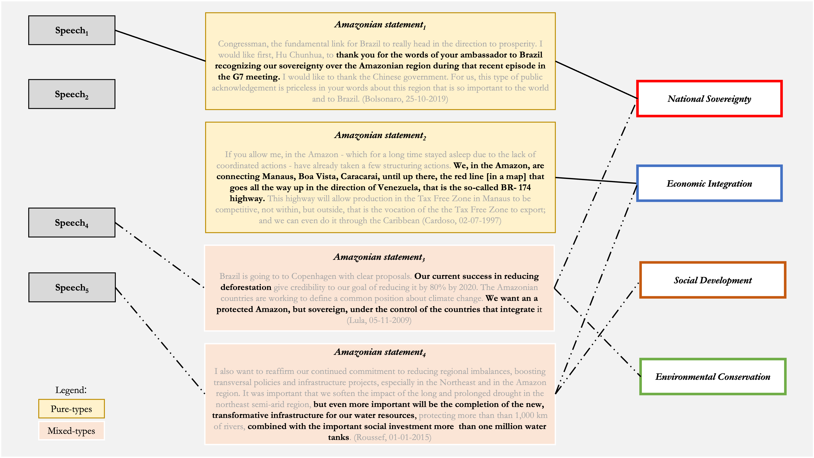

```{=latex}
\keywords{ discourse analysis, transnational governance, environmental policy, Brazilian Amazon, supervised learning, deforestation}
```
```{=latex}
\wordcount{ 8470 (including abstract, text, references, and and footnotes)}
```
```{r setup, include=FALSE, warning=FALSE, message=FALSE}
knitr::opts_chunk$set(include = FALSE)
library(dplyr)
library(tidyr)
library(scales)
library(RColorBrewer)
library(stargazer)
library(kableExtra)
library(tibble)
library(readxl)
library(ggplot2)
library(gridExtra)
library(sjPlot)
library(parameters)

Sys.setlocale("LC_ALL", "C")
options(stringsAsFactors = FALSE, scipen = 999)
```

```{r data, message=FALSE, warning=FALSE, include=FALSE}
# Load data
pop <- readRDS("~/Documents/GitHub/amazondef/Replication_files/BR_presid_speeches_final.Rds")
pop <-  pop %>% select(-c(title, date, location))
ama <- readRDS("~/Documents/GitHub/amazondef/Replication_files/final_data_as.Rds")
ama <- ama %>% select(-c(title, date, text, false_positives)) %>% rename (ei= "EI", sd= "SD")
AAI <- readRDS("~/Documents/GitHub/amazondef/Replication_files//AAI.Rds")
location_km <- read_excel("~/Documents/GitHub/amazondef/Replication_Files/location_km.xlsx") %>%
  select(-location_cat) %>%
  distinct()
ama <- left_join(ama, location_km, by = "location")
amazon_def_year <- readRDS("~/Documents/GitHub/amazondef/Replication_files//amazon_def_year.Rds")
adr <- data.frame(year = c(1985, 1986, 1987), def_year = c(21.050, 21.050, 21.050))
# Missing year data
amazon_def_year <- rbind(adr, amazon_def_year) 
hp = data.frame(beg = c(1985, 1990, 1993, 1994, 2002, 2010, 2016, 2018),
                end = c(1990, 1993, 1994, 2002, 2010, 2016, 2018, 2022),
                label = c(1987, 1991, 1993, 1998, 2006, 2013, 2017, 2020),
                presid = c("Sarney", "Collor", "Franco", "Cardoso", "Lula",
                           "Rousseff", "Temer", "Bolsonaro"))
amazon_def_year$area <- amazon_def_year$def_year*1000
# Prepare data for problem-constructions
sov <- ama %>% 
  filter(sov==1) %>% 
  count(sov, year) %>%
  group_by(year) %>%
  select(-c(sov))%>%
  rename (sov = n)
ei <- ama %>% 
  filter(ei==1) %>% 
  count(ei, year) %>%
  group_by(year) %>%
  select(-c(ei))%>%
  rename (ei = n) %>%
  ungroup() %>%
  tibble::add_row(year = 2017, ei = 0) %>%
  tibble::add_row(year = 2018, ei = 0)
sd <- ama %>% 
  filter(sd==1) %>% 
  count(sd, year) %>%
  group_by(year) %>%
  select(-c(sd))%>%
  rename (sd = n)
con <- ama %>% 
  filter(con==1) %>% 
  count(con, year) %>%
  group_by(year) %>%
  select(-c(con))%>%
  rename (con = n)
other <- ama %>% 
  filter(other==1) %>% 
  count(other, year) %>%
  group_by(year) %>%
  select(-c(other))%>%
  rename (other = n)
temp <- ei %>% 
  left_join(other) %>% 
  left_join(con) %>% 
  left_join(sd) %>% 
  left_join(sov) %>% 
  replace(is.na(.), 0)
# Get mixed types in
ama_mx <-  ama %>%
  unite(mixed_type, sov:con, sep="_") %>%
  mutate(mx_cat = factor(case_when(mixed_type == '1_0_0_0' ~ "Pure National Sovereignty",
                                   mixed_type == '0_1_0_0' ~ "Pure Economic Integration", 
                                   mixed_type == '0_0_1_0' ~ "Pure Social Development",
                                   mixed_type == '0_0_0_1' ~ "Pure Environmental Conservation",
                                   mixed_type == '0_0_0_0' ~ "Other",
                                   mixed_type == '0_1_0_1' ~ "Economic Conservation",
                                   mixed_type == '0_1_1_0' ~ "Social Economic",
                                   mixed_type == '1_0_0_1' ~ "Sovereign Conservation",
                                   mixed_type == '0_1_1_1' ~ "Economic, Social,\nand Conservation",
                                   mixed_type == '1_1_0_0' ~ "Economic Sovereignty",
                                   mixed_type == '0_0_1_1' ~ "Social Conservation",
                                   grepl("1_0_1_0|1_0_1_0|1_0_1_1|1_1_0_1|1_1_1_0|1_1_1_1",
                                         mixed_type) ~ "Other Mixed-types"),
         levels = c("Pure Economic Integration", "Pure Environmental Conservation",
                    "Pure Social Development",
                    "Pure National Sovereignty", "Other", "Economic Conservation", 
                    "Social Economic", "Sovereign Conservation",
                    "Economic, Social,\nand Conservation",
                    "Economic Sovereignty", "Social Conservation", "Other Mixed-types")),
         mx_cat2 = case_when(grepl("Pure Economic Integration|Pure Environmental Conservation|
                                   |Pure Social Development|Pure National Sovereignty",
                                   mx_cat) ~ "Pure-types",
                             grepl("^Other$", mx_cat) ~ "Other",
                             grepl("Economic Conservation|Social Economic|Sovereign Conservation|
                                   |Economic, Social,\nand Conservation|Economic Sovereignty|
                                   |Social Conservation|Other Mixed-types",
                                   mx_cat) ~ "Mixed-types"),
         election_year = ifelse(grepl("1989|1994|1998|2002|2006|2010|2014|2018",
                                      year), 1, 0),
                  location_cat = ifelse(grepl("parana|paraiba|mato grosso|mato grosso do sul",
                                     location, ignore.case = TRUE), # minor coding issues to fix
                               "Non Amazonian States", location_cat),
         location_cat = ifelse(grepl("paraguay", location, ignore.case = TRUE),
                               "International", location_cat), # minor coding issues to fix
         location_cat = factor(ifelse(grepl("Bolivia|Peru|Ecuador|Colombia|Venezuela|Guyana|Suriname",
                                            location), "Amazonian Countries", location_cat),
                               levels = c("International", "Amazonian States",
                                          "Amazonian Countries", "Brasilia",
                                          "Non Amazonian States")))

```

```{r theme, include=FALSE, warning=FALSE, message=FALSE}
# custom ploting theme for all plots
theme_am <- function(x) {
  theme(text = element_text(size=12,  family="Times"),
        panel.background = element_rect("white", "black", .5, "solid"),
                  panel.grid.major = element_line(color = "grey", size = 0.2,
                                                  linetype = "solid"),
        axis.text = element_text(color = "black", size = 10),
        title = element_text(color = "black", size = 10, face = "bold"),
        legend.title = element_blank(),
        plot.subtitle = element_text(color = "black", size = 9, face = "plain"),
        legend.position = "none")
}
```

\pagebreak

# 1 Introduction

*We need to protect the Amazon from foreign interests. We need to exploit the Amazon's natural resources. We need to provide better living standards for the people in the Amazon. We need to preserve the Amazon as a standing ecosystem.* Each of these statements contains an implicit assumption of what needs to be solved, or in other words, it represents the Amazon as a particular problem: national sovereignty, economic integration, social development, and environmental conservation, respectively.These specific problems touch on common understandings of the Amazon as part of the larger socio-cultural history of the country.Different governments throughout Brazilian history have been described as proponents of a specific view of the Amazon [@drummond2006; @padua2012; @franchini2019; @capobianco2019; @pereira2021].

We conceptualize the Amazon region, forest, and people to be a policy object, this is a specific issue that deserves dedicated policy attention. While the military dictatorship(1964-85) is associated with understanding the Amazon as issues of national sovereignty and economic integration, Sarney's (1985-1990) and Lula's (2003-2010)presidencies are often tied to environmental conservation views. These monolithic representations advance the view that specific governments understand and act towards the Amazon as one problem, hiding within government diversity of both policies and perspectives. Albeit the current calls to understand the environment as a social-cultural construction and to identify the effect of culture on environmental outcomes [@lepolaindewaroux2021], we lack empirical accounts of how the Brazilian Amazon has been constructed as a problem in discourses over time, by geographical location, and between, or within, governments. Building on @hirschman1963 conceptualization of chosen problems and @bacchi2009 theory of problem-representation in policy, we propose a framework for identifying problem-constructions in discourse and investigate how the Brazilian Amazon has been constructed as a problem in transnational political discourses. We understand transnationalism[^1] as relationships that transcend nation-states, from the local level to the supranational level encompassing non-state actors [@keck1998].

[^1]: We use the noun transnationalism, the adverb transnationally, and the adjective transnational interchangeably

Although problem-construction takes place in a series of instances, we analyze the case of speeches by Brazilian presidents since 1985. Scholarly research about environmental policy in Brazil has focused on the role of the environmental bureaucracy [@silva-muller2022a], non-governmental organizations [@keck1998], legislation [@soares-filho2014], and international markets [@assuncao2015; @rajao2020 ], and many others. Nevertheless, the role of the president remains understudied. We opt for presidential speeches for two reasons. First, presidential discourses have the power to introduce and justify the public policy, as well as shape its perception to broad audiences [@zarefsky2004; @gillion2016]. It legitimizes ways of thinking about the Amazon. In turn, policy perception is key for policy adoption and implementation [@alesina2009; @lopez2020]. This is especially pertinent to deforestation in Brazil as expectations of local actors, generated from material and discursive governmental practices, are a crucial factor in decisions to deforest on the ground [@assuncao2015; @capobianco2019; @capobianco2021; @campbell2015]. Second, we argue that presidents can deploy problem-constructions that build policy objects as different problems depending on whom they are speaking to. Presidential discourses take place in different settings, from launching a new bridge in a small municipality in the middle of the Amazon to a speech at the UN general assembly in New York. Working with presidential discourses allows us to identify this variation in meaningful ways and better understand how the Amazon is discursively constructed in transnational politics.

To investigate how the Brazilian Amazon has been constructed as a problem in presidential speeches, we create a dataset containing 6130 official presidential speeches by all Brazilian presidents since 1985. We subset the dataset by identifying Amazon-related statements within these speeches. We find that 2014 sections in these discourses refer to the Amazon at least once. We then develop a codebook grounded on Amazonian historiography to code how each of these statements constructs Amazon as a particular problem. We use this codebook to manually code a randomly selected training set of Amazon-related statements. We train a supervised machine-learning model to automatically label the remaining set of Amazonian statements. We then conduct a descriptive and inferential analysis of this data, tying patterns in the data to Amazonian policies and deforestation outcomes over time.

Our empirical findings are threefold. First, we find that the frequency of the Amazon as a topic in speeches inside and outside Brazil is equally driven by domestic events (e.g. the assassination of Chico Mendes) as well as international events (e.g.Climate Summits). Second, the same government adopts a diverse range of problem-constructions over time. While economic integration dominated discourse from 1985 to the mid-2000s, environmental conservation and social development constructions steadily grew in the 2000s, briefly surpassing economic integration as more common problem-constructions from 2011 to 2016. Constructing the Amazon as an issue of sovereignty has increasingly become more pertinent after 2010. Finally, using logit models, we find that presidents are more likely to construct the Amazon as a problem of environmental conservation as presidents move farther away from the Amazon region. That is, presidents talk to the economic and social needs of the people domestically while boasting about environmental policy internationally.Empirically, we provide the first comprehensive overview of when, where, and how the Amazon is constructed as problems in presidential speeches. Conceptually, this contributes to understanding the social construction of the Amazon in discourses as a multi-level game and how these relates to policies. 


This article proceeds as follows: first, we propose a conceptual framework to understand problem-construction in discourses. We then review Amazonian historiography literature to identify the main phases and their underlying problem-construction. In the methodology section, we explain how the framework is operationalized and present the codebook. We proceed to describe, visualize, and interpret our findings in the analysis section. Finally, we conclude with a discussion connecting our findings to past and present environmental policies.

# 2 Conceptual framework and contribution

## 2.1 Chosen problems, presidential discourses, and policy objects

In "Journey towards Progress", @hirschman1963 draws a conceptual distinction between pressing problems (pressured by outside parties to the government) and chosen problems (chosen by the government at their discretion). Pressing problems can be either privileged or neglected, depending on the degree of pressure exercised by the interested groups. Chosen problems are those that governments select at their discretion. Problems can change from pressing to chosen as a function of (a) solutions becoming available, (b) a change in the level of government control in society, or (c) a shift of interests from top policymakers [@hirschman1963]. @hirschman1975 example of policymakers choosing a problem is President's Kubitschek decision of building Brasilia, which was not particularly pressed by any interest group.

@bacchi2009 [p. 10] argues that policies have a cultural dimension as they take" shape within specific historical and national or international contexts". The existence or proposal of a policy implies that there is a (public) problem that needs (governmental) action to be fixed, this is a policy object. We conceptualize policy objects as a problems that demand dedicated policy attention. The alleged problem is not always explicitly stated in a policy: policies are represented as solutions for implicit problems. Building Brasilia (the policy object), thus, could solve a problem of regional inequality, a problem of a dormant economy without state investment, a problem of political representation, or all three depending on how governments speak about it.

Governments can choose to emphasize (or not) one or more implicit problems that a policy solves depending on which interest group they are in communication with. Depending on how the policy is represented to be, it can be portrayed as a solution to problems that are considered pressing or not for different groups and it is up to the discretion of the political actor to construct a particular problem in a particular way given context. @putnam1988's seminal article on the two-level game can help us make sense of this variation conceptually. The author argues that the outcomes of international negotiations lie within the overlap between the agenda (and pressure) of domestic and international groups. If policies are socially constructed, governments can in theory construct them to meet the expectations of both. Consequently, this entails that governments are more diverse in their opinions, rather than monolithic.

An interesting context to study the relationship between problem-construction and policy objects is presidential speeches, as they legitimize ways of thinking about an issue. While the relationship between presidential speeches and policy may not be causal, they have the power to introduce and justify public policy, as well as shape issue perception to broad audiences [@zarefsky2004; @gillion2016]. As presidents speak across several locations to various audiences, they construct similar issues differently.

The possibility of different problem-constructions in presidential speeches has important implications for democracy and global politics. With globalization, presidents have the opportunity of promoting different problem-constructions transnationally. We understand transnationalism as relationships that transcend nation-states, from the local level to the international level encompassing non-state actors [@keck1998]. The environment and climate change, in particular, have received particular trasnantional attention, as narratives of global collective action dominated academic literature (for an overview, see @aklin2020).Relatedly, when Brazilian presidents speak about the Amazon it not only makes headlines, nationally and internationally [@brice2021; @harris2021; @miranda2021], but also incites responses, shapes expectations, and feeds into the behavior of a myriad of related actors. This is partially because the forest is a key biome in global climate-mitigation. It is important to understand, thus, to what extent the implemented policy agenda correlates with problem-constructions promoted at the local, federal, or international levels.

The connection between presidential discourse and the environment has been studied in the case of the United States but remains conceptually underdeveloped. @calderwood2019, for instance, examines 2019 mentions of climate change in American official presidential speeches since 1989. Among other things, the author finds that American presidents frequently side-step the environmental aspects of climate change. Building on @putnam1988, @calderwood2020 demonstrates that American presidents are more likely to mention climate change in foreign locations, and that location influences the specific discursive approach and tone they adopt. Elsewhere, @bevitori2015 finds that mentions of the environment are typically co-selected with the pronoun 'our', as well as with 'economy', 'clean', and 'preserve'. While these studies corroborate the possibilities of variation depending on the audience, they fail to tie vocabulary to specific problem-constructions based on wider shared meanings of environment and climate change. That is, problem-constructions touch on shared meanings available to both the speaker and the audiences as part of larger social-cultural history [see @bacchi2009], therefore, mentions to the lexicon as 'environment', 'preserve', or 'climate change should be tied to the larger meaning of policies in the United States.

There is also an empirical gap in terms of how the Amazon, specifically, has been constructed as a problem along time and geographic location in political discourses. While governmental discourses in Brazil have been studied for topics such as inflation or race relations [see @silva2019], the environment remains largely absent. An exception is @barros2020, who investigates Amazonian discourse in the Brazilian Congress. The author finds that the economic value of the Amazon for the cattle industry is the most salient narrative put forward by congressmen and concludes that there is a mismatch between the international debate (which focuses on preservation) and the national debate (which focuses on economic development).

This variation in problem-construction entails that the same governments are more diverse in their positions than the literature suggests. Scholars often describe federal governments as proponents of a cohesive set of policies toward the Amazon [see @drummond2006; @padua2012; @franchini2019; @capobianco2019; @pereira2021]. In this literature, the 1964 military dictatorship is associated with securing sovereignty in the region by populating it and integrating it into the national economy [@drummond2006]. The governments from the late 1980s up to 2009 are associated with a turn towards policies that focus on environmental conservation. The presidencies of Dilma and Temer (2011-2018) are connected to the decline of conservationist policies, while Bolsonaro to the dismantling of environmental policies. Although these works are important to understand how different governments have acted toward the Amazon, the classification of specific governments into policy periods, or policy cycles, represents them as monolithic: they associate specific governments with one specific view of the Amazon.

We propose a conceptual framework that accepts the possibility of varied problem-construction for the same policy object and connects it to presidential speeches. Governments often choose what problems to solve and what policies to implement. The same policies can be represented as solving different problems implying a degree of social construction [@bacchi2009]. Governments can emphasize, or not, implicit problems that a policy solves depending on which interest group they are in communication with. The variation in problem-construction suggests that Brazilian governments are more diverse in their positions than the literature suggests. An interesting context to study the relationship between varied problem-construction and policy is presidential speeches as they legitimize ways of thinking about an issue, matter for policymaking, and environmental outcomes. As presidents speak in different places and to diverse audiences, it is an empirical site prone to identifying variation.

## 2.2 Problem-construction in Amazonian historiography

We rely on the Amazonian historiography literature to identify possible problem-constructions and their connection to the socio-cultural history of the country. We refer to Amazonian historiography as the body of research conducted by social and environmental scientists that tell the story of diverse governmental programs that approach the Amazon region, forest, and its people as a policy object demanding dedicated action. From this literature, we identify three historical-political constructions: national sovereignty, economic integration, and environmental conservation. We also argue that a fourth one is missing, social development, that focuses on the rights and dignity of the inhabitants of the Amazonian region.

### National Sovereignty

@hecht1990 [p. 1] write that "what imbues the case of the Amazon with such passion is the symbolic content of the dreams it ignites". In the process of securing Amazonian borders since the 18th century, Brazil thwarted "the imperial ambitions of France, Britain, the United States, Belgium, Bolivia, and Peru" [@hecht1990, p. 8], and when the dust settled and the scramble was over, over half of the Amazon emerged Brazilian. While Brazilian military diplomacy was very successful, the process did not come without its traumas as the negotiations with Bolivia in 1902 to secure the territory of the state of Acre [@hecht1990]. These traumas were referred to, and offered context, to Amazonian discourses and policies during the military dictatorship of 1964 at earlier regimes aimed at protecting Brazil's sovereignty over the Amazon [@hecht2020]. As we move from a world where non-state actors gain importance in environmental governance [@silva-muller2022; @andonova2014; @keck1998], sovereignty-related problems become more varied. Threats to national sovereignty, consequently, broaden from state actors to a wide set of actors. Claims of attempts to 'internationalize' the Brazilian Amazon, for instance, are targeted at foreign actors as well as domestic non-state actors. The sovereignty problem-construction advances the view that the Brazilian Amazon belongs to Brazil and any foreign or non-state presence in the region can be part of a broad strategy to take the region. The policy solutions to the issue of sovereignty included the monitoring of the borders and strict regimes related to entry into the region.

### Economic Integration

The Vargas dictatorship (1937-46) and the military dictatorship (1964-89) took over the task of modernizing the Amazon. In 1966, the Brazilian Military launched 'Operation Amazon', a policy to modernize the region based on three assumptions[@acker2021] . First, it assumes that nature should be conquered by mankind Second, it assumes that exploiting natural resources would render the Amazon region economically profitable. Third, it assumes that populating the region was necessary to integrate it into the country and exert control over the territory. Concretely, this meant a series of major infrastructural projects, incentives for settlers to expand the agricultural frontier, and the establishment of a tax-free zone in Manaus to attract industry. @capobianco2019 and @becker2005 describe the period from the 1950s to the 1980s in similar vein, as one of often centralized economic policies by the federal government.The economic integration problem-construction advances the view that the Brazilian Amazon needs to be developed and modernized. These policy solutions have at their core the development of the necessary infrastructure (physical, fiscal, or monetary) to integrate the region into the national and international economy.

### Environmental Conservation

The rapid economic changes in the region from the 1960s to the 1980s were matched with the birth of environmental institutions [@drummond2006]. A common explanation for the creation of these institutions in the Amazonian literature is the impression of the lack of control over the market, engendered by years of centralized economic integration in the region [@acker2021; @capobianco2021; @hecht1990]. This process accelerated in the late 1980s with the birth of modern environmentalism [@viola1987], epitomized in the 1992 Earth Summit in Rio de Janeiro [@hochstetler2021; @capobianco2021]. @hochstetler2007 argue that during preparations for the summit, a new form of Brazilian environmentalism emerged: socio-environmentalism. They define it as an emphasis on the local livelihoods of traditional populations while protecting nature. @capobianco2019 argues that socio-environmentalism informed a series of policies throughout the 1990s and early 2000s towards preserving the forest, such as the establishment of several conservation units in the Amazon in 2001. The environmental conservation problem-constructions emphasize that the Amazon should be preserved, deforestation should be halted, and the sustainable practices of indigenous and local peoples should be maintained through the protection of their territories and rights to self-determination [@hochstetler2007]. The policy solution implies, for example, further investments in command-and-control institutions, the valuation of standing ecosystems through incentive schemes, and the creation of protected areas.

### Social Development

Governments can emphasize the lack of hospitals, sanitation, and schools concerning peoples' dignity, standards of living, and other constitutional rights. However, such emphasis can be masked within both the economic integration and environmental conservation accounts. @acker2021 [p. 10], for example, argues that during the military dictatorship attempts to populate the Amazon were seen, among other things, as a solution for the country's growing social inequalities elsewhere. As democracy established itself in Brazil, the settlers from the military dictatorship became electorates with constitutional rights. @hochstetler2007 argue that with the transition to democracy, the mobilization of diverse social movements to demand social equality and conservation was an integral part of the socio-environmentalist movement in Brazil. While indigenous rights and preservation of the forest go hand in hand, it is not clear whether providing better standards of livings to the large and poor populations of the state and preservation do; perhaps this is also why there was never an open consensus about socio-environmentalism in Brazil [@hochstetler2007]. Although related to economic integration and environmental conservation, social development is a problem-construction that focuses on constitutional rights, citizenship, and dignity. The policy solution to social development implies the policies to facilitate access to water, sanitation, electricity, internet, and radio, as well as the construction of schools and hospitals locally.

# 3 Methodology: operationalizing Amazonian problem-constructions

## 3.1 Codebook and Data

To analyze how presidents construct the Amazon as a problem, we build upon the dataset provided by [@cezar2020] which contains all official speeches by Brazilian Presidents from 1985 to 2019 scrapped from the archives of the Brazilian Presidential Library. We update the dataset by scraping and adding all official speeches from 2020 and 2021. The final dataset encompasses 6130 speeches for all the presidents of Brazil. Then, we proceed to identify all speeches that refer to the Amazon as a region, people, or forest. We do so by detecting all speeches in which the stem "amazon" appears. In Portuguese, the stem captures terms such as "Amazonia", "Amazonica", "Amazonidas", "Amazonense(s)", "Amazonas", among others. We find that 946 speeches are, at least partially, about the Amazon out of the 6130.

Using the poldis R package [@sposito2021], we proceed to extract two sentences before and two sentences after the sentence in which the stem "amazon" appears. We opt for picking two sentences around, rather than words because sentences usually contain a cohesive idea. By doing so we create our unit of analysis: an Amazon statement. We use Amazon statements as our unit of analysis because it allows us to identify only passages that are meaningful for our specific purpose.This process yields 2014 unique Amazonian statements across the 946 speeches about the Amazon identified. When an Amazonian statement contains two or more matches of the stem "amazon", we get two sentences before the first match and two sentences after the last match. On average, an Amazonian statement contains 123 words.

Our approach to text coding has three steps. First, we develop a codebook to code Amazonian statements in one or more problem-constructions (see codebook in appendix). In their conceptualization, each problem-construction is mutually exclusive, meaning that they cover different forms of constructing the Amazon as a problem. Nevertheless, each Amazonian statement might be assigned to one or more codes. A statement can, for example, construct the Amazon as a problem of sovereignty and a problem of economic integration, or a problem of social development and conservation. Amazonian statements, thus, can be either coded as pure-types or mixed-types. Mixed-types are relevant as constructions and policies are often multifaceted while portraying the Amazon as a combination of these problem-constructions. Figure 1, below, portrays this operationalization strategy.

````{=tex}
\begin{landscape}

```{r figure1, echo=FALSE, fig.cap="Operationalization of problem-constructions", out.width = '100%', include=TRUE}

```

\end{landscape}
````

Second, with the codebook in hand, each one of the authors, separately, hand-coded the same set of 1007 randomly selected Amazonian statements. This amount refers to 50% of all the Amazon Statements identified. We chose to hand code half of the observations because there are several nuances in discourse in how presidents talk about the Amazon over time and as a problem.As the size of the training set should increase with the number of categories [@grimmer2022], we deemed four categories and 50% of the statements as reliable. This allows a robust validation set to verify the models. Also, automating the coding of half of the observations saved the authors over one month of work in comparison to manual coding. The intercoder agreement for hand-coded categories was 85%, on average. For each non-matching coded observation, the co-authors discussed and sorted their disagreements. Most disagreements related to different interpretations of the codebook, which were subsequently clarified.

Third, the hand-coded data is then randomly divided into a training set, containing 80% of the hand-coded observations (806 observations), and a validation set, containing the remaining 20% of the hand-coded data (201 observations). We chose to employ a support-vector machine (SVM) algorithm, a non-probabilistic linear classifier that classifies documents by assigning points in mapped space to maximize the gap between binary categories, to label texts [@meyer2021; @noble2006]. The SVM model is trained using the hand-coded training set and then employed to classify observations in the validation set. The trained SVM model was, on average 82%, accurate in classifying observations in the validation set before being tuned. After the SVM model is tuned, we use the model to automatically code the remaining 1007 Amazonian statements. The final dataset for analysis, excluding false positive matches, contains 1895 coded Amazonian statements.

## 3.2 Analysis and Limitations

To analyze our data, we first present a series of different plots on the proportions of Amazonian statements and problem-constructions over time and by presidents. To test whether problem-constructions depend on where presidents speak, we run four separate logistic regressions. Each model takes the share of a specific problem-construction versus all other problem-constructions as their dependent variable. This means we try to predict the probability of a president constructing the Amazon as an issue of (1) environmental conservation, (2) economic integration, (3) social development, and (4) national sovereignty, separately, and in relation to the remaining three problem-constructions. Our main independent variable is the distance (in kilometers) from the state or country capital where the speech took place to Manaus (the capital of the Amazonas State and centrally located in the region). The logic behind this relates to presidents playing multi-level games. We expect presidents to change how they construct the Amazon based on their believes of audiences' expectations.We interpret the plots and model considering multiple Amazon-related events and policies over the last 30 years, with the support of existing literature, and their correlations with different presidents and locations.

This approach comes with limitations. Our codebook is developed using specific Amazon-related vocabulary. For example, a statement will be coded as economic integration if it is meaningful support for the tax-free zone of Manaus or a dam in the Amazon. However, the economy is generally a topic that presidents speak about frequently. Hence, the high incidence of economic integration in Amazonian statements can also be related to the higher importance of this problem-construction in Brazil overall Moreover, we classify statements as Amazonian based on a dictionary composed of a single lexicon stem: "amazon". We chose to do so knowing that a few speeches about the Amazon might not contain the lexicon "Amazon", for example, when the president says, "the forest" or "deforestation". Hence, we might be missing statements about Amazon that do not refer to it. However, we consider this safer as we cannot be sure that mentions of the forest or deforestation do not correspond to other biomes such as the Cerrado or the Atlantic Forest. Finally, our dataset covers only what is considered an official speech. Presidents, though, give interviews, appear in debates, talk at campaign rallies, and, more recently, post on social media. Problem-construction within presidential discourse, thus, also happens in different sites for which we do not account in this paper.

# 4 How has the Amazon been constructed as a problem?

## 4.1 The rises and falls of the Amazon as a topic in presidential speeches

When, where, and how often do presidents speak about the Amazon? Figure 2, below, shows the proportion of speeches that mentions the Amazon in relation to all speeches in a year. On average, presidents mention the Amazon in 15.4% of their speeches. For comparison purposes the averages for other policy objects in the same corpus of speeches are: Inequality (14.7%), Criminality (17.3%), Inflation (20.9%), and Unemployment (13.8%). The frequency at which the Amazon appears across presidential speeches inside, outside, and overall varies similarly across time (see Figure 7 in appendix).

```{r Figure 2, fig.cap="Amazonian speeches in time", echo=FALSE, message=FALSE, warning=FALSE, paged.print=TRUE, include=TRUE}
perc1 <- pop %>%
  count(amazon_speech, year) %>%
  group_by(year) %>%
  mutate(perc = n / sum(n)) %>%
  filter(amazon_speech == 1) %>% 
  select(c(perc, amazon_speech, year))
Amazon_year <- perc1 %>% ggplot(., aes(x = year, y = perc)) +
  geom_line(color = "darkgreen") +
  geom_line(aes(y=mean(perc)), color="black", size=.5, linetype="dotted")+
  scale_y_continuous(labels = percent_format()) + 
  annotate("text", x = 1985, y = 0.18, label = "15.4%", size = 3.5)+
  annotate("text", x = 1988.7, y = 0.35, label = "The Murder of\nChico Mendes", size = 3)+
  annotate("text", x = 1992.5, y = 0.27, label = "Earth Summit", size = 3)+
  annotate("text", x = 2009, y = 0.24, label = "Copenhagen Summit", size = 3)+
  annotate("text", x = 2015, y = 0.21, label = "Paris Summit", size = 3)+
  annotate("text", x = 2019, y = 0.26, label = "2019 Record\nAugust Fires", size=3) +
  labs(x = "", y = "",
       title = "Share of speeches that mention the Amazon per year",
       subtitle = "Sample composed by all 6130 speeches since 1985",
       color='Y series') +
  theme_am()
Amazon_year
```

We observe five local maxima both inside and outside Brazil: 1989, 1992, 2009, 2015, and 2019. These points coincide with internal and external events that help us explain the rises and falls of the Amazon in presidential discourse. From 1985 to 1988, the mentions of the Amazon in official speeches increased from 4% to 14%. During this period, the latest Brazilian Constitution was written, which gave indigenous and traditional populations space to advocate for constitutional environmental rights and the protection of their territories [@hecht1990]. In 1989, however, the Amazon appeared in 32% of all speeches. This maximum correlates with the brutal murder of Chico Mendes in the last days of 1988. The incident caught unprecedented international attention and Sarney responded to this with a set of policies to address deforestation [@capobianco2021], including accepting to host the 1992 Earth Summit [@keck1998].

1990-91 the Amazon appeared in 12% to 14% of all speeches but, by 1992, this average increased to 25%. The 1992 Earth Summit in Brazil brought international attention to environmental topics related to the Amazon. One of the big announcements, for example, was the consolidation of the first transnational partnership for the Amazon, the G7 Pilot Program, which brought a high number of financial resources to the region for public policy implementation [@capobianco2021]. Throughout the rest of the 1990s and 2000s, during the Cardoso (1995-2002) and Lula administrations, the Amazon as a topic did not diverge much from the average until 2009, when we see another maximum in mentions of the Amazon. This coincides with the 2009 Copenhagen Summit and the steepest decrease in deforestation rates since data is available as Figure 3, below, illustrates. Lula led the delegation to Copenhagen with a self-image of "we do not promise, we deliver" when the stakes about climate change were high [@franchini2019].

```{r Figure 3, fig.cap="Deforestation rates since 1988", echo=FALSE, message=FALSE, warning=FALSE, paged.print=FALSE, include=TRUE}
def_rates <- ggplot(amazon_def_year, aes(x = year)) +
  geom_line(aes(y = area), color= "darkolivegreen", linetype="twodash", size= 0.5)+
  geom_smooth(se=FALSE, color="black", aes(y=area), linetype="solid", size= 0.5)+
  annotate("text", x = 2005, y = 29000,
           label = "2004 Plan to Combat and Control Deforestation", size = 3) +
  annotate("text", x = 2012.5, y = 3500, label = "2012 Forest Code ", size = 3) +
  labs(x = "", y = "Deforestation in squared kilometers",
       title = "Deforestation rates since 1988",
       subtitle= "Data from INPE, Brazilian Ministry of Science and Technology.",
       color = "",
       caption= "Black curve smoothed using loess.")+
  theme_am()
def_rates
```

From 2010 to 2018, except for 2015, we see a general decrease in mentions of the Amazon in all official presidential speeches. From 2010 to 2014, mentions of the Amazon went down from 18% to 8%. Disagreements related to the priority of environmental preservation over economic development were frequent, most notably in the case of approval of the New Forest Code in 2012, which regularized land ownership of many illegally deforested areas. The period was also marked by political and economic instability which culminated in the impeachment of Rousseff in 2016. In 2015, the Amazon appeared in 19% of all speeches. This maximum coincides with the Paris summit which became a key turn in climate politics after the failures of Copenhagen. Brazil went to the Paris Summit with deforestation numbers slightly higher than Copenhagen and a perception that there was a turn towards less conservation inside the country. By 2016 mentions of Amazon in official speeches went down to 6%, the lowest share since 1985.

We subsequently observe a steady increase from 6% in 2016 to 24% in 2019, the first year of Bolsonaro's presidency. At the time, international and national media brought unprecedented attention to Brazilian environmental issues as the record burning of the Amazon led up to a red sky afternoon in São Paulo in August 2019. Alongside this, Bolsonaro's dismantling of environmental governance and the threats to leave the Paris Agreement had strong media attention, and, as a response, the topic became prominent in his speeches. Bolsonaro went on to retrieve Brazil's hosting status for COP25.

The frequency at which the Amazon appears in domestic and international speeches varies in similar ways as the maxima in the topic frequencies, led by the events discussed above, appear within and outside Brazil (see Figure 7 appendix). We interpret this as evidence that relevant events drive interest and alter how pressing the Amazon as a policy object is perceived both nationally and internationally. This does not mean, though, that when presidents speak about the Amazon, they highlight the same issues.

## 4.2 Problem-constructions in time

Our subsequent analysis of pure-types and mixed-types suggests that governments do not defend a specific view of the Amazon. The same governments construct the Amazon as various pure and mixed type problems, which unravels a less cohesive story than that told by the literature scrutinizing policy cycles.

### Pure-type problem-constructions

We conceptualize four problem-constructions: sovereignty, economic integration, social development, and conservation. Figure 4, below, illustrates the share of each pure-type in time. Pure problem-constructions dominate, with an average of 56% of all Amazonian statements across time.We identify a discursive shift in problem-constructions from developing the Amazon economically, to conserving it and providing services to its citizens. Pure economic integration constructions dominated constructions from 1985 to the late 2000s. This is especially pertinent during the Cardoso administration. Brazilian presidents after Cardoso moved from employing one problem-constructions consistently to a more diverse strategy. During Lula's terms in office, constructing the Amazon purely as an issue of economic integration decreased, while constructing the Amazon issues of environmental conservation and social development increased. Conservation and social development constructions surpassed economic integration around 2010 and continued to dominate as Amazonian constructions during Rousseff's administration. Still, environmental conservation and social development problem-constructions were not as dominant in terms of frequency or periods in time in discourses as economic integration was until the early 2000s. Finally, we observe a steady increase in sovereignty constructions in the late 2000s, reaching the highest frequencies with the presidencies of Bolsonaro. As we conceptualize and operationalize sovereignty as containing internal and external perceived threats to the Amazon, we interpret this increase as not only attacks on international interference in the Amazon but also on indigenous and traditional populations.

```{r Figure 4, fig.cap="Pure-types in time", echo=FALSE, message=FALSE, warning=FALSE, paged.print=FALSE, include=TRUE}
mmt1 <- ama_mx %>%
  filter(mx_cat2 == "Mixed-types") %>%
  count(mx_cat) %>%
  mutate(perc = n / sum(n)) # averages in relation to only mixed-types
mmt2 <- ama_mx %>%
  count(mx_cat)%>%
  mutate(perc = n / sum(n)) # averages in relation to full sample
pure_types_time <- ama_mx %>%
  count(mx_cat, mx_cat2, year) %>%
  group_by(year) %>%
  mutate(perc = n / sum(n)) %>% 
  filter(mx_cat2 == "Pure-types") %>%
  ggplot(aes(x=as.numeric(year), y = perc, color = mx_cat)) +
  geom_smooth(aes(fill = mx_cat), se = FALSE, size =0.75, linetype="solid") +
  scale_y_continuous(labels = percent_format(accuracy = 1)) +
  labs(x = "", y = "", title ="Share of each pure-type problem-construction by year",
       subtitle = "Sample composed by 1895 Amazonian statements in presidential speeches since 1985",
       caption = "Curves in the plot were smoothed using loess method.") +
  theme_am() +
  theme(legend.position = "bottom")+
  guides(fill=guide_legend(nrow=2,byrow=TRUE))

pure_types_time
```

The trends identified are especially interesting considering Amazonian policies and deforestation rates portrayed in Figure 3, above. First, deforestation rates have a strong negative correlation with environmental conservation. When deforestation rates increased from 1988 to 2004, and from 2012 until 2021, environmental conservation constructions decreased. As deforestation rates decreased from 2004 to 2012, environmental conservation constructions in presidential speeches increased. @capobianco2021 argues that the unprecedented decrease in deforestation we observed from 2004 to 2012 was a product of an increase in the perception of stronger federal policies and police presence in the Amazon region which, in turn, engendered a perception of a higher risk of being caught and fined for deforestation. The shift from constructing the Amazon as an issue of economic integration to an issue of environmental conservation generates a perception that illegal deforestation will be increasingly monitored and sanctioned. Second and relatedly, deforestation rates have a positive and strong correlation with economic integration. When deforestation increased from 1988 to 2004 and from 2012 to 2021, so did mentions to economic integration. When deforestation decreased from 2004 to 2012, economic integration decreased as well. This suggests that presidents might boast policy outcomes related to economic integration as justifications for deforestation.

### Mixed-type problem-constructions

In a speech, presidents might mix multiple problem-constructions within a same statement about the Amazon. Although presidents prefer pure problem-constructions, they also construct the Amazon as a multifaceted issue. Mixed-type problem-constructions in discourse offer more intricate understandings of the Amazon as a problem. Constructing the Amazon as multiple issues averages at 18% of all constructions in time. Some mixed-types rarely appear so we focus our discussion on those mixed-types with higher incidence. Figure 5, below, displays the averages of mixed-types constructions by presidents.

```{r Figure 5, fig.cap="Mixed-types by president", echo=FALSE, message=FALSE, warning=FALSE, paged.print=FALSE, include=TRUE}
mixed_types_presid <- ama_mx %>%
  count(president, mx_cat, mx_cat2) %>%
  group_by(president) %>%
  mutate(perc = n / sum(n)) %>%
  filter(mx_cat2 == "Mixed-types") %>%
  mutate(president = factor(president, levels = c("Sarney", "Collor", "Itamar", "FHC",
                                                  "Lula", "Dilma", "Temer", "Bolsonaro"))) %>%
  ggplot(aes(x = president, y = perc, fill = mx_cat,
             label = scales::percent(perc, accuracy=.1))) +
  geom_bar(stat = "identity", position = "stack") +
  geom_text(size = 2, position = position_stack(vjust = .5)) +
  scale_y_continuous(labels = percent_format(accuracy = 1)) +
  scale_fill_brewer(type = "qual", palette = "Set2", direction= 1) +
  labs(x = "", y = "", title ="Share of each mixed-type problem-constructions by president",
       subtitle = "Sample composed by 1895 Amazonian statements in presidential speeches since 1985",
       caption = "") +
  theme_am() +
  theme(legend.position = "right")
mixed_types_presid
```

The most frequent mixed-type problem construction of the Amazon is economic conservation. This mixed-type construction, composed of Amazonian statements that construct the Amazon as a problem of both economic integration and environmental conservation, generally increased over time. This increase suggests that later presidents, along with being more diverse in how they construct the Amazon as an issue (see Figure 4), increasingly find ways to reconcile the dictum between the economy and the environment that had prevailed in the previous years. The second most common mixed-type mixes social development and economic integration and appears, on average, in 5.4% of all statements. This is not surprising, as developing countries like Brazil repeatedly claim a "right to develop", when it comes to negotiating strong climate commitments and policies with a focus on both social development and economic integration. Nonetheless, there is a general increase of mixed-types over time, which is expected given the rise of global agendas understanding interconnections of social, environmental, and economic domains such as the Millennium Development Goals and the Sustainable Development Goals.

Both Lula and Bolsonaro construct the Amazon as a multifaceted issue more frequently than other presidents. Lula usually mixed economic integration with environmental conservation and social development when constructing the Amazon as an issue, while Bolsonaro constructs the Amazon as an issue of national sovereignty and economic integration much more than any other president, mimicking the military dictatorship discourses and policies toward the region [@hecht1990].

## 4.3 The Amazonian multi-level game: boasting policy outside and talking to people inside

The Amazon region, forests, and peoples have historically been the topic of local, national, and international debates. This implies that audiences' priorities in each setting change and consequently which policies are appropriate to solve the "Amazon issue" differ as well. As presidents physically move farther away from the Amazon, audiences might have different stakes and interests in it. While speeches inside the Amazon might focus on social development, for example, speeches in the United Nations in New York might highlight environmental conservation. To investigate the relationship between where presidents speak and how they construct the Amazon as an issue, we run four logistic regressions, one for each pure-type construction as a dependent variable. We focus on pure-type constructions as these represent most constructions and avoid ambiguity. The independent variable for all models is the distance between the state country capital to Manaus. Figure 6, below, depicts the predicted probabilities from the models (see Table 1) as functions of distance.

```{r Figure 6, fig.cap="Logistic Regression predicted values", echo=FALSE, message=FALSE, warning=FALSE, paged.print=FALSE, include=TRUE}

ama_model <- dplyr::left_join(ama_mx, amazon_def_year, by = "year") # merge
ama_model <- dplyr::left_join(ama_model, AAI, by = "year") # merge
ama_model <- filter(ama_model, location_cat != "Non Identified",
                    mx_cat != "Other Mixed-types") %>%
  mutate(con_vs_all = ifelse(mx_cat == "Pure Environmental Conservation", 1, 0),
         EI_vs_all = ifelse(mx_cat == "Pure Economic Integration", 1, 0),
         SD_vs_all = ifelse(mx_cat == "Pure Social Development", 1, 0),
         sov_vs_all = ifelse(mx_cat == "Pure National Sovereignty", 1, 0))

# model

model_logit_con <- glm(con_vs_all ~ km_to_manaus + election_year + def_year + AAI,
                   family=binomial(link = "logit"), data = ama_model)
model_logit_ei <- glm(EI_vs_all ~ km_to_manaus + election_year + def_year + AAI,
                   family=binomial(link = "logit"), data = ama_model)
model_logit_sd <- glm(SD_vs_all ~ km_to_manaus + election_year + def_year + AAI,
                   family=binomial(link = "logit"), data = ama_model)
model_logit_sov <- glm(sov_vs_all ~ km_to_manaus + election_year + def_year + AAI,
                   family=binomial(link = "logit"), data = ama_model)


# Plot model
ama_model$"Environmental Conservation" = predict(model_logit_con, ama_model, type = "response")
ama_model$"Economic Integration" = predict(model_logit_ei, ama_model, type = "response")
ama_model$"Social Development" = predict(model_logit_sd, ama_model, type = "response")
ama_model$"National Sovereignty" = predict(model_logit_sov, ama_model, type = "response")
plot_loc <- ama_model %>% gather(key=p_c, value = pred, 22:25)

plot_loc$p_c <-factor(plot_loc$p_c, levels = c("Economic Integration",
                                               "Environmental Conservation",
                                               "Social Development",
                                               "National Sovereignty"))
all_loc <- ggplot(plot_loc, aes(x = km_to_manaus, y=pred, color=p_c)) +
  geom_jitter(alpha=1, size=1) +
  geom_smooth(size = .5, se=FALSE) +
  scale_y_continuous(labels = percent_format()) +
  labs(x = "Distance from the Amazon (km)",
       y = "",
       title = "Predicted probability of each problem-construction as a function of\ndistance from the Amazon",
       caption = "Curves in the plots are estimated using loess method.") +
    theme_am() +
  theme(legend.position = "none")+
  facet_wrap(~p_c, ncol=2)

all_loc

```

```{r Models for Table, include=FALSE}

#models for table

ama_model$thousand_km<- ama_model$km_to_manaus/1000

model_logit_con2 <- glm(con_vs_all ~ thousand_km + election_year + def_year + AAI,
                   family=binomial(link = "logit"), data = ama_model)
model_logit_ei2 <- glm(EI_vs_all ~ thousand_km + election_year + def_year + AAI,
                   family=binomial(link = "logit"), data = ama_model)
model_logit_sd2 <- glm(SD_vs_all ~ thousand_km + election_year + def_year + AAI,
                   family=binomial(link = "logit"), data = ama_model)
model_logit_sov2 <- glm(sov_vs_all ~ thousand_km + election_year + def_year + AAI,
                   family=binomial(link = "logit"), data = ama_model)

```

We convert log odds from Table 1, below, into probabilities [^2]. It shows that for each 1000Km increase, we find an increase of 52.8% in the predicted probability of constructing the Amazon as an issue of environmental preservation. That is, the farthest away the president is from the Amazon region, the more likely the president is to construct it as an issue of environmental conservation. Second,the opposite is true for both economic integration (and social development): for an increase of 1000Km, we find a decrease of 48.5% (47.4%), respectively. When speaking within the Amazon, presidents focus on social development and economic integration. This entails that conservation might be a desirable construction when speaking internationally about the Amazon, but not at the local level, where presidents highlight economic and social development. This multi-level game implies that presidents talk to the economic and social needs of the people domestically while boasting about environmentalism internationally. Finally, national sovereignty problem constructions do not appear to change with distance.

[^2]: See table 3 in appendix for all odds ratios and confidence intervals.

````{=tex}
\begin{landscape}

```{r Table 1, fig.cap="Logistic Regressions Output", echo=FALSE, message=FALSE, warning=FALSE, paged.print=FALSE, include=TRUE, results="asis"}

md <-stargazer::stargazer(model_logit_con2, model_logit_ei2, model_logit_sd2,
                          model_logit_sov2, digits = 6, 
                          dep.var.labels = c("Conservation", "Economic Integration",
                                             "Social Development", "Sovereignty"),
                          covariate.labels = c("Distance from the Amazon in 1000s of km",
                                               "Election year", "Yearly Deforestation",
                                               "Yearly   Inflation"), no.space = TRUE,
                          title = "Logistic Regressions Output")
```

\end{landscape}
````

```{r model probs, include=FALSE}

# Increasing thousand_km by 1, will result in a 0.11555 in logit(probability) or log(p/1-p)
# p/(1-p)=exp.0.1155
# p/(1-p)=1.122435
# p= 1.12243/2.1224
# p=52.8%

logit2prob <- function(logit){
  odds <- exp(logit)
  prob <- odds / (1 + odds)
  return(prob)
}

logit2prob(coef(model_logit_con2))
logit2prob(coef(model_logit_ei2))
logit2prob(coef(model_logit_sd2))
logit2prob(coef(model_logit_sov2))

```

Our models also suggest that deforestation plays an important role. Presidents are, for example, more likely to construct the Amazon as an issue of environmental conservation as deforestation decreases. Alternatively, as deforestation increases, presidents are more likely to construct the amazon as an issue of economic integration. This indicates that Brazil created a self-image of a strong climate leadership because of the good results achieved from 2004 to 2012 [@franchini2019]. In the same fashion, economic integration problem-constructions are likely deployed as a justification for increasing deforestation rates.

# 5 Discussion and Conclusion

This paper investigates how the Brazilian Amazon has been constructed as a problem in Brazilian presidential speeches since 1985. Our findings are threefold: we find that the frequency of the Amazon as a topic in speeches inside and outside Brazil is equally driven by domestic events (e.g. the assassination of Chico Mendes) as well as international events (Climate Summits). Second, the same government adopts a diverse range of problem-construction. While economic integration dominated discourse from 1985 to the mid-2000s, environmental conservation and social development constructions steadily grew in the 2000s, temporarily surpassing economic integration as a more common problem-construction from 2010 to 2015. This implies an overall movement from only exploiting the Amazon for economic purposes to exploiting it and protecting it. Constructing the Amazon as an issue of sovereignty became more pertinent after 2010. Finally, we find that presidents are more likely to construct the Amazon as an environmental conservation problem than economic integration or social development, as presidents move away from the Amazon region. Conceptually, this contributes to understanding the social construction of the Amazon in discourses and how these relate to policies and environmental outcomes. Empirically, we provide the first comprehensive overview of when, where, and how the Amazon is constructed as an issue in presidential discourse.

Discursive problem-construction within democracies legitimizes ways of thinking and acting towards the environment. If presidents promote an agenda of economic and social development within Brazil that diverges from the one promoted outside of Brazil, to what extent does the implemented agenda respond to domestic versus international demands? The Brazilian government successfully funded domestic public policy with transnational support on several occasions: the 1992 Pilot Programme of the G7 for the Protection of Rainforest; the 2001 Amazon Regional Protected Areas Program by the World Bank and others; and the 2008 Amazon Fund which provided over USD 1 billion [@silva-muller2022]. Concurrently, the national agenda of economic integration or social development was pursued. For instance, rural credit offered to local agricultural producers in Amazonian states, went up from 500 million reais a year in 1999 to over 4 billion a year by 2012 [@capobianco2021]. Multiple contradictory policies negotiated simultaneously, imply that presidents construct policy objects as issues important to local electorates within the Amazon while, at the same time, highlighting aspects important for international actors elsewhere.

The decrease in deforestation that took place in Brazil from 2004 to 2012, was accompanied by a period of strong economic growth. With the strengthening of environmentalism, through the participation of indigenous and civil society in politics [@hochstetler2007], the fall of economic integration problem-construction and the rise of both social development and environmental conservation constructions in the 2000s suggest a new balance between granting local livelihoods their rights and economic development. This new balance was both unprecedented and not long-standing. Unprecedented because never before the environment and people were equally present as the economy in presidential discourse. Not long-standing because the dismantling of environmental policy in favor of infrastructure and agricultural expansion was already on its way in the late 2010s. The 2012 New Forest Code is seen as a turning point: political opposition to conservation organized itself and managed to lobby with the executive and won these battles even though they were largely opposed by environmentalists.

The steady increase of sovereignty problem-constructions starting in 2010 brings an eerie twist. The embryo of Bolsonaro's Amazonian discourse was breeding half a decade before he took office. Bolsonaro is a product of political re-organization of national and international actors - to which Rousseff and Temer were already responding in discourse - rather than the cause of change in politics. The political forces in Brazilian democracy that drove these policy and discursive changes in problem-construction were long in the making, Bolsonaro's problem-constructions and policies are the strongest forms of this shift.

# Acknowledgements

The authors are extremely grateful to Matias López, Graziella Moraes Silva, and James Hollway for their support. The authors would also like to thank Mario, Federico, Rodrigo, and Anna for valuable comments on earlier drafts of this paper.

# Disclosure Statement

The authors report there are no competing interests to declare.

# References

::: {#refs}
:::

\newpage

# Appendix

```{r Figure 7, fig.cap="Amazonian speeches in time and space", echo=FALSE, message=FALSE, warning=FALSE, paged.print=TRUE, include=TRUE}
perc_in <- pop %>%
   mutate(location_cat = ifelse(grepl("International|Non Identified",
                                      location_cat),
                                "Outside of Brazil", "In Brazil")) %>%
  filter(location_cat == "In Brazil") %>% 
  count(amazon_speech, year, location_cat) %>%
  group_by(year) %>%
  mutate(perc = n / sum(n)) %>%
  filter(amazon_speech == 1) %>%
  select(c(perc, amazon_speech, year, location_cat))
perc_out <- pop %>%
   mutate(location_cat = ifelse(grepl("International|Non Identified",
                                      location_cat),
                                "Outside of Brazil", "In Brazil")) %>%
  filter(location_cat == "Outside of Brazil") %>% 
  count(amazon_speech, year, location_cat) %>%
  group_by(year) %>%
  mutate(perc = n / sum(n)) %>%
  filter(amazon_speech == 1) %>%
  select(c(perc, amazon_speech, year, location_cat)) 
# location plots
Amazon_year_in <- perc_in %>%
  ggplot(., aes(x = year, y = perc))+
  geom_line(color="darkgreen")+
  geom_line(aes(y=mean(perc)), color="black", size=.5, linetype="dotted")+
  annotate("text", x = 1985, y = 0.17, label = "16.17%", size = 3.5)+
  annotate("text", x = 1988.7, y = 0.39, label = "Chico Mendes", size = 3)+
  annotate("text", x = 1992, y = 0.36, label = "Earth Summit", size = 3)+
  annotate("text", x = 2009, y = 0.28, label = "Copenhagen Summit", size = 3)+
  annotate("text", x = 2015, y = 0.24, label = "Paris Summit", size = 3)+
  annotate("text", x = 2019, y = 0.28, label = "August Fires", size=3) +
  scale_y_continuous(labels = percent_format())+
  labs(x = "", y = "",
       title = "Share of speeches inside Brazil",
       subtitle= " 4344 speeches out of 6130",
       color='Y series') +
  theme_am()
Amazon_year_out <- perc_out %>% 
  ggplot(., aes(x = year, y = perc))+
  geom_line(color="darkgreen")+
  geom_line(aes(y=mean(perc)), color="black", size=.5, linetype="dotted")+
  annotate("text", x = 1985, y = 0.165, label = "15.49%", size = 3.5)+  
  annotate("text", x = 1988.7, y = 0.39, label = "Chico Mendes", size = 3)+
  annotate("text", x = 1992, y = 0.36, label = "Earth Summit", size = 3)+
  annotate("text", x = 2009, y = 0.28, label = "Copenhagen Summit", size = 3)+
  annotate("text", x = 2015, y = 0.24, label = "Paris Summit", size = 3)+
  annotate("text", x = 2019, y = 0.28, label = "August Fires", size=3)+
  scale_y_continuous(labels = percent_format())+
  labs(x = "", y = "",
 title = "Share of speeches outside Brazil",
       subtitle= " 1786 speeches out of 6130",
       color='Y series') +
  theme_am()
grid.arrange(Amazon_year_in, Amazon_year_out, nrow=2)
```

````{=tex}
\begin{landscape}

```{r codebook, fig.cap="Codebook", echo=FALSE, message=FALSE, warning=FALSE, paged.print=TRUE, include=TRUE}
codebook <- tibble::tibble("problem-construction" = c("National Sovereignty", "Economic Integration","Social Development", "Environmental Conservation"),
                           Description = c("This code constructs the Amazon region and/or forest as an issue of national sovereignty. We understand claims of sovereignty as a particular problem-construction that touches on imaginaries of external threats to territory. Relatedly, we also understand sovereignty as raising concerns about wrong perspectives and criticism from foreign and non-state actors about government action related to the Brazilian Amazon. In all, it advances the view that the Amazon is Brazilian, foreign, and non-state presence in the region needs to be monitored closely.","This code constructs the Amazon region and/or forest as an issue of economic integration. It advances the view that the Amazon needs to be developed and connected to the national economy. This includes expanding the agricultural frontier through incentives, creating a diverse set of infrastructure (roads, dams, internet, radio, energy), fostering differing industries (tourism, mining, cattle, agriculture and so on) through tax-free zones, as well as facilitating the exploitation of natural resources for developmental purposes.", "This code constructs the Amazon region and/or forest as an issue of social development. It advances the view that Amazon is full of citizens who should have their rights guaranteed. This refers to the construction of schools and universities (right to education), of hospitals (right to health), and of housing (right to house). This also includes guarantees of a dignified life with decent employment, access to water and sanitation, as well as access to electricity, internet, radio, and light. Finally, this includes referrals to culture and the right to vote.", "This code constructs the Amazon region and/or forest as an issue of conservation. This problem-construction focuses on the value of a standing forest and of the preserved ecosystem in the region. The conservationist narrative advances the view that Amazon should be preserved, deforestation should be halted, and the practices of indigenous and traditional populations should be maintained and fostered. It advances the view that the emission of greenhouse gasses should be halted, that renewable energy should be supported, and that protected areas should be created."), Example = c("Congressman, the fundamental link for Brazil to really head in the direction to prosperity. I would like first, Hu Chunhua,  to thank you for the words of your ambassador to Brazil recognizing our sovereignty over the Amazonian region during that recent episode in the G7 meeting. I would like to thank the Chinese government. For us, this type of public acknowledgement is priceless in your words about this region that is so important to the world and to Brazil. (Bolsonaro 25/10/2019)",
                                       "If you allow me, in the Amazon - which for a long time stayed asleep due to the lack of coordinated actions - have already taken a few structuring actions. We, in the Amazon, are connecting Manuas, Boa Vista, Caracarai, until up there, the red line [in a map] that goes all the way up in the direction of Venezuela, that is the so-called  BR-174 highway. This highway will allow production in the Tax Free Zone in Manaus to be competitive, not within, but outside, that is the vocation of the the Tax Free Zone to export; and we can even do it through the Caribbean (Cardoso 02/07/1997)",
                                       "The state does not work for profits, the state needs to guarantee dignity, we find that a citizen who lives in the riverside of the Amazon river, 600 kilometers from Manaus, has the right to have the electricity in their house, to owe a fridge, to owe a television where to watch the soap operas. We have invested over 14 billion reais in this program, in three and a half years. Do you know how many electrical lines we have already built? One million kilometers of lines. (Lula 20/11/2009)",
                                       "I have put in place emergency measures, I have suspended the exports of wood logs, I have suspended the fiscal incentives and credits to projects that could damage the environment in the amazon and I have made a license mandatory to gold mining that prohibits utilizing mercury in the process. This began the restructuring of the governmental system of control and preservation of the environment, I have created the Brazilian Institute for the Environment and Natural Resources [IBAMA], which will be headed by Dr. Mesquita (Sarney 20/07/1989)"))

kbl(codebook, booktabs = T, caption = "Amazonian Problem-Construction Codebook") %>% kable_styling(latex_options = c("striped", "repeat_header", "scale_down"),position= "center", font_size = 9, full_width = TRUE) %>% column_spec(1, width="3cm", bold=TRUE) %>% column_spec(2, width="9cm") %>% column_spec(3, width = "9cm")
```

\end{landscape}
````

````{=tex}
\begin{landscape}

```{r Table 3, fig.cap="Odds Ratio and Confidence Intervals", echo=FALSE, message=FALSE, warning=FALSE, paged.print=FALSE, include=TRUE, results="asis"}

tab_model(model_logit_con2,model_logit_ei2,model_logit_sd2,model_logit_sov2)

```

\end{landscape}
````
