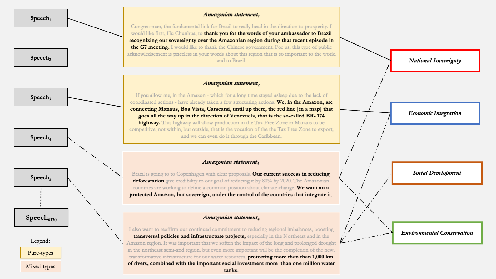

```{=latex}
\keywords{ discourse analysis, transnational governance, environmental policy, Brazilian Amazon, supervised learning, deforestation}
```

```{=latex}
\wordcount{ 10000 (including abstract, text, references, and footnotes)}
```

```{r setup, include=FALSE, warning=FALSE, message=FALSE}
knitr::opts_chunk$set(include = FALSE)
library(dplyr)
library(tidyr)
library(scales)
library(RColorBrewer)
library(stargazer)
library(kableExtra)
library(tibble)
library(ggplot2)
library(plm)
Sys.setlocale("LC_ALL", "C")
options(stringsAsFactors = FALSE, scipen = 999)
```

```{r theme, include=FALSE, warning=FALSE, message=FALSE}
# custom ploting theme for all plots
theme_am <- function(x) {
  theme(text = element_text(size=12,  family="Times"),
        panel.background = element_rect("white", "black", .5, "solid"),
                  panel.grid.major = element_line(color = "grey", linewidth = 0.2,
                                                  linetype = "solid"),
        axis.text = element_text(color = "black", size = 10),
        title = element_text(color = "black", size = 10, face = "bold"),
        legend.title = element_blank(),
        plot.subtitle = element_text(color = "black", size = 9, face = "plain"),
        legend.position = "none")
}
```

```{r data, message=FALSE, warning=FALSE, include=FALSE}
# Load data complete
pop <- readRDS("~/Documents/GitHub/amazondef/Replication_files/BR_presid_speeches_final.Rds")
# Load coded data on Amazonian statements and remove extra variables
ama <- readRDS("~/Documents/GitHub/amazondef/Replication_files/final_data_as.Rds")
ama <- ama %>%
  select(-c(title, date, text, false_positives)) %>%
  rename (ei= "EI", sd= "SD")
# Load annual deforestation rates data, lag years, and fill data
amazon_def_year_lag <- readRDS("~/Documents/GitHub/amazondef/Replication_files//amazon_def_year.Rds")
amazon_def_year_lag$year <- amazon_def_year_lag$year + 1
# Fill missing years are missed with first non missing value.
# This is also consistent with def. rates from literature
adr <- data.frame(year = c(1985, 1986, 1987, 1988),
                  def_year = c(21.050, 21.050, 21.050, 21.050))
amazon_def_year_lag <- rbind(adr, amazon_def_year_lag) # Missing year data
amazon_def_year_lag$def_year <- scales::rescale(amazon_def_year_lag$def_year) # scale def. rates
# Load inflation data, annual
aai <- readRDS("~/Documents/GitHub/amazondef/Replication_Files/AAI.Rds")
aai_2022 <- data.frame("year" = 2022, "AAI" = 5.79) # Add 2022 rates
aai <- rbind(aai_2022, aai)
aai$AAI <- scales::rescale(aai$AAI) # scale annual inflation
# Code PCs as categories
ama_mx <-  ama %>%
  unite(mixed_type, sov:con, sep="_") %>%
  mutate(mx_cat = factor(case_when(mixed_type == '1_0_0_0' ~ 
                                     "Pure National Sovereignty",
                                   mixed_type == '0_1_0_0' ~ 
                                     "Pure Economic Integration", 
                                   mixed_type == '0_0_1_0' ~ 
                                     "Pure Social Development",
                                   mixed_type == '0_0_0_1' ~ 
                                     "Pure Environmental Conservation",
                                   mixed_type == '0_0_0_0' ~ 
                                     "Other",
                                   TRUE ~ "Mixed-types"),
         levels = c("Pure Economic Integration",

                                      year), 1, 0),
        peak_year = ifelse(grepl("1989|1992|2009|2019", year), 1, 0),
        location_cat = factor(case_when(location_cat == "International" ~ 
                                          "Non Amazonian Countries",
                                        location_cat == 
                                          "Amazonian States" ~ 
                                          "Amazonian States",
                                        location_cat == "Amazonian Countries" ~ 
                                          "Amazonian Countries",
                                        TRUE ~ "Non Amazonian States"),
                              levels = c("Amazonian States",
                                         "Amazonian Countries",
                                         "Non Amazonian States",
                                         "Non Amazonian Countries")))
# Get peak years in Amazon speeches, as a control for modelling
mean_perc <- pop %>%
  count(amazon_speech, year) %>%
  group_by(year) %>%
  mutate(perc = n / sum(n)) %>% 
  filter(amazon_speech == 1) %>%
  select(c(year, perc))
mean_perc[mean_perc$perc > mean(mean_perc$perc) + sd(mean_perc$perc),] # 89, 92, 09, 19
# Create/wrangle data for modelling PCs
ama_model_lag <- dplyr::left_join(ama_mx,
                                  amazon_def_year_lag, by = "year") %>%
  dplyr::left_join(aai, by = "year") %>%
  filter(location_cat != "Non Identified") %>%
  mutate(con_vs_all = ifelse(mx_cat == "Pure Environmental Conservation",
                             1, 0),
         EI_vs_all = ifelse(mx_cat == "Pure Economic Integration", 1, 0),
         SD_vs_all = ifelse(mx_cat == "Pure Social Development", 1, 0),
         sov_vs_all = ifelse(mx_cat == "Pure National Sovereignty", 1, 0),
         mixed_vs_all = ifelse(mx_cat == "Mixed-types", 1, 0))
# Create/wrangle data for modelling Amazon speech proportions
ama_model2_lag <- dplyr::select(pop, -text) %>%
  dplyr::left_join(amazon_def_year_lag, by = "year") %>%
  dplyr::left_join(aai, by = "year") %>%
  filter(location_cat != "Non Identified")%>%
  dplyr::mutate(location_cat = ifelse(grepl("parana|paraiba|mato grosso|mato grosso do sul",
                                            location, ignore.case = TRUE),
                                      "Non Amazonian States", location_cat),
         location_cat = ifelse(grepl("paraguay", location, ignore.case = TRUE),
                               "International", location_cat),
         location_cat = ifelse(grepl("Bolivia|Peru|Ecuador|Colombia|Venezuela|Guyana|Suriname",
                                     location), "Amazonian Countries",
                               location_cat),
         location_cat = factor(case_when(location_cat == "International" ~ 
                                          "Non Amazonian Countries",
                                        location_cat == 
                                          "Amazonian States" ~ 
                                          "Amazonian States",
                                        location_cat == "Amazonian Countries" ~ 
                                          "Amazonian Countries",
                                        TRUE ~ "Non Amazonian States"),
                               levels = c("Amazonian States",
                                         "Amazonian Countries",
                                         "Non Amazonian States",
                                         "Non Amazonian Countries")),
         election_year = ifelse(grepl("1989|1994|1998|2002|2006|2010|2014|2018",
                                      year), 1, 0),
         peak_year = ifelse(grepl("1989|1992|2009|2019", year), 1, 0))
```

\pagebreak

> *"[...] I will fight against the NGOs on this issue of associating the increase in deforestation to our agricultural expansion. First of all, these NGOs should go plant trees in their own countries [...]" 
(President Lula, Cuiaba - MT, 2007).*

# 1. Introduction

Scholars studying the Brazilian Amazon often identify different governments throughout Brazilian history as proponents of a single view of the region, its people, and forest [see @drummond2006; @padua2012; @franchini2019; @capobianco2019; @pereira2021]. While the military dictatorship (1964-85) and Bolsonaro’s presidency (2019-2022) are, for example, associated with understanding the Amazon as issues of national sovereignty and economic integration, Sarney’s (1985-1990) and Lula’s (2003-2010) presidencies are associated with environmental conservation. Yet, such representations advance the view that governments understood and acted consistently towards the Amazon as a specific problem, masking government diversity of discursive constructions and policies. In this article, we show where, when, and how the Brazilian Amazon has been constructed as a problem in presidential discourses since 1985. 

By combining @bacchi1999’s theory of problem representation and @keck1998's theory of transnationalism, we place the way the objects of policies are constructed in discourse at the center of our analysis. We offer a framework that explains variation in discursive problem-constructions depending on speech setting and problem pressingness as actors participate and shape transnational politics. We focus on transnational speeches, rather than policies, because they allow us to capture the diversity of ways the Amazon, as a policy object that demands dedicated attention, has been discursively constructed as a problem. While many analyses of Brazilian environmental discourse and policies intend to dissect its national and international nature, they rarely adopt methodological strategies that distinguish how important actors behave differently in both scenarios [@hochstetler2007]. Our framework and methodology help identify and account for these variations. We show, for instance, that when speaking to farmers in Cuiaba, one of Brazil’s agricultural powerhouses, in a moment when the environmental problem is pressing, it is likely that any president would sidestep environmental issues, as President Lula did in the opening epigraph.

To investigate where, when, and how the Brazilian Amazon has been constructed as a problem in presidential speeches, we create a dataset containing 6240 official presidential speeches by all Brazilian presidents since 1985. Next, we identify all instances where presidents refer to the Amazon in their speeches. Using an inductive strategy that goes back and forth between the speeches and the Amazonian literature, we develop a codebook to code how each one of these statements constructs the Amazon as one, or multiple, particular problems related to national sovereignty, economic integration, social development, or environmental conservation. With this codebook in hand, we manually code a randomly selected set of statements and use supervised machine learning to label the remaining observations. We then conduct an inferential and descriptive analysis of the coded data.

We have four main findings. First, we find that presidents adopt different Amazonian constructions  in different settings according to how they expect to leverage audiences for symbolic and/or  material gains. When presidents speak outside (or inside) the Amazon, they are more likely to construct the Amazon as an issue of environmental conservation (or economic integration). Second, presidents often focus on alternative problem-constructions when general aligned problems become more pressing; whereas they boast about positive outcomes when aligned problems are less pressing. When aligned environmental problems are pressing, presidents are likely to construct the Amazon as a different issue such as economic integration. Third, we also find that high-profile environmental related events, which receive strong international media attention, drive up the importance of the Amazon as a general topic in presidential speeches. Alternatively, relevant Amazonian related policies  appear to not to attract much attention. Finally, we find that while all presidents deploy multiple problem-constructions across space and over time, we are now in a period when the dictum between understanding the Amazon as an environment or as an economic issue has been overcome, at least discursively, as Amazonian problem-constructions have become more mixed and balanced. Conceptually, our research shows how focusing on problem-constructions highlight what certain objects of policy are assumed to be, and when they are ignored or privileged, based on the transnational setting of the speech and the pressingness of aligned problems.

In what follows, we start our article by outlining our conceptual framework connecting problem-constructions, transnationalism, and presidential speeches. We then move to a research design section where we describe our data and explain our methodological approach. We open our analysis with our inferential analysis and move to explain developments over time. We conclude by summarizing the empirical and conceptual contributions of the article as well as providing avenues for future research.

# 2. Theory: problem-constructions, transnational settings, and problem pressingness

We divide our theoretical framework in two parts. We start with an explanation of what are problem-constructions and why presidential speeches are an interesting instance to identify them. Next, we argue that problem-constructions can vary depending on the transnational setting of the speech and on the pressingness of its problem.

## 2.1 Problem representation in presidential discourse
 
Social scientists often describe federal governments as proponents of a cohesive set of policies toward the Amazon [see @drummond2006; @padua2012; @franchini2019; @capobianco2019; @pereira2021]. The 1964 military dictatorship, for example, is associated with securing sovereignty in the region by populating it and integrating it into the national economy [@drummond2006]. Whereas, governments from the late-1980s up to the late-2000s are associated with a turn towards policies that focus on environmental conservation of the Amazon [@padua2012]. The presidencies of Rousseff (2011-2016) and Temer (2016-2018) are connected to the de-prioritizing of environmental conservation policies, while Bolsonaro (2019-2022) with the dismantling of environmental policies [@capobianco2019]. Although these works are important to understand how different governments acted towards the Amazon, they represent governments monolithically by bundling them into cohesive policy periods, or policy cycles, with one all-encompassing understanding of the Amazon.

We argue that the reason behind these monolithic representations of governments in literature about the Amazon is conceptual: many studies of the region contain an explicit or implicit assumption of what the “Amazon problem” is. There is more variation within a specific government, though, than suggested by the policy cycle approach. Social scientists have shown how governments have contradictory agrarian policies (López 2023), redistribution policies [@fairfield2017], health policies [@poncedeleon2021], and social policies [@niedzwiecki2017]. In the case of the Amazon, it has often been seen as a key biome in global climate-mitigation, and consequently, as an environmental problem. If the Amazon is thought of as an “environmental” problem, then it demands an “environmental” solution. However, in order to build a more comprehensive account of the Amazon as forest, region, and peoples we need a framework that assumes the possibility of varied problem-constructions beyond Amazonian environmental nature.
 
@bacchi1999 [p. 2] places the question of “what is the problem represented to be” in the center of policy studies. The author argues that “objects or targets of policy [do not exist] independently of the way they are spoken about or represented” [@bacchi1999, p. 1]. These objects of policies have a cultural dimension as they take “shape within specific historical and national or international contexts” [@bacchi2009, p. 10]. The existence or proposal of a policy implies that there is a (public) problem that needs (governmental) action to be fixed. Hence, discourse represents objects of policies as instances of a specific problem, which can be explicit or implicit. Problem-representation matters because it carries implications related to who is involved both in the root causes and in the solutions of the problem [@bacchi1999]. 

Following Bacchi, we place discourse about policy objects in the center of our conceptual framework. We define policy objects as political objects that demand dedicated political attention. We argue that by deciding to speak about a policy object, governments are making a deliberate choice. When speaking about policy objects, governments make a choice to represent, or construct it, as a specific problem. The problem might be either explicitly stated, or implicitly hidden in the underlined solution. This is what we label as problem-constructions.
 
Presidential discourses are a good instance to identify problem-constructions over time. While the relationship between presidential and policy may not be linearly causal, speeches have the power to introduce, define, and justify public policy, as well as shape issue perception to broad audiences [@zarefsky2004]. This is particularly true in the Brazilian context where the executive branch of government, led by the president, has historically been the primary player in shaping public policy, especially after the 1988 constitution [@pinto2016]. In  Brazil’s hybrid system, often referred to Coalitional Presidencialism [@couto2021], presidents build legislative support for a broad agendas through the distribution of positions in the state bureaucracies. This means that presidents have enough power and support to implement the agenda they deem appropriate. Presidential authority and engagement in Brazil, in the form of discursive constructions, bureaucratic appointments, and coalition building, were essential drivers of the policy agenda for diverse issues from human rights to disarmament [@macaulay2017]. We thus consider presidential speeches an adequate instance to identify various problem-constructions for the same policy object.

## 2.2 Transnational settings, pressingness, and variation in problem-constructions

The possibility of different problem-constructions for the same policy object in political discourse, requires an explanation of why they vary. There are two notable contenders for tying the problem-construction to international politics: Putnam’s two-level game and Keck and Sikkink’s transnational networks.
 
@putnam1988 argues that the outcomes of international negotiations lie within the overlap between the interests (and pressure) of domestic and international groups. At the national level, interest groups pressure the government to adopt favorable policies. Internationally, the government seeks to fulfill domestic preferences “while minimizing the adverse consequences of foreign developments” [@putnam1988 p. 434]. While the theory has been expanded to cover multi-levels games [see @collinson1999], its core remains the same: the outcome of negotiations should lie within the overlap of diverse interest groups.
 
This two-level approach is, for example, the avenue pursued by @calderwood2019 and @calderwood2020 who investigates variation in American presidential speeches about climate change. Consistent with the two-level games, the author finds that presidents are more likely to mention climate change outside the US, though the location of the speech (domestic or foreign) can have a small effect on the content of the mention [@calderwood2020]. The party affiliation of American presidents also mediates how they speak about climate change [@calderwood2019]. Thus, adopting a two-level approach to analyze diverse discursive constructions implies that whatever presidents say inside and outside lies within the policy expectations of domestic and foreign interest groups. Consequently, presidential speeches are not necessarily contradictory across venues but a common denominator of the interest of different groups.
 
The two-level game theory implies that actors respond rationally to systemic pressures imposed by their position in relation to interest groups. Its contribution is to propose a connection between the national and international spheres as avenues for state-actors. While there is some evidence of two-level games at play, this view seems incompatible with the possibility of contradictory policies and of varied problem-constructions depending on specific historical contexts, timing, and places. Rather, we start from the idea of transnationalism as relationships that transcends nation-states and incorporates non-state actors, spamming from the local level to the international level [@nye1971; @keck1998]. In this context, international summits are considered a transnational setting because non-state actors participate and shape them. We view, for instance, summits as the United Nations Framework Convention of Climate Change (UNFCCC) not only as a purely intergovernmental body, but as a transnational space composed of international media, corporations, non-governmental organizations, and social movements.
 
@keck1998 theory of international politics as transnational networks reject the dichotomy of international and domestic levels arguing that the identity and goals of state and non-state actors are not derived from their structural location vis-a-vis domestic and foreign interest groups. Rather, international politics as transnational networks have “a structured and structuring dimension” [@keck1998, p. 4]: state and non-state actors participate in and shape international politics.
 
While their theory is developed in the context of value-based advocacy groups, this is non-state actors, the overall view of international politics as structured and structuring, should hold for state actors as well. Important participants of transnational networks, as presidents, have a myriad of tactics to introduce, define, persuade, socialize, and pressure when interacting with other actors. They can create politically meaningful information and/or move it where they believe it can have an impact [@keck1998, p. 24]. Or, they can leverage institutions to realize symbolic or material gains. In this sense, the positions of actors as components of a transnational network derive from complex interactions in which their identities and goals are malleable and can vary depending on the space and time of the interaction. 
 
Problem-constructions are choices made by presidents when speaking. If malleable identities across space and time are a defining feature of transnational politics, it follows that presidents' choice of problem-constructions depend on the president's views of an audience at a certain period. Specifically, how pressing a problem is in a certain space and/or at a certain time. 
 
*Space*

Presidents construct problems and attempt to inform and/or leverage transnational audiences for symbolic or material gains according to their expectations of that audience. We conceptualize spaces in terms of settings. Settings are levels of aggregation for transnational audiences that make sense in light of the object of policy under study. This indicates that how presidents construct policy objects as problems can vary, for instance, within the country — speaking inside the Amazon region versus outside — because presidents identify these audiences as sources of different types of support and demand. The same holds when speaking outside the country — in Amazonian countries, non-Amazonian countries, and international summits — where expectations and identities of audiences could diverge completely from that of domestic actors. In each one of these settings different problems might be more pressing and the president's expectations about what can be leveraged for material and symbolic gains might drive how a problem is implicitly or explicitly constructed.
 
*Time*

How presidents construct policy objects can also vary in time because the pressingness of certain problems change as new information arises. We conceptualize time as the perceived pressingness of a broad and related issue to those surrounding a policy object. This indicates, for instance, that as climate change becomes more pressing and widespread as a broad issue, it is more likely that transnational actors will consider climate change when discussing various forms of public policy. It is likely that when speaking about subsidies for fossil fuel companies in the 1980s, presidents would not mention the dangers of climate change. Conversely, today, if fossil fuel subsidies are discussed, climate change will likely be an issue given the increased pressingness of the topic in comparison to the 1980s.

While time and space might interact, here we are interested in their cumulative effects: when speaking in the 1990s to an audience that finds climate change pressing, certain transnational actors would likely mention it as a problem independently of the perceived  pressingness of a climate breakdown at the time. Accordingly, certain transnational actors might even consider touching upon the issue while speaking at a business association today, because of its urgency. 

Our conceptual framework, thus, combines Bacchi’s theory of problem-representation and Keck and Sikkink’s theory of transnationalism to account for diverse problem-constructions. It explains how and why problem-constructions vary depending on actors’ expectations of a specific audience in a certain setting at a specific moment in time. Audiences relate to the location of the speech and actors’ expectation of what gains can be achieved in that setting. Time concerns to what extent that problem is pressing, or not, at that moment. Conceptually, we provide an explanation that, differently than two-level games, accepts the possibility of diverse, or even contradictory, speeches in space. We tie this to pressingness, which accounts for how problems evolve over time. 

Our framework also helps to advance the literature about the Amazon. We provide an outlook of the region, its people and forest beyond its environmental nature by focusing on different problem-constructions. In doing so, we avoid assuming what type of problem the Amazon is and, instead, focus on how it has been represented as a problem. Furthermore, many analyses of Brazilian environmental policies dissect its national and international nature but fail to adopt methodological strategies that distinguish how important actors behave differently in both scenarios [@hochstetler2007]. Our focus on presidential speeches affords us analytical leverage to identify transnational variation, as speeches take place in multiple settings over time. Finally, presidential speeches in Brazil have been studied for topics such as race relations [@silva2019] and inequality [@grangeia2017]. When it comes to the environment, studies tend to focus primarily  on Bolsonaro’s discourse [see @marquardt2022; @mendes2022] or policies [see @capelari2023]. We argue, however, that a longitudinal view across Brazilian presidents is important to understand how much continuity and change there really is.

# 3. Research design

We start this section by detailing the data and how we operationalize the main variables of our framework. We then move to a section explaining our descriptive and inferential strategy. We discuss the limitations of our approach in each subsection.

## 3.1 Data

To create a dataset containing all Brazilian presidential speeches, we build upon @cezar2020's dataset which contains all speeches from 1985 to 2019. We update the dataset by scraping and adding all official speeches from 2020 to 2022. The final dataset encompasses 6240 speeches, with their dates and speech location. We proceed to identify speeches that refer to the Amazon as a region, people, or forest. We do so by detecting all speeches in which the stem “amazon” appears. In Portuguese, the stem captures terms such as “Amazonia”, “Amazonica”, “Amazonidas”, “Amazonense(s)”, “Amazonas”, among others. We find that 968 speeches are, at least partially, about the Amazon. 

Using the poldis R package [@sposito2021], we extract two sentences before and after the sentence in which the stem “amazon” appears. We opt for picking two sentences around, rather than words, because sentences usually contain a cohesive idea. This is how our unit of analysis, Amazonian statements, are generated. One speech can contain none or multiple Amazonian statements. This process yields 2048 unique Amazonian statements. On average, an Amazonian statement contains 131 words.

Our dataset covers only what is considered an official speech. Presidents, though, give interviews, appear in debates, talk at campaign rallies, and, more recently, post on social media. Problem-construction within presidential discourse, thus, happens in different public, private, and online venues for which we do not account for in this paper.

```{r word_count, eval=FALSE, include=FALSE}
# Total speeches
nrow(pop) # 6240 speeches
# Speeches about the Amazon
sum(pop$amazon_speech) # 968 about Amazon
# Amazonian statements
final_labeled_data <- readRDS("~/Documents/GitHub/amazondef/Replication_Files/final_labeled_data.Rds")
nrow(final_labeled_data) # 2048 Amazonian statements
nrow(ama) # 1924 Amazon statements after removing false positives
# Count average words in Amazonian Statements, using original text data
amazon_speeches_long <- readRDS("~/Documents/GitHub/amazondef/Replication_Files/amazon_speeches_long.Rds")
sum(stringr::str_count(amazon_speeches_long$AM2, '\\w+'))/2048 # 131 words on average
```

## 3.2 Operationalizing Amazonian problem-constructions

To test our conceptual framework, we need to operationalize the possible problem-constructions for the Amazon policy object. To classify Amazonian statements as specific types of problem-constructions, we developed a codebook inductively and with assistance of the literature. We identify three historical-political constructions: national sovereignty, economic integration, and environmental conservation. We argue a fourth separate one also exists: social development. The social development construction focuses on the constitutional rights and dignity of the inhabitants of the Amazonian region.

*National Sovereignty:* In the process of securing Amazonian borders since the 18th century, Brazil thwarted “the imperial ambitions of France, Britain, the United States, Belgium, Bolivia, and Peru” [@hecht1990, p. 8], and when the dust settled and the scramble was over, more than half of the Amazon territory emerged Brazilian. While the Brazilian military diplomacy following the scramble was very successful, the process did not come without its traumas as, for example, the negotiations with Bolivia in 1902 to secure the state of Acre [@hecht1990]. These traumas were referred to, and offered context, to Amazonian discourses and policies that highlighted Brazil’s sovereignty over the Amazon [@rajao2020]. More recently, as we move to a world where non-state actors gain importance in international politics [@silva-muller2022; @andonova2014; @keck1998], sovereignty-related problems become more varied. Threats to national sovereignty, consequently, broaden from nation-states to a wide set of actors. The sovereignty problem-construction advances the view that the Brazilian Amazon belongs to Brazil and any foreign or non-state presence in the region can be part of a broad strategy to take the region. The policy solutions to the issue of sovereignty included the monitoring of the borders and strict regimes related to entry into the region.

*Economic Integration:* The Vargas dictatorship (1937-46) and the military dictatorship (1964-89) took over the task of modernizing the Amazon [@capobianco2019; @becker2005]. In 1966, the Brazilian Military launched ‘Operation Amazon’, a policy to modernize the region based on three assumptions [@acker2021]. First, it assumed that nature should be conquered by mankind. Second, it assumed that exploiting natural resources would render the Amazon region economically profitable. Third, it assumed that populating the region was necessary to integrate it into the country and exert control over the territory. Concretely, this meant a series of major infrastructure projects, incentives for settlers to expand the agricultural frontier, and the establishment of a tax-free zone in Manaus to attract industry. The economic integration problem-construction advances the view that the Brazilian Amazon needs to be developed and modernized. These policy solutions have at their core the development of the necessary infrastructure (physical, fiscal, or monetary) to integrate the region into the national and international economy.

*Environmental Conservation:* The rapid economic changes in the region from the 1960s to the 1980s were matched with the birth of environmental institutions [@drummond2006]. The creation of these institutions stemmed from the impression of the lack of control over the environment following the efforts to economically integrate in the region [@acker2021; @capobianco2021; @hecht1990]. This process accelerated in the late 1980s with the birth of modern environmentalism [@viola1987], epitomized in the 1992 Earth Summit in Rio de Janeiro [@hochstetler2021; @capobianco2021]. The environmental conservation problem-construction emphasizes that the Amazon should be preserved by the creation of protected areas and deforestation should be halted. The policy solution implies, for example, further investments in command-and-control institutions, the valuation of standing ecosystems through incentive schemes, and the creation of protected areas.

*Social Development:* As democracy established itself in Brazil, especially with the 1988 constitution, settlers in the Amazon became electorates with constitutional rights. Governments can emphasize the lack of hospitals, sanitation, and schools concerning peoples’ dignity, standards of living, and other constitutional rights. However, such emphasis can be masked within both the economic integration and environmental conservation accounts. While for some groups, such as indigenous peoples, constitutional rights and preservation of the forest go hand in hand, providing better standards of living to large portions of populations of the Amazonian states and conservation are not necessarily connected. Social development is a problem-construction that focuses on constitutional rights, citizenship, and dignity. The policy solution to social development implies the policies to facilitate access to water, sanitation, electricity, internet, and radio, as well as the construction of schools and hospitals locally.

In their conceptualization, each problem-construction is mutually exclusive; that is, they cover different forms of constructing the Amazon as a problem. However, an Amazonian statement can be coded as referring to multiple problem-constructions (see Figure 1 below). Amazonian statements, thus, can be pure-type statements (i.e. they construct the Amazon as a single problem) or mixed-types (i.e. they construct the Amazon as multiple issues).

````{=tex}
\begin{landscape}

```{r figure1, echo=FALSE, fig.cap="Operationalization of problem-constructions", out.width = '100%', include=TRUE}

```

\end{landscape}
````

With the codebook in hand (see Codebook in appendix), each one of the authors separately hand-coded 1024 randomly selected Amazonian statements. This amount refers to 50% of all the Amazonian statements identified. We chose to hand code half of the observations because there are several nuances in how presidents talk about the Amazon over time. As well, since we have four different code categories, the size of the training set should be increased [see @grimmer2022]. Our hand-coding strategy provides a robust and reliable number of observations to be used for training and validation of the automated model. Once hand coding was completed, the average intercoder agreement for hand-coded categories was 85%. For each non-matching coded observation, the authors discussed and sorted their disagreements, which were subsequently specified in the codebook.

The hand-coded data was then randomly divided into a training set, containing 80% of the data (819 observations), and a validation set, containing the remaining 20% of the data (205 observations). We employ a support-vector machine (SVM) algorithm, a non-probabilistic linear classifier appropriate for binary categories, to label texts [@meyer2021; @noble2006]. To validate the model, the SVM algorithm is trained using the hand-coded training set and employed to classify observations in the validation set. As a final robustness check, the authors randomly select 100 automatically coded statements and find that the automated model is 95% accurate in coding these statements as the authors would. Automating the coding of the remaining half of the observations is estimated to have saved the authors over one month of work in comparison to manual coding. The final dataset for analysis, excluding false positive matches ^[We also train the model to identify false positive matches in Amazonian statements. These are 124 Amazonian Statements that contain the stem “amazon” but are not necessarily meaningful as they might simply salute the governor of the Amazon, for example.], contains 1924 coded Amazonian statements.

## 3.3 Operationalizing Settings and Pressingness

Our explanation for variation in problem-constructions is based on the setting of a speech and the pressingness of an aligned problem. This comprises our independent variables.

*Settings*

Presidents construct problems and attempt to inform or leverage symbolic or material gains according to their expectations of an audience. To operationalize settings, we extract the location of the speech and create four distinct settings: Amazonian states within Brazil, non-Amazonian states within Brazil, Amazonian countries, and non-Amazonian countries. 

Each one of these settings encompasses audiences that can have different expectations in reference to our policy object, the Brazilian Amazon. When speaking at Amazonian states presidents face audiences that likely have distinct social, economic, or environmental demands in relation to the Brazilian Amazon. Such expectations might be distinct from the ones audiences in Brazil, but outside of the Amazonian region, have for the same policy object. 

In the same vein, audiences within Amazonian Countries, these are other countries that also harbor the Amazon Rainforest (e.g. Peru, Colombia, Venezuela, Equator), might have distinct expectations about the policy object in relation to audiences in other countries outside of the Amazonian region (and within Brazil). In bilateral visits to Amazonian countries, presidents can view other Amazonian countries as potential peers governing a transnational policy object and, therefore, shape the ways in which they speak about the Amazon as a problem to those audiences. Alternatively, when speaking at non-Amazonian countries, these also entail speeches that take place within multilateral mechanisms such as the UNFCCC, international summits as the World Economic Forum annual meeting in Davos, or bilateral visits to the United States or France, presidents deploy problem-constructions aligned with what presidents perceive as possible expected symbolic or material gains from such audiences.

This operationalization of settings comes with limitations. While we would ideally like to capture the exact venue of the speech (i.e. multilateral mechanism, private fora, bilateral visit, bridge inauguration), it is difficult to programmatically code exact locations from thousands of speeches that often mention multiple locations in the same text. Nevertheless, we believe the four settings coded are already enough to demonstrate whether, and how, problem-construction might change transnationally.

*Pressingness*

Beyond setting, timing matters because issues aligned to certain problem-constructions vary in their pressingness over time. To capture the pressingness of problems, we use two proxies: lagged deforestation rates in the Brazilian Amazon and annual inflation rates. When deforestation rates are high, the problem of environmental conservation can be perceived as more pressing. Relatedly, when inflation is high, the problem of economic integration issues can be perceived as more pressing. We opt for lagging deforestation rates by one year as the consolidated rates for a certain year are published in the following year. We do not lag inflation since data for it is widely available on a monthly basis. Inflation is taken at the country level, and not at the regional level for Amazonian states, for two reasons. First, we could not find separate inflation data for many of the Amazonian states in Brazil. Second, it is national level data that makes up headlines and often drives price changes across the country. Since both annual deforestation rates and annual inflation rates come in different measurements (i.e. percentage and kilometers square) we scale these values to facilitate interpretation of coefficients. Scaling variables do not affect statistical inference in regression models.

This approach to operationalizing pressingness also has its limitations. Ideally, we would like to add additional proxies of pressingness for social and sovereignty issues. However, social development indicators (e.g. life expectancy, education levels, access to sanitation) generally increased over time in Brazil. In terms of national sovereignty, the way we conceptualize the problem-construction entails internal and external threats which are not easily measured. Despite these limitations, we can draw some conclusions from the pressingness of environmental and economic issues and their aligned problem-constructions.

## 3.4 Inferential and Descriptive Analysis 

We start our analysis with the inferential portion with five separate fixed-effect logistic regression models that predict the probability of a speech mentioning the Amazon generally (model 1), and of each problem-construction (models 2-5). The fixed-effects models are indexed by the president, since each president might have individual-specific characteristics that can influence outcomes (i.e. ideology). For instance, if a president’s political ideology predicts variation in our dependent variables, fixed-effects could control for such issues along other unit-unvarying characteristics [@allison2009]. 

The dependent variables of the model are the share of speeches that mention the Amazon (model 1) and the share of a problem-construction (models 2-5). We chose to model each construction separately, and to focus on pure-types (i.e. statements that construct the Amazon as a single problem), to provide unambiguous interpretations and more robust coefficients. Our main explanatory variables are settings (i.e. Amazonian states within Brazil, non-Amazonian states within Brazil, Amazonian countries, and non-Amazonian countries) and pressingness of an aligned issue (i.e. lagged deforestation rates and average annual inflation), as described above. 

We also add two control variables in the models: election years and peak years. In the case of election years, we control for the possibility of presidents constructing the Amazon in systematically different ways in those years. In the case of peak years, these are years in which the Amazon was disproportionately more mentioned as a share of all presidential speeches. We calculate these by capturing years in which mentions of the Amazon are above one standard deviation from their mean share. Controls for peak years are only added to the models that focus on how the Amazon is constructed as a problem (i.e. models 2-5) for endogeneity reasons since we also model based on the share of Amazonian speeches (i.e.model 1). 

It is important to outline that we do not make any causal claims. Many scholars inquire and find causal relationships between discourse and outcomes. Our research design and data does not allow us to do so. While we might point to particular directions for correlations between where speeches happen, how pressing aligned issues might be at certain times, and at certain specific policy outcomes, none of our claims are linearly causal. Instead, we carefully  focus on the relationships in themselves rather than their order or cause.

We wrap the analysis with a descriptive and longitudinal analysis of Amazonian speeches in time, considering the findings of the models. We, first, identify when presidents speak more, or less, about the Amazon. We do so by visualizing the frequency in which Amazon appears in relation to all presidential speeches since 1985. This helps us identify instances when presidents mention the Amazon more frequently, as well as, when it is not mentioned. In other words, when the Amazon might, or not, be perceived as a problem. Next, we discuss how the Amazon has been constructed as a problem since 1985. We show the evolution of yearly problem-constructions in time by taking the annual share of each problem-construction in Amazonian statements. 

# 4. How has the Brazilian Amazon been constructed as a problem?
 
We open our analysis with the models predicting the probability of presidents mentioning the Amazon in speeches (model 1) and of presidents employing certain problem-construction (model 2-5). Subsequently, we plot and discuss the longitudinal developments of Amazonian speeches and of problem-constructions considering the model results.

## 4.1 The Amazon as a transnational problem: setting and pressingness
 
By combining Bacchi’s theory of problem-representation and Keck and Sikkink’s theory of transnationalism, we argue that presidents’ expectations about an audience at a certain setting and the pressingness of specific problems explain variations in when the Amazon becomes a  problem and how it is constructed as a type of problem it is. Our models, below, confirm the relationships expected by our framework. Multiple, often contradictory, problem-constructions are forwarded across settings as presidents participate and shape transnational politics.

````{=tex}
\begin{landscape}

```{r models president fixed effect, fig.cap="Log odds for fixed-effects logistic regressions indexed by president", echo=FALSE, message=FALSE, warning=FALSE, paged.print=FALSE, include=TRUE, results="asis"}
# Run models
c1 <- plm(con_vs_all ~ as.factor(location_cat) + 
                         def_year + AAI + election_year + peak_year,
                         data = ama_model_lag,
                         model = "within", index = "president")
c2 <- plm(EI_vs_all ~ as.factor(location_cat) +
                         def_year + AAI + election_year + peak_year,
                         data = ama_model_lag,
                         model = "within", index = "president")
c3 <- plm(SD_vs_all ~ as.factor(location_cat) +
                         def_year + AAI + election_year + peak_year,
                         data = ama_model_lag,
                         model = "within", index = "president")
c4 <- plm(sov_vs_all ~ as.factor(location_cat) +
                         def_year + AAI + election_year + peak_year,
                         data = ama_model_lag,
                         model = "within", index = "president")
c5 <- plm(amazon_speech ~ as.factor(location_cat) +
                         def_year + AAI +  election_year,
                         data = ama_model2_lag,
                         model = "within", index = "president")
# Regression table                       
stargazer::stargazer(c5, c1, c2, c3, c4, digits = 3, no.space = TRUE,
                     title = "Log odds for fixed-effects logistic regressions indexed by president",
                      column.sep.width = "-12pt",
                      font.size="small",
                      dep.var.labels = c("Amazon Speech",
                                         "Environmental Conservation",
                                         "Economic Integration",
                                         "Social Development",
                                         "National Sovereignty"),
                     covariate.labels = c("Amazonian Countries",
                                          "Non Amazonian States",
                                          "Non Amazonian Countries",
                                          "Deforestation",
                                          "Inflation",
                                          "Election Year",
                                          "Peak years"))
```

\end{landscape}
````

As we argue that the effects of setting and pressingness are cumulative, we start by first scrutinizing the relationship between the former and problem-construction. Model 1 addresses the question of when the Amazon is a problem to begin with. We model the probability of a speech generally mentioning the Amazon in relation to the reference category, Amazonian States within Brazil. The findings are intuitive: the likelihood of mentioning the Amazon in speeches decreases as presidents move away from the region and biome.

The following models (2-5) address the question of how the Amazon is constructed as a problem in presidential speeches depending on where presidents are speaking. In terms of environmental conservation (model 2), we observe that when speaking at non-Amazonian countries, be it in international summits, bilateral meetings, or fora, presidents are much more likely to construct the Amazon as an issue of environmental conservation, in relation to when they speak within Amazonian states in Brazil (reference category). To a lesser extent, this also holds for when presidents speak in non-Amazonian states within Brazil where they are more likely to construct the Amazon as an issue of environmental conservation. While the results for economic integration (model 3) and social development (model 4) problem-constructions are not as robust, they are strong enough to suggest the opposite direction. Social development problem-constructions are less likely to be deployed outside of Brazil, in both Amazonian and non-Amazonian countries, than within Brazil. Relatedly, economic integration problem-constructions become less likely to be deployed as we move far away from the Amazon states within and neighboring Amazonian countries. Finally, when it comes to national sovereignty (model 5), the problem-constructions are more likely to take place when presidents speak at non-Amazonian states in Brazil than when they are speaking elsewhere.

Overall, we interpret these results as evidence that presidents construct the Amazon as different problems based on their expectations of an audience at certain settings. When it comes to non-Amazonian countries, it is likely that Brazilian presidents construct the Amazon as an issue of environmental conservation to leverage financial support for the Amazonian region. The Brazilian government successfully funded domestic public policy with transnational financial support on several occasions since the 1990s, most notably with the Amazon Fund or policies in the Amazon which provided over USD 1 billion for the region along with multiple bilateral and philanthropic grants [@silva-muller2022]. That is, presidents realize material and symbolic gains outside of Brazil and of Amazonian countries, by constructing the Amazon as an environmental problem.  
 
In turn, when speaking within the Brazilian Amazon, presidents see their audiences as local constituencies. Therefore, it is no surprise that presidents never stopped pursuing a national agenda of economic integration and social development within Brazil while, concurrently, financing environmental policies with transnational funds. For example, rural credit offered to local agricultural producers in Amazonian states went up from 500 million reais a year in 1999, to over 4 billion reais a year by 2012 [@capobianco2021]. As well, the special fiscal regime in Manaus, designed to increase industry presence in the region, was largely maintained. Moreover, additional roads and dams (e.g. the BR-163 highway and the Belo Monte dam and hydroelectric power plant) were constructed during the same period. Presidents likely highlight and push for economic and social problem-constructions within the Amazon as they speak to voters to whom they are constitutionally accountable and who are perceived as more interested in socio-economic problems than environmental ones.
 
We also argue that the pressingness of an aligned problem in time influences the likelihood of the president mentioning the Amazon and what they will say. We find evidence across our models that this holds. For instance, we find that presidents are less likely to generally mention the Amazon in speeches when deforestation rates increase and so the pressingness of environmental problems (model 1). The opposite is true for inflation. As inflation increases, and so the pressingness of economic problems, presidents are more likely to generally mention the  Amazon in speeches (model 1). This relationship is even more interesting when we look at how amazonian constructions vary in presidential speeches as environmental or economic problems become more pressing (models 2-3). We find strong evidence that when the pressingness of environmental problems increases, the probability of presidents constructing the Amazon as an environmental conservation problem decreases and the probability of constructing it as an issue of economic integration increases. Alternatively, as the pressingness of economic problems increases, the probability of presidents constructing the Amazon as an issue of economic integration decreases and the probability of constructing it as an issue of environmental conservation  increases.
 
In line with our framework, the pressingness of aligned problems relates to problem-constructions in intricate ways. Presidents often opt for an alternative problem-construction than the construction that aligns with the more pressing issues. By opting for an alternative problem-construction to that which is pressing, presidents can side-step an issue and shift the focus to something else. In turn, when issues are not pressing, presidents often opt for employing aligned constructions. This entails that presidents attempt to collect symbolic and material rewards for positive aligned outcomes. 
 
Overall, our models suggest that presidents’ promotion of economic integration and social development within Brazil, and neighboring Amazonian countries to a certain extent, diverge from the promotion of environmental constructions in non-Amazonian countries. That is, presidents talk to the economic or social needs of audiences within Brazil, while focusing on environmentalism outside (and far away) of the Amazon. Additionally the pressingness of environmental and economic problems in time drive opposite problem-constructions. That is, presidents likely side-step issues as they get more pressing, while boosting positive aligned outcomes to attempt and collect benefits as aligned issues become less pressing.

## 4.2 Amazonian speeches in time

Looking at speeches that mention the Amazon in time (the dependent variable of model 1) reviews several interesting trends. Figure 2, below, shows the proportion of speeches that mentions the Amazon in relation to all speeches in a year. By investigating its development in time, we can identify instances when the Amazon in itself becomes more pressing as a problem, and when not. On average, presidents mention the Amazon in 15.5% of their speeches ^[For comparison purposes, the averages for other policy objects in the same corpus of speeches are inequality (13.7%), criminality (17.3%), inflation (19.1%), and unemployment (13.3%).]. This suggests the Amazon is a topic of relative high importance for presidents generally. However, we observe four peak years in the figure: 1989, 1992, 2009, and 2019. As discussed above, peak years represent years in which the Amazon is mentioned, on average, more than one standard deviation from the mean. We find that these peak years coincide with high-profile environmental events, but not with domestic policy adoption.

```{r Figure speeches, fig.cap="Amazonian speeches in time", echo=FALSE, message=FALSE, warning=FALSE, paged.print=TRUE, include=TRUE}
pop %>%
  count(amazon_speech, year) %>%
  group_by(year) %>%
  mutate(perc = n / sum(n)) %>% 
  filter(amazon_speech == 1) %>% 
  select(c(perc, amazon_speech, year)) %>%
  ggplot(., aes(x = year, y = perc)) +
  geom_line(color = "darkgreen") +
  geom_line(aes(y=mean(perc)), color="black", linewidth=.5, linetype="dotted")+
  scale_y_continuous(labels = percent_format()) + 
  annotate("text", x = 1985, y = 0.165, label = "15.5%", size = 3.5)+
  annotate("text", x = 1988.7, y = 0.345, label = "Murder of\nChico Mendes", size = 3)+
  annotate("text", x = 1992.5, y = 0.26, label = "Earth Summit", size = 3)+
  annotate("text", x = 2009, y = 0.24, label = "Copenhagen Summit", size = 3)+
  annotate("text", x = 2019, y = 0.26, label = "2019 Record\nAugust Fires", size=3) +
  labs(x = "", y = "",
       title = "Share of speeches that mention the Amazon per year",
       subtitle = "Sample composed by all 6240 speeches since 1985",
       color='Y series') +
  theme_am()
```

```{r comparisonq, eval=FALSE, include=FALSE}
mean(mean_perc$perc) # 15.53 mean for Amazonian speeches
# Comparison with inflation, criminality, unemployment, and inequality
pop %>%
  mutate(desigual = ifelse(grepl("desigual", text,
                                 ignore.case = TRUE), 1, 0),
         crime = ifelse(grepl("violencia|crime|criminalidade|seguranca publica",
                              text, ignore.case = TRUE), 1, 0),
         inf = ifelse(grepl("inflacao|inflaçao",
                             text, ignore.case = TRUE), 1, 0),
         unemploy = ifelse(grepl("desempreg",
                             text, ignore.case = TRUE), 1, 0)) %>%
  summarise(desigual = mean(desigual),
            crime = mean(crime),
            inf = mean(inf),
            unemploy = mean(unemploy))
```

In 1989 the Amazon appeared in 32% of all speeches. This coincides with the brutal murder of the environmental activist Chico Mendes in the last days of 1988. The incident caught unprecedented transnational media attention and then President Sarney (1985-1989) responded to this with a set of policies to address deforestation [@capobianco2021]. One of the responses was the offer and acceptance to host the 1992 Earth Summit [@keck1998], which also led to a peak in 1992. During the summit, we saw the realization of the first transnational partnership for the Amazon, the Pilot Programme of the G7 for the Protection of Rainforest (PPG7), which brought a high number of financial resources to the region for public policy implementation [@capobianco2021].
 
Throughout the rest of the 1990s and 2000s, during the Cardoso (1995-2002) and Lula presidencies, the Amazon as a topic did not diverge much from the average. This is aligned with our model as the pressingness of the environmental problem was high during the period. In 2009, however, we observed another peak which coincided with the Copenhagen Summit. Lula led the delegation to the summit with a strong climate leadership self-image of “we deliver” [@franchini2019], in a moment when deforestation rates have been decreasing since 2005. From 2010 to 2016, except for 2015 when the Paris summit took place, we see a general decrease in mentions of the Amazon in all official presidential speeches. In this period,  the pressingness of environmental problems was increasing as deforestation rates were rising. The period was also marked by political and economic instability which culminated in the impeachment of President Rousseff in 2016. By 2016 mentions of Amazon in official speeches went down to 6%, their lowest share since 1985.

We subsequently observe a steady increase reaching 24% in 2019, the first year of Bolsonaro’s presidency. At the time, international and national media brought attention to record burning of the Amazon, which led up to a red sky afternoon in São Paulo in August 2019. Right after being elected in 2018, Bolsonaro went on to retrieve Brazil’s hosting status for COP25. Alongside, Bolsonaro’s dismantling of environmental governance and the threats to leave the Paris Agreement had strong media attention, and, as a response, the topic became prominent in his speeches. Finally, although not technically a peak year, in 2022 environmental activist, Bruno Mendes, and British journalist, Dom Phillips, were murdered in the Amazon [@mccoy2022]. This event also drove the proportion of speeches mentioning the Amazon up. 

The figure 2, above, also shows that the frequency in which the Amazon is mentioned, as a general topic in speeches, is not related by proposed policy solutions. In 2000, for instance, Brazil adopted a strong legislation regulating the creation of protected areas [@silva-muller2022]. In 2004, President Lula decreed the creation of Brazil’s Plan to Combat and Control Deforestation in the Brazilian Amazon. In 2008, Brazil announced the Amazon Fund, the largest fund of this kind ever created. Finally, in 2012, the revision of the Forest Code, debated in 2010 and 2011, pardoned thousands of illegal deforesters in the Amazon [@sant2021]. Yet, these policy landmarks do not seem to be systematically meaningful for when Amazon is mentioned as a general problem more often. 
 
The longitudinal trends in Amazonian speeches reveal a dynamic that our models did not capture: we find that all peak years relate to high-profile environmental events within the country that gained large repercussions within and outside of the country. These are events that received distinct coverage from transnational actors as media and civil society outside of Brazil, which is likely one of the reasons why it temporarily drives the topic up. This suggests that the Amazon is mentioned more in presidential speeches as transnational attention towards it increases. While our measure of pressingness of the environmental problem does not capture these events, these events change how pressing of a problem the Amazon is in certain years. In doing so, these events bring outside attention to the Amazon to which the president's response is more likely to be in the form of reaffirming Brazil’s sovereignty over the Amazon (model 5). That is, presidents tend to construct the Amazon as an issue of national sovereignty and side-step the aligned environmental conservation constructions around high-profile environmentally related events.

## 4.3 Amazonian problem-constructions in time

While we identified the effects of setting and pressingness on problem-constructions (models 2-5), the developments of problem-constructions in time also reveal unique trends. In this section, we investigate how pure-types and mixed-types problem-constructions evolved over time. Figure 3, below, illustrates the annual share of pure-types problem-constructions.

```{r Figure pure, fig.cap="Pure-types constructions in time", echo=FALSE, message=FALSE, warning=FALSE, paged.print=FALSE, include=TRUE}
#summary(as.factor(ama_mx$mx_cat))
ama_mx %>%
  count(mx_cat, year) %>%
  group_by(year) %>%
  mutate(perc = n / sum(n)) %>% 
  filter(mx_cat != "Other",
         mx_cat != "Mixed-types") %>%
  ggplot() +
  geom_smooth(aes(x=as.numeric(year), y = perc, color = mx_cat),
              se = FALSE, linewidth =0.75, linetype="solid") +
  scale_y_continuous(labels = percent_format(accuracy = 1)) +
  labs(x = "", y = "", title ="Share of pure-types problem-constructions by year",
       subtitle = "Sample composed by 1924 Amazonian statements in presidential speeches since 1985",
       caption = "Curves in the plot were smoothed using loess method.") +
  theme_am() +
  theme(legend.position = "bottom") +
  scale_color_discrete(labels = c("Economic Integration", "Environmental Conservation",
                                  "Social Development", "National Sovereinty"))
```

Pure economic integration constructions were the most frequent from 1985 to 2009. This is especially pertinent during Cardoso’s presidency (1995-2002), when construction of the Amazon as an issue of economic integration increased while environmental conservation constructions decreased. This was a period when the pressingness of the environmental problem grew as deforestation rates were increasing, so presidents were more likely to avoid environmental conservation constructions. When Lula took office (2003-2010), construction of the Amazon as an issue of environmental conservation and social development increased. During this period, the pressingness of environmental problems decreased along with deforestation rates, so presidents are more likely to employ environmental conservation constructions. From around 2010 until the mid-2010s, especially during the Rousseff (2011-2016) administration, we see a reversal at the top whereas environmental conservation and social development problem-constructions surpass economic integration. However, this reversal was not long-standing. With the presidencies of Temer (2016-2018) and Bolsonaro (2019-2022), economic integration constructions become the most favored again.
 
We also notice a steady increase of sovereignty as salient problem-constructions from 2008 onwards, much before Bolsonaro was elected. This might relate to policy developments that were taking place. The revision of the Forest Code, adopted in 2012, inaugurated a new phase of strong representation of agri-businesses in government and congress and, consequently, strong civil society criticism of government [@horochovski2016; @castelo2015]. In a period when sovereignty-related issues broadened from nation-states to a wider set of actors, presidents might become more assertive about Brazil’s sovereignty over the Amazon while rebating  broad criticism from civil society actors with accusations of internationalization attempts. Therefore, the political forces in Brazilian politics that drove policy and discursive changes in problem-construction were long in the making. Bolsonaro’s problem-constructions, characterized by a unique combination of economic integration and sovereignty, is the strongest form of this shift.
 
Our operationalization of problem-constructions also foresees the possibility of presidents mixing multiple constructions within the same Amazonian Statement. Figure 4, below, shows that constructing the Amazon as multiple issues increased from 18%, in 1985, to 29%, in 2022, as a share of all constructions. Mixed-type problem-constructions in discourse offer more complex and balanced understandings of the Amazon as a problem. The increase in mixed-type constructions suggests that later presidents see the Amazon as an important mix of environmental, economic, social, and sovereignty-related problems.  Indeed, we observe an increase in policies that attempt to address environmental and social problems, for instance, at the same time. Examples of this are payment for ecosystem services conditioned for low income populations residing in the Amazon, as Bolsa Floresta [@silva-muller2022] or Bolsa Verde [@abers2019]. Relatedly, this is aligned with transnational processes as the Millennium Development Goals and the Sustainable Development goals, that highlight the importance of forward human well-being in the economic, social, and environmental spheres.

```{r Figure mixed, fig.cap="Mixed-types problem constructions in time", echo=FALSE, message=FALSE, warning=FALSE, paged.print=FALSE, include=TRUE}
#summary(as.factor(ama_mx$mx_cat))
ama_mx %>%
  count(mx_cat, year) %>%
  group_by(year) %>%
  mutate(perc = n / sum(n)) %>% 
  filter(mx_cat == "Mixed-types") %>%
  ggplot() +
  geom_smooth(aes(x=as.numeric(year), y = perc, color = mx_cat),
              se = FALSE, linewidth =0.75, linetype="solid") +
  scale_y_continuous(labels = percent_format(accuracy = 1)) +
  labs(x = "", y = "", title ="Share of mixed-types problem-constructions by year",
       subtitle = "Sample composed by 1924 Amazonian statements in presidential speeches since 1985",
       caption = "Curves in the plot were smoothed using loess method.") +
  theme_am() +
  scale_color_manual(values = "yellow3")
```

We interpret the balance in pure-types and the increase in mixed-types as evidence that presidents increasingly find ways to reconcile the dictum between the economy and the environment that had prevailed in the previous years decades. We see in these findings the possibility of the Amazon becoming an increasingly coherent transnational problem, where audiences do not only recognize it as a single pure-type but an intricate policy object.

# 5. Conclusion

This paper investigated where, when, and how the Brazilian Amazon has been constructed as a problem in Brazilian presidential speeches since 1985. We have four main empirical findings. First, we find that presidents construct the Amazon as different problems depending on where they speak. When presidents speak outside the country and far away from the Amazon, they are more likely to construct the Amazon as an issue of environmental conservation. Within the country or the Amazonian region, presidents prefer constructing the Amazon as issues of social development and economic integration. Second, we find that presidents are likely to construct the Amazon as an environmental conservation problem when environmental related issues are not pressing (e.g. low deforestation rates). When environmental related problems become more pressing (e.g. rising deforestation rates), presidents tend to side-step the issue and construct the Amazon as different issues as economic integration. Third, we find that high-profile environmental events, which receive strong international media attention, drive up the frequency in which the Amazon appears in discourse. Relevant Amazonian related policies, in turn, appear not to affect how much discursive attention is paid to the Amazon by presidents. Finally, we find that we are now in a period where the dictum between seeing the Amazon as an environment or an economic issue has been overcome, at least discursively, as Amazonian problem-constructions have become more mixed and balanced lately.

Our framework also helps to advance the Amazonian literature in two ways. First, we provide an outlook of the region, its people and forest beyond its environmental nature by focusing on different problem-constructions. In so doing, we avoid assuming what type of problem the Amazon is and, instead, focus on how it has been represented. Second, while many analyses of Brazilian environmental policies intend to dissect its national and international nature, they rarely adopt methodological strategies that distinguish how important actors behave differently in both scenarios (Hoschstetler and Keck, 2004). Our focus on presidential speeches affords us analytical leverage to identify transnational variation, as speeches take place in multiple settings over time. In doing so, we can contextualize problem-constructions in time and space.

The conceptual implications of our findings are threefold. First, we argue that a focus on problem-constructions complements policy studies Investigating problem-representation to begin with, can highlight the extent at which certain perspectives of problems are ignored or privileged. Second, we argue that transnational setting is a key factor that drives problem-construction. While existing studies identify a convergence in positions because of interest group pressure, we account for diverging, and even contradictory, problem-constructions in discourse. This is because state and non-state actors have expectations of a particular audience. Third, we argue that another key factor in explaining variation in problem-construction is the pressingness of specific problems in time. As the environmental crisis increases in its salience, important actors are less likely to simply ignore it. They need to find strategies, such as side-stepping issues or boasting positive outcomes, in order to remain credible to their audiences.

In terms of future research, we see at least three possibilities. First, we have introduced a flexible framework that can be extended to cover other policy objects. We expect to inspire some to investigate other policy objects in domains beyond the Brazilian Amazon (e.g. Cerrado Biome, Antarctic, Inequality, Criminality, etc.). This opens up the possibility of interesting time and space  comparisons. Relatedly, as we find evidence that problem-constructions in Amazonian countries differ from other settings, scholars should investigate how Amazonian problem-constructions in other Amazonian countries differ, and not, from the ones we see in the Brazilian case. Second, while we argue that settings are important to explaining variation in problem-constructions, social media can change this in fundamental ways. As short videos of presidential discourses travel more rapidly than ever, social media might contribute to diminishing the importance of physical settings. This could make presidents less likely to afford very diverging problem-constructions anymore. Alternatively, micro-targeting of social media algorithms could enhance how different problem-constructions are distributed to audiences. We look forward to works that investigate how setting and audience interact with problem-construction in unofficial political communications in the era of social media. Finally, while we do not explicitly conceptualize the possibility of problem-constructions having a direct effect on policy outcomes, it is possible, though, to design studies that test the causal relationship between presidential discourse and outcomes. In a forthcoming article, Ajzenman, Cavalcanti, and Da Mata (2020) propose an identification strategy that ties Bolsonaro’s speech to covid-19 infections. We look forward to studies that identify how different problem-constructions affect (environmental) outcomes in more direct ways.

# Acknowledgements

The authors are extremely grateful to Graziella Moraes Silva, James Hollway, and Matias López for their support. The authors would also like the two anonymous reviewers for their comments and suggestions. Finally, we would like to thank Anna, Federico, Mario, and Rodrigo for their invaluable help.

# Disclosure Statement

The authors report that there are no competing interests to declare.

# References

::: {#refs}
:::

# Appendix

````{=tex}
\begin{landscape}

```{r codebook, fig.cap="Codebook", echo=FALSE, message=FALSE, warning=FALSE, paged.print=TRUE, include=TRUE}
codebook <- tibble::tibble("problem-construction" = c("National Sovereignty", "Economic Integration","Social Development", "Environmental Conservation"),
                           Description = c("This code constructs the Amazon region and/or forest as an issue of national sovereignty. We understand claims of sovereignty as a particular problem-construction that touches on imaginaries of external threats to territory. Relatedly, we also understand sovereignty as raising concerns about wrong perspectives and criticism from foreign and non-state actors about government action related to the Brazilian Amazon. In all, it advances the view that the Amazon is Brazilian, foreign, and non-state presence in the region needs to be monitored closely.","This code constructs the Amazon region and/or forest as an issue of economic integration. It advances the view that the Amazon needs to be developed and connected to the national economy. This includes expanding the agricultural frontier through incentives, creating a diverse set of infrastructure (roads, dams, internet, radio, energy), fostering differing industries (tourism, mining, cattle, agriculture and so on) through tax-free zones, as well as facilitating the exploitation of natural resources for developmental purposes.", "This code constructs the Amazon region and/or forest as an issue of social development. It advances the view that Amazon is full of citizens who should have their rights guaranteed. This refers to the construction of schools and universities (right to education), of hospitals (right to health), and of housing (right to house). This also includes guarantees of a dignified life with decent employment, access to water and sanitation, as well as access to electricity, internet, radio, and light. Finally, this includes referrals to culture and the right to vote.", "This code constructs the Amazon region and/or forest as an issue of conservation. This problem-construction focuses on the value of a standing forest and of the preserved ecosystem in the region. The conservationist narrative advances the view that Amazon should be preserved, deforestation should be halted, and the practices of indigenous and traditional populations should be maintained and fostered. It advances the view that the emission of greenhouse gasses should be halted, that renewable energy should be supported, and that protected areas should be created."), Example = c("Congressman, the fundamental link for Brazil to really head in the direction to prosperity. I would like first, Hu Chunhua,  to thank you for the words of your ambassador to Brazil recognizing our sovereignty over the Amazonian region during that recent episode in the G7 meeting. I would like to thank the Chinese government. For us, this type of public acknowledgement is priceless in your words about this region that is so important to the world and to Brazil. (Bolsonaro 25/10/2019)",
                                       "If you allow me, in the Amazon - which for a long time stayed asleep due to the lack of coordinated actions - have already taken a few structuring actions. We, in the Amazon, are connecting Manuas, Boa Vista, Caracarai, until up there, the red line [in a map] that goes all the way up in the direction of Venezuela, that is the so-called  BR-174 highway. This highway will allow production in the Tax Free Zone in Manaus to be competitive, not within, but outside, that is the vocation of the the Tax Free Zone to export; and we can even do it through the Caribbean (Cardoso 02/07/1997)",
                                       "The state does not work for profits, the state needs to guarantee dignity, we find that a citizen who lives in the riverside of the Amazon river, 600 kilometers from Manaus, has the right to have the electricity in their house, to owe a fridge, to owe a television where to watch the soap operas. We have invested over 14 billion reais in this program, in three and a half years. Do you know how many electrical lines we have already built? One million kilometers of lines. (Lula 20/11/2009)",
                                       "I have put in place emergency measures, I have suspended the exports of wood logs, I have suspended the fiscal incentives and credits to projects that could damage the environment in the amazon and I have made a license mandatory to gold mining that prohibits utilizing mercury in the process. This began the restructuring of the governmental system of control and preservation of the environment, I have created the Brazilian Institute for the Environment and Natural Resources [IBAMA], which will be headed by Dr. Mesquita (Sarney 20/07/1989)"))

kbl(codebook, booktabs = T, caption = "Amazonian Problem-Construction Codebook") %>% kable_styling(latex_options = c("striped", "repeat_header", "scale_down"),position= "center", font_size = 9, full_width = TRUE) %>% column_spec(1, width="3cm", bold=TRUE) %>% column_spec(2, width="9cm") %>% column_spec(3, width = "9cm")
```

\end{landscape}
````

````{=tex}
\begin{landscape}

```{r odds ratio, fig.cap = "Odds-ratio and confidence intervals for fixed-effects logistic regressions indexed by president", echo=FALSE, message=FALSE, warning=FALSE, paged.print=FALSE, include=TRUE, results="asis"}
# Calculate the custom CIs
ci1 <- exp(confint(c1))
ci2 <- exp(confint(c2))
ci3 <- exp(confint(c3))
ci4 <- exp(confint(c4))
ci5 <- exp(confint(c5))
# Regression table                       
stargazer::stargazer(c5, c1, c2, c3, c4, digits = 3, no.space = TRUE,
                     title = "Odds-ratio for fixed-effects logistic regressions indexed by president",
                     ci = T, apply.coef = exp,
                     ci.custom = list(ci5, ci1, ci2, ci3, ci4, ci5),
                     t.auto=F, p.auto=F,
                      column.sep.width = "-12pt",
                      font.size="small",
                      dep.var.labels = c("Amazon Speech",
                                         "Environmental Conservation",
                                         "Economic Integration",
                                         "Social Development",
                                         "National Sovereignty"),
                     covariate.labels = c("Amazonian Countries",
                                          "Non Amazonian States",
                                          "Non Amazonian Countries",
                                          "Deforestation",
                                          "Inflation",
                                          "Election Year",
                                          "Peak years"))
```

\end{landscape}
````
