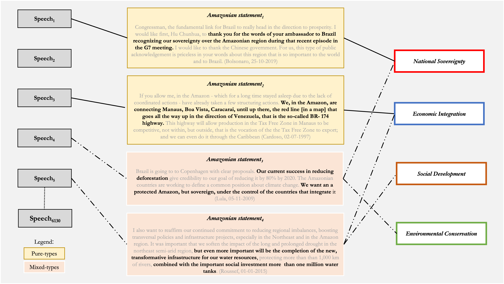

```{=latex}
\keywords{ discourse analysis, transnational governance, environmental policy, Brazilian Amazon, supervised learning, deforestation}
```

```{=latex}
\wordcount{ 8299 (including abstract, text, references, and footnotes)}
```

```{=latex}
\wv{ }
```

```{r setup, include=FALSE, warning=FALSE, message=FALSE}
knitr::opts_chunk$set(include = FALSE)
library(dplyr)
library(tidyr)
library(scales)
library(RColorBrewer)
library(stargazer)
library(kableExtra)
library(tibble)
library(readxl)
library(ggplot2)
library(gridExtra)
library(modelsummary)
library(plm)
Sys.setlocale("LC_ALL", "C")
options(stringsAsFactors = FALSE, scipen = 999)
```

```{r data, message=FALSE, warning=FALSE, include=FALSE}
# Load data
pop <- readRDS("~/Documents/GitHub/amazondef/Replication_files/BR_presid_speeches_final.Rds")
ama <- readRDS("~/Documents/GitHub/amazondef/Replication_files/final_data_as.Rds")
ama <- ama %>% select(-c(title, date, text, false_positives)) %>% rename (ei= "EI", sd= "SD")
AAI <- readRDS("~/Documents/GitHub/amazondef/Replication_files//AAI.Rds")
location_km <- read_excel("~/Documents/GitHub/amazondef/Replication_Files/location_km.xlsx") %>%
  select(-location_cat) %>%
  distinct()
ama <- left_join(ama, location_km, by = "location")
amazon_def_year <- readRDS("~/Documents/GitHub/amazondef/Replication_files//amazon_def_year.Rds")
amazon_def_year$year <- amazon_def_year$year + 1
adr <- data.frame(year = c(1985, 1986, 1987, 1988),
def_year = c(21.050, 21.050, 21.050, 21.050))
amazon_def_year <- rbind(adr, amazon_def_year) # Missing year data 
hp = data.frame(beg = c(1985, 1990, 1993, 1994, 2002, 2010, 2016, 2018),
                end = c(1990, 1993, 1994, 2002, 2010, 2016, 2018, 2022),
                label = c(1987, 1991, 1993, 1998, 2006, 2013, 2017, 2020),
                presid = c("Sarney", "Collor", "Franco", "Cardoso", "Lula",
                           "Rousseff", "Temer", "Bolsonaro"))
amazon_def_year$area <- amazon_def_year$def_year*1000
# Prepare data for problem-constructions
sov <- ama %>% 
  filter(sov==1) %>% 
  count(sov, year) %>%
  group_by(year) %>%
  select(-c(sov))%>%
  rename (sov = n)
ei <- ama %>% 
  filter(ei==1) %>% 
  count(ei, year) %>%
  group_by(year) %>%
  select(-c(ei))%>%
  rename (ei = n) %>%
  ungroup() %>%
  tibble::add_row(year = 2017, ei = 0) %>%
  tibble::add_row(year = 2018, ei = 0)
sd <- ama %>% 
  filter(sd==1) %>% 
  count(sd, year) %>%
  group_by(year) %>%
  select(-c(sd))%>%
  rename (sd = n)
con <- ama %>% 
  filter(con==1) %>% 
  count(con, year) %>%
  group_by(year) %>%
  select(-c(con))%>%
  rename (con = n)
other <- ama %>% 
  filter(other==1) %>% 
  count(other, year) %>%
  group_by(year) %>%
  select(-c(other))%>%
  rename (other = n)
temp <- ei %>% 
  left_join(other) %>% 
  left_join(con) %>% 
  left_join(sd) %>% 
  left_join(sov) %>% 
  replace(is.na(.), 0)
# Get mixed types in
ama_mx <-  ama %>%
  unite(mixed_type, sov:con, sep="_") %>%
  mutate(mx_cat = factor(case_when(mixed_type == '1_0_0_0' ~ "Pure National Sovereignty",
                                   mixed_type == '0_1_0_0' ~ "Pure Economic Integration", 
                                   mixed_type == '0_0_1_0' ~ "Pure Social Development",
                                   mixed_type == '0_0_0_1' ~ "Pure Environmental Conservation",
                                   mixed_type == '0_0_0_0' ~ "Other",
                                   mixed_type == '0_1_0_1' ~ "Economic Conservation",
                                   mixed_type == '0_1_1_0' ~ "Social Economic",
                                   mixed_type == '1_0_0_1' ~ "Sovereign Conservation",
                                   mixed_type == '0_1_1_1' ~ "Economic, Social,\nand Conservation",
                                   mixed_type == '1_1_0_0' ~ "Economic Sovereignty",
                                   mixed_type == '0_0_1_1' ~ "Social Conservation",
                                   grepl("1_0_1_0|1_0_1_0|1_0_1_1|1_1_0_1|1_1_1_0|1_1_1_1",
                                         mixed_type) ~ "Other Mixed-types"),
         levels = c("Pure Economic Integration", "Pure Environmental Conservation",
                    "Pure Social Development",
                    "Pure National Sovereignty", "Other", "Economic Conservation", 
                    "Social Economic", "Sovereign Conservation",
                    "Economic, Social,\nand Conservation",
                    "Economic Sovereignty", "Social Conservation", "Other Mixed-types")),
         mx_cat2 = case_when(grepl("Pure Economic Integration|Pure Environmental Conservation|
                                   |Pure Social Development|Pure National Sovereignty",
                                   mx_cat) ~ "Pure-types",
                             grepl("^Other$", mx_cat) ~ "Other",
                             grepl("Economic Conservation|Social Economic|Sovereign Conservation|
                                   |Economic, Social,\nand Conservation|Economic Sovereignty|
                                   |Social Conservation|Other Mixed-types",
                                   mx_cat) ~ "Mixed-types"),
        election_year = ifelse(grepl("1989|1994|1998|2002|2006|2010|2014|2018",
                                      year), 1, 0),
        peak_year = ifelse(grepl("1989|1992|2009|2015|2019", year), 1, 0),
        py_1989=ifelse(grepl("1989", year), 1, 0),
        py_1992=ifelse(grepl("1992", year), 1, 0),
        py_2009=ifelse(grepl("2009", year), 1, 0),
        py_2015=ifelse(grepl("2015", year), 1, 0),
        py_2019=ifelse(grepl("2019", year), 1, 0),
        location_cat = ifelse(grepl("parana|paraiba|mato grosso|mato grosso do sul",
                                     location, ignore.case = TRUE), # minor coding issues to fix
                               "Non Amazonian States", location_cat),
         location_cat = ifelse(grepl("paraguay", location, ignore.case = TRUE),
                               "International", location_cat), # minor coding issues to fix
         location_cat = factor(ifelse(grepl("Bolivia|Peru|Ecuador|Colombia|Venezuela|Guyana|Suriname",
                                            location), "Amazonian Countries",
                                      location_cat),
                               levels = c("Amazonian States",
                                          "Non Amazonian States",
                                          "Brasilia",
                                          "Amazonian Countries",
                                          "International")))

ama_model_lag <- dplyr::left_join(ama_mx, amazon_def_year, by = "year") %>%
dplyr::left_join(AAI, by = "year") %>%
filter(location_cat != "Non Identified", mx_cat != "Other Mixed-types") %>%
  mutate(con_vs_all = ifelse(mx_cat == "Pure Environmental Conservation", 1, 0),
         EI_vs_all = ifelse(mx_cat == "Pure Economic Integration", 1, 0),
         SD_vs_all = ifelse(mx_cat == "Pure Social Development", 1, 0),
         sov_vs_all = ifelse(mx_cat == "Pure National Sovereignty", 1, 0))
```

```{r theme, include=FALSE, warning=FALSE, message=FALSE}
# custom ploting theme for all plots
theme_am <- function(x) {
  theme(text = element_text(size=12,  family="Times"),
        panel.background = element_rect("white", "black", .5, "solid"),
                  panel.grid.major = element_line(color = "grey", size = 0.2,
                                                  linetype = "solid"),
        axis.text = element_text(color = "black", size = 10),
        title = element_text(color = "black", size = 10, face = "bold"),
        legend.title = element_blank(),
        plot.subtitle = element_text(color = "black", size = 9, face = "plain"),
        legend.position = "none")
}
```

# 3 Methods

## 3.1 Data and Operationalization

To analyze how presidents construct the Amazon as a problem, we build upon the dataset provided by (Cezar 2020) which contains all official speeches by Brazilian Presidents from 1985 to 2019 scrapped from the archives of the Brazilian Presidential Library. We update the dataset by scraping and adding all official speeches from 2020 and 2021. The final dataset encompasses 6130 speeches. Then, we proceed to identify speeches that refer to the Amazon as a region, people, or forest. We do so by detecting all speeches in which the stem “amazon” appears. In Portuguese, the stem captures terms such as “Amazonia”, “Amazonica”, “Amazonidas”, “Amazonense(s)”, “Amazonas”, among others. We find that 946 speeches are, at least partially, about the Amazon.

Using the poldis R package (Sposito 2021), we proceed to extract two sentences before and two sentences after the sentence in which the stem “amazon” appears. We opt for picking two sentences around, rather than words, because sentences usually contain a cohesive idea. When an Amazonian statement contains two or more matches of the stem “amazon”, we get two sentences before the first match and two sentences after the last match. By doing so we create our unit of analysis: an Amazonian statement. Amazonian statements represent text portions that are meaningful for our specific purpose. This process yields 2014 unique Amazonian statements about the Amazon. On average, an Amazonian statement contains 123 words.

Our approach to text coding is threefold. First, we follow the Amazonian historiography literature to develop a codebook to code Amazonian statements as one, or more, problem-constructions (see codebook in appendix). In their conceptualization, each problem-construction is mutually exclusive, meaning that they cover different forms of constructing the Amazon as a problem. Nonetheless, each Amazonian statement might be assigned to one or more codes. A statement can, for example, construct the Amazon as a problem of sovereignty and a problem of economic integration, or a problem of social development and conservation. Amazonian statements, thus, can be either coded as pure-types or mixed-types. Figure 1, below, portrays this operationalization strategy.

````{=tex}
\begin{landscape}

```{r figure1, echo=FALSE, fig.cap="Operationalization of problem-constructions", out.width = '100%', include=TRUE}

```

\end{landscape}
````

Second, with the codebook in hand, each one of the authors, separately, hand-coded the same set of 1007 randomly selected Amazonian statements. This amount refers to 50% of all the Amazonian Statements identified. We chose to hand code half of the observations because there are several nuances in discourse in how presidents talk about the Amazon over time, and as a problem. As well, the size of the training set should increase with the number of categories (Grimmer, Roberts, and Stewart 2022). Since we have four categories, hand coding 50% of the statements mean we have a robust and reliable number of observations to be used for the training, and for validation, of the models. Automating the coding of half of the observations saved the authors over one month of work in comparison to manual coding. Once coded, the average intercoder agreement for hand-coded categories was 85%. For each non-matching coded observation, the authors discussed and sorted their disagreements, which were subsequently specified in the codebook.

Third, the hand-coded data is then randomly divided into a training set, containing 80% of the hand-coded observations (806 observations), and a validation set, containing the remaining 20% of the hand-coded data (201 observations). We chose to employ a support-vector machine (SVM) algorithm, a non-probabilistic linear classifier that classifies documents by assigning points in mapped space to maximize the gap between binary categories, to label texts (Meyer et al. 2021; Noble 2006). As a robustness check, the SVM model is trained using the hand-coded training set and then employed to classify observations in the validation set. The trained SVM model was, on average, 82%, accurate in classifying observations in the validation set before being tuned. After the SVM model is tuned and the size of the training set is increased by including all hand coded observations, we use the model to automatically code the remaining 1007 Amazonian statements. The authors then randomly select 100 Amazonian statements automatically coded and find that the model is 97% accurate in coding these statements. The final dataset for analysis, excluding false positive matches, contains 1895 coded Amazonian statements (add a footnote for false positives here)).

## 3.2 Analysis and Limitations

To analyze our data, we model the share of a specific pure problem-construction, versus all other problem-constructions, as the dependent variable, in relative to the settings in which a particular speech happens, as our independent variable. This means we predict the probability of a president constructing the Amazon as an issue of (1) environmental conservation, (2) economic integration, (3) social development, and (4) national sovereignty, separately, and in relation to the remaining problem-constructions (see table 1 below). We chose to focus on pure constructions to provide unambiguous interpretation and robust correlations. We divide setting in terms of non-Amazonian Brazilian states, Amazonian states within Brazil, Brasilia, Amazonian countries, and international. The level aggregation refers to geo-political settings that make sense in light of the Amazon, as a policy object. This aggregation combines different expectations presidents might have about transnational audiences in these settings. As well, Brasilia is a separate setting because of its’ unique location and since most presidential speeches are delivered in Brasilia. We control for yearly deforestation rates, inflation, election years, and peak years for Amazon appearing year in presidential speeches. Subsequently, we plot Amazonian statements and problem-constructions over time and by setting. We interpret the plots and model considering the literature alongside with multiple Amazon-related events and policies over the last 30 years.

```{r table 1, fig.cap="Models Description", echo=FALSE, message=FALSE, warning=FALSE, paged.print=TRUE, include=TRUE}

models <- tibble::tibble("Models Description" = c("Fixed-effects logistic regressions indexed by president (controlling for time and ideology)."),
                         "Dependent variables" = c("Pure environmental conservation; pure economic integration; pure social development; and pure national sovereignty."),
                         "Independent Variables" = c("Amazonian states within Brazil (reference category); non-Amazonian Brazilian states; Brasilia; Amazonian countries; and international."),
                         "Controls" = c("Yearly deforestation rates lagged by one year; average annual inflation; election years; and peak years for Amazon appearing year in presidential speeches (footnote)."))

kbl(models, booktabs = T, caption = "Model description") %>%
  kable_styling(latex_options = c("striped", "repeat_header",
                                  "scale_down", "HOLD_position"),
                position = "center", font_size = 9, full_width = TRUE)
```

The main limitations of our approach are threefold. First, related to our sub-setting and coding strategies, we classify statements as Amazonian based on a dictionary composed of a single lexicon stem: “amazon”. We chose to do so knowing that a few speeches about the Amazon might not contain the lexicon “Amazon”, for example, when the president says, “the forest” or “deforestation”. Hence, we might be missing statements about Amazon that do not refer to it. However, we consider this safer as we cannot be sure that mentions of the forest or deforestation do not correspond to other biomes such as the Cerrado or the Atlantic Forest. Moreover, our codebook is developed using specific Amazon related vocabulary. For example, a statement will be coded as economic integration if it is meaningful support for the tax-free zone of Manaus or a dam in the Amazon. However, the economy is generally a topic that presidents speak about frequently. Hence, the high incidence of economic integration in Amazonian statements could also be related to the higher importance of this problem-construction in Brazil overall.

Second, our dataset covers only what is considered an official speech. Presidents, though, give interviews, appear in debates, talk at campaign rallies, and, more recently, post on social media. Problem-construction within presidential discourse, thus, happens in different public and private venues for which we do not account in this paper. We believe that setting remains an important factor in changing expectations about audiences, especially for a historical analysis. Although we recognize that this, arguably, has begun to change with the advancement of communication technologies. Furthermore, we aggregate levels to socio-political-cultural settings that make sense in light of the policy object in question. Therefore, we are aware that a category as “international”, for instance, encompasses speeches delivered by presidents in a wide variety countries and institutions to a wider variety of audiences, which are not differentiated.

Third, employing lagged deforestation as a control variable has several constraints. We assume presidential discourse, policies, and outcomes are co-constitutive. Though, we lag annual deforestation one year since data for the year usually gets publicly released later and, frequently, there is a time difference to when discourses might refer to certain deforestation rates. We do think discourses capture general problem constructions that can be used to introduce, discuss, and justify policy and general outcomes. Throughout the analysis we carefully discuss how presidential discourses might relate to deforestation rates and outcomes by pointing to the patterns and correlations without making causality claims.


# Acknowledgements

The authors are extremely grateful to Matias López, Graziella Moraes Silva, and James Hollway for their support. The authors would also like to thank the Mario, Federico, Rodrigo, and Anna for valuable comments on earlier drafts of this paper.

# Disclosure Statement

The authors report there are no competing interests to declare.

# References

::: {#refs}
:::

# Appendix

````{=tex}
\begin{landscape}

```{r codebook, fig.cap="Codebook", echo=FALSE, message=FALSE, warning=FALSE, paged.print=TRUE, include=TRUE}
codebook <- tibble::tibble("problem-construction" = c("National Sovereignty", "Economic Integration","Social Development", "Environmental Conservation"),
                           Description = c("This code constructs the Amazon region and/or forest as an issue of national sovereignty. We understand claims of sovereignty as a particular problem-construction that touches on imaginaries of external threats to territory. Relatedly, we also understand sovereignty as raising concerns about wrong perspectives and criticism from foreign and non-state actors about government action related to the Brazilian Amazon. In all, it advances the view that the Amazon is Brazilian, foreign, and non-state presence in the region needs to be monitored closely.","This code constructs the Amazon region and/or forest as an issue of economic integration. It advances the view that the Amazon needs to be developed and connected to the national economy. This includes expanding the agricultural frontier through incentives, creating a diverse set of infrastructure (roads, dams, internet, radio, energy), fostering differing industries (tourism, mining, cattle, agriculture and so on) through tax-free zones, as well as facilitating the exploitation of natural resources for developmental purposes.", "This code constructs the Amazon region and/or forest as an issue of social development. It advances the view that Amazon is full of citizens who should have their rights guaranteed. This refers to the construction of schools and universities (right to education), of hospitals (right to health), and of housing (right to house). This also includes guarantees of a dignified life with decent employment, access to water and sanitation, as well as access to electricity, internet, radio, and light. Finally, this includes referrals to culture and the right to vote.", "This code constructs the Amazon region and/or forest as an issue of conservation. This problem-construction focuses on the value of a standing forest and of the preserved ecosystem in the region. The conservationist narrative advances the view that Amazon should be preserved, deforestation should be halted, and the practices of indigenous and traditional populations should be maintained and fostered. It advances the view that the emission of greenhouse gasses should be halted, that renewable energy should be supported, and that protected areas should be created."), Example = c("Congressman, the fundamental link for Brazil to really head in the direction to prosperity. I would like first, Hu Chunhua,  to thank you for the words of your ambassador to Brazil recognizing our sovereignty over the Amazonian region during that recent episode in the G7 meeting. I would like to thank the Chinese government. For us, this type of public acknowledgement is priceless in your words about this region that is so important to the world and to Brazil. (Bolsonaro 25/10/2019)",
                                       "If you allow me, in the Amazon - which for a long time stayed asleep due to the lack of coordinated actions - have already taken a few structuring actions. We, in the Amazon, are connecting Manuas, Boa Vista, Caracarai, until up there, the red line [in a map] that goes all the way up in the direction of Venezuela, that is the so-called  BR-174 highway. This highway will allow production in the Tax Free Zone in Manaus to be competitive, not within, but outside, that is the vocation of the the Tax Free Zone to export; and we can even do it through the Caribbean (Cardoso 02/07/1997)",
                                       "The state does not work for profits, the state needs to guarantee dignity, we find that a citizen who lives in the riverside of the Amazon river, 600 kilometers from Manaus, has the right to have the electricity in their house, to owe a fridge, to owe a television where to watch the soap operas. We have invested over 14 billion reais in this program, in three and a half years. Do you know how many electrical lines we have already built? One million kilometers of lines. (Lula 20/11/2009)",
                                       "I have put in place emergency measures, I have suspended the exports of wood logs, I have suspended the fiscal incentives and credits to projects that could damage the environment in the amazon and I have made a license mandatory to gold mining that prohibits utilizing mercury in the process. This began the restructuring of the governmental system of control and preservation of the environment, I have created the Brazilian Institute for the Environment and Natural Resources [IBAMA], which will be headed by Dr. Mesquita (Sarney 20/07/1989)"))

kbl(codebook, booktabs = T, caption = "Amazonian Problem-Construction Codebook") %>% kable_styling(latex_options = c("striped", "repeat_header", "scale_down"),position= "center", font_size = 9, full_width = TRUE) %>% column_spec(1, width="3cm", bold=TRUE) %>% column_spec(2, width="9cm") %>% column_spec(3, width = "9cm")
```

\end{landscape}
````
