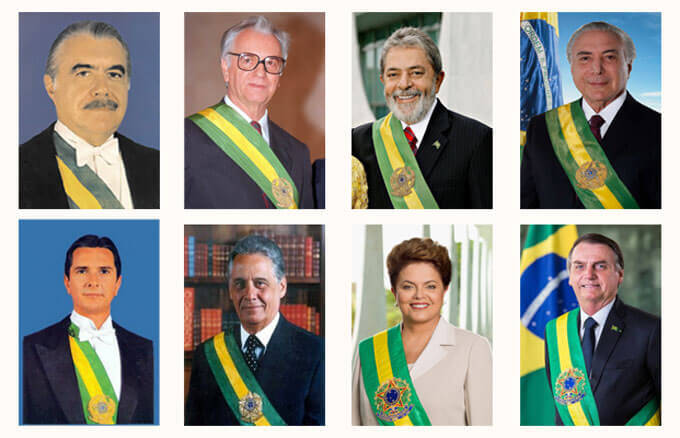

class: center middle

## How has the Brazilian Amazon been constructed as a problem in discourse over time, by geographical location, and between/within governments?



*Motivation*: Connecting the social-cultural construction of the Amazon and to the effects on environmental outcomes

```{r setup, include=FALSE}
options(htmltools.dir.version = FALSE, servr.daemon = TRUE)
knitr::opts_chunk$set(cache=TRUE, autodep = TRUE, fig.retina = 3, message = FALSE, warning = FALSE)
library(knitr)
library(iheiddown)
library(sjPlot)
#devtools::install_github("mitchelloharawild/icons")
library(icons)
#devtools::install_github("gadenbuie/xaringanExtra")
library(xaringanExtra)
xaringanExtra::use_tile_view()
xaringanExtra::use_editable(expires = 1)
```

```{css echo=FALSE}
.highlight-last-item > ul > li, 
.highlight-last-item > ol > li {
  opacity: 0.5;
}
.highlight-last-item > ul > li:last-of-type,
.highlight-last-item > ol > li:last-of-type {
  opacity: 1;
}
```

```{r, load_refs, include=FALSE, cache=FALSE}
# Initializes the bibliography
library(RefManageR)
BibOptions(check.entries = FALSE,
           bib.style = "authoryear", # Bibliography style
           max.names = 3, # Max author names displayed in bibliography
           sorting = "nyt", #Name, year, title sorting
           cite.style = "authoryear", # citation style
           style = "markdown",
           hyperlink = FALSE,
           dashed = FALSE)
myBib <- ReadBib("assets/myBib.bib", check = FALSE)
# Note: don't forget to clear the knitr cache to account for changes in the
# bibliography.
```
---
class: split two

Conceptual framework

--

## Chosen problems, presidential discourse, and policy issues
.pull-left[<i class="fas fa-broom"></i>
  - @hirschman1963 chosen versus pressing problem and @bacchi2009 problem representation
  - 
  -
  -
]

--

## Problem-construction in Amazonian historiography
.pull-right[<i class="fas fa-list"></i>
  - National Sovereignty [see @hecht1990]
  - Economic Integration [see @acker2014]
  - Environmetal Conservation []
  - What about social development?
]

---
class: split two

## Data and Methods

--

## Operationalization

.pull-left[<i class="fas fa-list"></i>
  - Dataset containing all 6130 official remarks by presidents since 1985
  - Sub-set of 2014 “amazonian statements”
  - hand-coding and supervised machine learning
  - 
]

--

## Limitations

.pull-right[<i class="fas fa-list"></i>
  -
]

---

The rises and falls of the Amazon as a topic in presidential speeches

---

How has the Amazon been constructed as a problem?

**Pure-type problem constructions**

---

How has the Amazon been constructed as a problem?

**Mixed-type problem constructions**

---

The Amazonian multi-level game: boasting policy outside and talking to people inside

---

Discussion

- The Amazon and Democracy

---

Thank you!

---

# References

```{r refs, echo=FALSE, results="asis"}
RefManageR::PrintBibliography(myBib)
```
