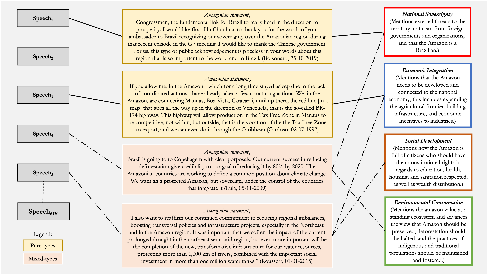
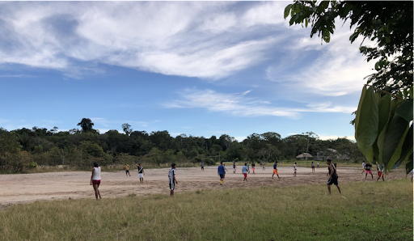

class: center middle

# The Brazilian Amazon as a problem in discourse over time, by geographical location, and between/within governments


How does the social-cultural construction of the Amazon matters to environmental outcomes?

```{r setup, include=FALSE}
options(htmltools.dir.version = FALSE, servr.daemon = TRUE)
knitr::opts_chunk$set(cache=TRUE, autodep = TRUE, fig.retina = 3, message = FALSE, warning = FALSE)
library(knitr)
library(iheiddown)
library(sjPlot)
#devtools::install_github("mitchelloharawild/icons")
library(icons)
#devtools::install_github("gadenbuie/xaringanExtra")
library(xaringanExtra)
xaringanExtra::use_tile_view()
xaringanExtra::use_editable(expires = 1)
```

```{r data, include=FALSE}
library(dplyr)
library(ggplot2)
library(tidyr)
library(scales)
library(RColorBrewer)
library(nnet)
# Load data
pop<- readRDS("~/Documents/GitHub/amazondef/Replication_files/BR_presid_speeches_final.Rds")
pop <-  pop %>% select(-c(title, date, text, location))
ama <- readRDS("~/Documents/GitHub/amazondef/Replication_files/final_data_as.Rds")
ama <-  ama %>% select(-c(title, date, text, false_positives)) %>% rename (ei= "EI", sd= "SD")
AAI <- readRDS("~/Documents/GitHub/amazondef/Replication_files//AAI.Rds")
amazon_def_year <- readRDS("~/Documents/GitHub/amazondef/Replication_files//amazon_def_year.Rds")
adr <- data.frame(year = c(1985, 1986, 1987), def_year = c(21.050, 21.050, 21.050)) # Missing year data
amazon_def_year <- rbind(adr, amazon_def_year) 
hp = data.frame(beg = c(1985, 1990, 1993, 1994, 2002, 2010, 2016, 2018),
                end = c(1990, 1993, 1994, 2002, 2010, 2016, 2018, 2022),
                label = c(1987, 1991, 1993, 1998, 2006, 2013, 2017, 2020),
                presid = c("Sarney", "Collor", "Franco", "Cardoso", "Lula",
                           "Rousseff", "Temer", "Bolsonaro"))
# Prepare data for problem constructions
sov <- ama %>% 
  filter(sov==1) %>% 
  count(sov, year) %>%
  group_by(year) %>%
  select(-c(sov))%>%
  rename (sov = n)
ei <- ama %>% 
  filter(ei==1) %>% 
  count(ei, year) %>%
  group_by(year) %>%
  select(-c(ei))%>%
  rename (ei = n) %>%
  ungroup() %>%
  tibble::add_row(year = 2017, ei = 0) %>%
  tibble::add_row(year = 2018, ei = 0)
sd <- ama %>% 
  filter(sd==1) %>% 
  count(sd, year) %>%
  group_by(year) %>%
  select(-c(sd))%>%
  rename (sd = n)
con <- ama %>% 
  filter(con==1) %>% 
  count(con, year) %>%
  group_by(year) %>%
  select(-c(con))%>%
  rename (con = n)
other <- ama %>% 
  filter(other==1) %>% 
  count(other, year) %>%
  group_by(year) %>%
  select(-c(other))%>%
  rename (other = n)
temp <- ei %>% 
  left_join(other) %>% 
  left_join(con) %>% 
  left_join(sd) %>% 
  left_join(sov) %>% 
  replace(is.na(.), 0)
# Get mixed types in
ama_mx <-  ama %>%
  unite(mixed_type, sov:con, sep="_") %>%
  mutate(mx_cat = factor(case_when(mixed_type == '1_0_0_0' ~ "Pure Sovereignty",
                                      mixed_type == '0_1_0_0' ~ "Pure Economic Integration", 
                                      mixed_type == '0_0_1_0' ~ "Pure Social Development",
                                      mixed_type == '0_0_0_1' ~ "Pure Conservation",
                                      mixed_type == '0_0_0_0' ~ "Other",
                                      mixed_type == '0_1_0_1' ~ "Economic Conservation",
                                      mixed_type == '0_1_1_0' ~ "Social Economic",
                                      mixed_type == '1_0_0_1' ~ "Sovereign Conservation",
                                      mixed_type == '0_1_1_1' ~ "Economic, Social,\nand Conservation",
                                      mixed_type == '1_1_0_0' ~ "Economic Sovereignty",
                                      mixed_type == '0_0_1_1' ~ "Social Conservation",
                                      grepl("1_0_1_0|1_0_1_0|1_0_1_1|1_1_0_1|1_1_1_0|1_1_1_1",
                                            mixed_type) ~ "Other Mixed-types"),
         levels = c("Pure Economic Integration", "Pure Conservation", "Pure Social Development",
                    "Pure Sovereignty", "Other", "Economic Conservation", 
                    "Social Economic", "Sovereign Conservation", "Economic, Social,\nand Conservation",
                    "Economic Sovereignty", "Social Conservation", "Other Mixed-types")),
         mx_cat2 = case_when(grepl("Pure Economic Integration|Pure Conservation|
                                   |Pure Social Development|Pure Sovereignty", mx_cat) ~ "Pure-types",
                             grepl("^Other$", mx_cat) ~ "Other",
                             grepl("Economic Conservation|Social Economic|Sovereign Conservation|
                                   |Economic, Social,\nand Conservation|Economic Sovereignty|
                                   |Social Conservation|Other Mixed-types",
                                   mx_cat) ~ "Mixed-types"),
         election_year = ifelse(grepl("1989|1994|1998|2002|2006|2010|2014|2018", year), 1, 0))
```

```{css echo=FALSE}
.highlight-last-item > ul > li, 
.highlight-last-item > ol > li {
  opacity: 0.5;
}
.highlight-last-item > ul > li:last-of-type,
.highlight-last-item > ol > li:last-of-type {
  opacity: 1;
}
```

---
class: split two

# Conceptual framework

--
.pull-left[**Theory**

- Chosen problems (Hirschman 1963; Bacchi 2009)

- Presidential discourse (Zarefsky 2004)

- Policy issues (Drummond and Barros-Platiau 2006)
]

--
.pull-right[**Problem-construction**

- National Sovereignty (Hecht and Cockburn 1990)

- Economic Integration (Acker 2014)

- Environmetal Conservation (Hochstetler and Keck 2007)

- What about social development?
]

---
class: split two

# Data and Methods

--
.pull-left[

- Dataset containing all 6130 official remarks by presidents since 1985

- Subset of 2014 “amazonian statements”

- Hand-coding and supervised machine learning

- Limitations
]

--
.pull-right[*Operationalization*


]

---

# The rises and falls of the Amazon as a topic in presidential speeches

.center[
```{r Figure 2, echo=FALSE, fig.height=6.5, fig.width=11}
perc1 <- pop %>%
  count(amazon_speech, year) %>%
  group_by(year) %>%
  mutate(perc=n / sum(n)) %>%
  filter(amazon_speech == 1) %>% 
  select(c(perc, amazon_speech, year))
Amazon_year <- perc1 %>% ggplot(., aes(x = year, y = perc)) +
  geom_line(color = "darkgreen") +
  scale_y_continuous(labels = percent_format()) +
  geom_text(aes(x = 1988.7, y = 0.34, label = "Chico Mendes"), size = 3) +
  geom_text(aes(x = 1992, y = 0.27, label = "Earth Summit"), size = 3) +
  geom_text(aes(x = 2009, y = 0.24, label = "Copenhagen Summit"), size = 3) +
  geom_text(aes(x = 2015, y = 0.21, label = "Paris Summit"), size = 3) +
  geom_vline(xintercept = c(1988.7, 1992, 2009, 2015),
             linetype = "dotted") +
  labs(x = "", y = "", title ="Share of speeches mentioning the Amazon by year",
       subtitle = "Sample composed by 6130 presidential speeches since 1985",
       caption = "",
       color='Y series') +
  theme(panel.background = element_rect("white", "black", .5, "solid"),
        panel.grid.major = element_line(color = "grey", size = 0.3, linetype = "solid"),
        axis.text = element_text(color = "black", size = 10),
        title = element_text(color = "black", size = 10, face = "bold"),
        legend.title = element_blank(),
        plot.subtitle = element_text(color = "black", size = 9, face = "plain"),
        legend.position = "bottom")
Amazon_year
```
]
---

# How has the Amazon been constructed as a problem? *Pure-type problem constructions*

.center[
```{r Figure 3, echo=FALSE, fig.height=6.5, fig.width=11}
pure_types_time <- ama_mx %>%
  count(mx_cat, mx_cat2, year) %>%
  group_by(year) %>%
  mutate(perc = n / sum(n)) %>% 
  filter(mx_cat2 == "Pure-types") %>% 
  ggplot(aes(x=as.numeric(year), y = perc, color = mx_cat)) +
  geom_smooth(aes(fill = mx_cat), se = FALSE, size = .5) + # to add CI here set se to TRUE
  scale_y_continuous(labels = percent_format(accuracy = 1)) +
  labs(x = "", y = "", title ="Share of each pure type by year",
       subtitle = "Sample composed by 1895 Amazonian statements in presidential speeches since 1985",
       caption = "Curves in the plot were smoothed using loess method.") +
  theme(panel.background = element_rect("white", "black", .5, "solid"),
        panel.grid.major = element_line(color = "grey", size = 0.3, linetype = "solid"),
        axis.text = element_text(color = "black", size = 10),
        title = element_text(color = "black", size = 10, face = "bold"),
        legend.title = element_blank(),
        plot.subtitle = element_text(color = "black", size = 9, face = "plain"),
        legend.position = "bottom") +
  annotate(geom = "rect", xmin = hp$beg, xmax = hp$end, ymin = 0, ymax = 0.40,
           fill = c("grey50", "ghostwhite", "grey50", "ghostwhite",
                    "grey50", "ghostwhite", "grey50", "ghostwhite"),
           alpha = 0.1) +
  annotate(geom = "text", x = hp$label, y = 0.01, vjus = 0.3, hjust = 0.3, angle = 25,
           label = hp$presid, alpha = 0.4)
pure_types_time
```
]
---

# How has the Amazon been constructed as a problem? *Mixed-type problem constructions*

.center[
```{r Figure 4, echo=FALSE, fig.height=6.5, fig.width=11}
mixed_types_presid <- ama_mx %>%
  count(president, mx_cat, mx_cat2) %>%
  group_by(president) %>%
  mutate(perc = n / sum(n)) %>%
  filter(mx_cat2 == "Mixed-types") %>%
  mutate(president = factor(president, levels = c("Sarney", "Collor", "Itamar", "FHC",
                                                  "Lula", "Dilma", "Temer", "Bolsonaro"))) %>%
  ggplot(aes(x = president, y = perc, fill = mx_cat,
             label = scales::percent(perc, accuracy=.1))) +
  geom_bar(stat = "identity", position = "stack") +
  geom_text(size = 2, position = position_stack(vjust = .5)) +
  scale_y_continuous(labels = percent_format(accuracy = 1)) +
  scale_fill_brewer(type = "qual", palette = "Set2", direction= 1) +
  labs(x = "", y = "", title ="Share of each mixed type problem-constructions by president",
       subtitle = "Sample composed by 1895 Amazonian statements in presidential speeches since 1985",
       caption = "") +
  theme(panel.background = element_rect("white", "black", .5, "solid"),
        panel.grid.major = element_line(color = "grey", size = 0.3, linetype = "solid"),
        axis.text = element_text(color = "black", size = 10),
        title = element_text(color = "black", size = 10, face = "bold"),
        legend.title = element_blank(),
        plot.subtitle = element_text(color = "black", size = 9, face = "plain"),
        legend.position = "right")
mixed_types_presid
```
]
---

# The Amazonian multi-level game: boasting policy outside and talking to people inside

.center[
```{r Figure 5, echo=FALSE, fig.height=6.5, fig.width=11}
logit2prob <- function(logit) {
  odds <- exp(logit)
  prob <- odds / (1 + odds)
  return(prob)
} # to transform log odds in probabilities
md_plot <- data.frame("Construction" = c("Economic Integration", "Social Development", "Sovereignty"),
                      "Amazonian_Countries" = c(1.3411972, 1.2460915, 0.9310706),
                      "Amazonian_States" = c(0.4578251, 1.4725563, 1.6281365),
                      "Non_Amazonian_States" = c(0.6198104, 1.5838611, 1.9830952),
                      "Brasilia" = c(-0.29279984, 0.59564579, 1.38333572))
md_plot$Brasilia <- logit2prob(md_plot$Brasilia)
md_plot$'Amazonian States' <- logit2prob(md_plot$Amazonian_States)
md_plot$'Non Amazonian States' <- logit2prob(md_plot$Non_Amazonian_States)
md_plot$'Amazonian Countries' <- logit2prob(md_plot$Amazonian_Countries)
mplot <- md_plot %>%
  select(-c("Amazonian_Countries", "Amazonian_States", "Non_Amazonian_States")) %>% 
  tidyr::pivot_longer('Amazonian Countries':Brasilia) %>%
  mutate(Percentage = 100*round(value, digit = 2)-50) %>%
  mutate(Location = factor(name, levels = c("Amazonian Countries", "Amazonian States",
                           "Non Amazonian States", "Brasilia"))) %>% 
  ggplot(aes(x = Location, y = Percentage, fill = Construction)) +
  geom_bar(stat = "identity", position = position_dodge(0.8), width = 0.7) +
  scale_fill_brewer(type = "qual", palette = "Set2", direction= 1) +
  scale_y_continuous(breaks = seq(-15, 40, 10), limits = c(-15, 40)) +
  geom_text(aes(label = Percentage), vjust = 1.5, size = 3, position = position_dodge(0.8)) +
  geom_hline(yintercept = 0, linetype = "dotted", color = "red") +
  labs(x = "", y = "Percentage",
       title = "Percentage for problem constructions across locations in relation\nto environmental conservation problem constructions Internationally",
       subtitle = "Bars reflect how much more (or less) likely are specific problem constructions in a specific location in relation to reference category") +
    theme(panel.background = element_rect("white", "black", .5, "solid"),
          panel.grid.major = element_line(color = "grey", size = 0.3, linetype = "solid"),
          axis.text = element_text(color = "black", size = 10),
          title = element_text(color = "black", size = 10, face = "bold"),
          legend.title = element_blank(),
          plot.subtitle = element_text(color = "black", size = 9, face = "plain"),
          legend.position = c(0.5, 0.15))
mplot
```
]
---

# Discussion: The Amazon, Democracy, and Environment

.pull-left[

- Amazonian frontier

- Multi-level game

- Contributions
]

.pull-right[

]

---
# References

```{r refs, echo=FALSE, results="asis"}
RefManageR::ReadBib("assets/myBib.bib")
```
