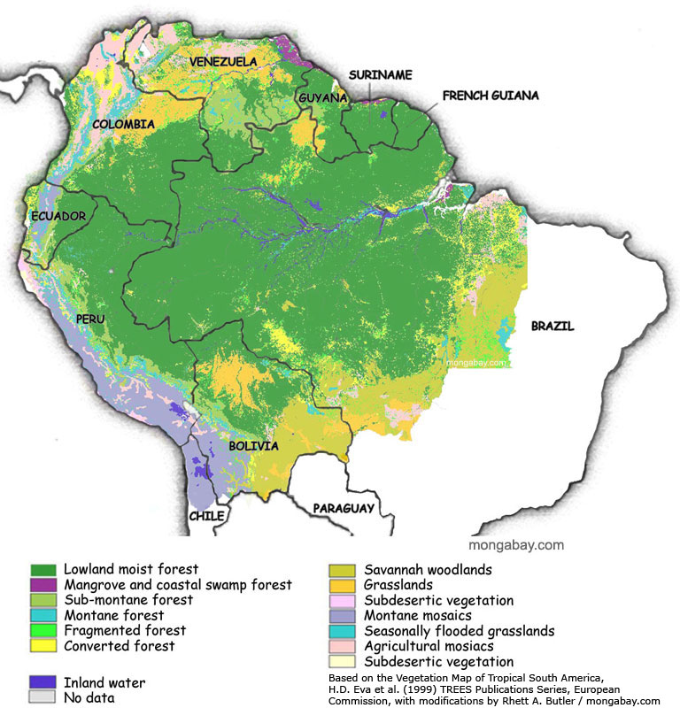

# How research get's made, a look under the hood

- Collaborating in R with [GitHub](https://github.com/henriquesposito/amazondef)

- This presentation

- This article

```{r setup, include=FALSE, message=FALSE, warning=FALSE}
options(htmltools.dir.version = FALSE, servr.daemon = TRUE)
knitr::opts_chunk$set(cache=TRUE, autodep = TRUE, fig.retina = 3, message = FALSE, warning = FALSE)
library(dplyr)
library(tidyr)
library(scales)
library(RColorBrewer)
library(stargazer)
library(kableExtra)
library(tibble)
library(readxl)
library(ggplot2)
library(gridExtra)
library(modelsummary)
library(xaringanExtra)
xaringanExtra::use_tile_view()
xaringanExtra::use_editable(expires = 1)
```

```{css echo=FALSE}
.highlight-last-item > ul > li, 
.highlight-last-item > ol > li {
  opacity: 0.5;
}
.highlight-last-item > ul > li:last-of-type,
.highlight-last-item > ol > li:last-of-type {
  opacity: 1;
}
```

```{r, load_refs, include=FALSE, cache=FALSE}
library(RefManageR)
myBib <- ReadBib("assets/myBib.bib")
```

---

class: split two

# The Brazilian Amazon, as a policy object

.pull-left[

**We need to protect the Amazon from foreign interests.**

**We need to exploit the Amazon's natural resources.**

**We need to provide better living standards for the people in the Amazon.**

**We need to preserve the Amazon as a standing ecosystem.**

]

.pull-right[

]

---

class: split two middle

.pull-left[

## Research Question:

*How the Brazilian Amazon has been constructed as a problem in transnational presidential speeches since 1985?*

]

.pull-right[


]

```{r data, message=FALSE, warning=FALSE, include=FALSE}
# Load data
pop <- readRDS("~/Documents/GitHub/amazondef/Replication_files/BR_presid_speeches_final.Rds")
pop <-  pop %>% select(-c(title, date, location))
ama <- readRDS("~/Documents/GitHub/amazondef/Replication_files/final_data_as.Rds")
ama <- ama %>% select(-c(title, date, text, false_positives)) %>% rename (ei= "EI", sd= "SD")
AAI <- readRDS("~/Documents/GitHub/amazondef/Replication_files//AAI.Rds")
location_km <- read_excel("~/Documents/GitHub/amazondef/Replication_Files/location_km.xlsx") %>%
  select(-location_cat) %>%
  distinct()
ama <- left_join(ama, location_km, by = "location")
amazon_def_year <- readRDS("~/Documents/GitHub/amazondef/Replication_files//amazon_def_year.Rds")
adr <- data.frame(year = c(1985, 1986, 1987), def_year = c(21.050, 21.050, 21.050))
# Missing year data
amazon_def_year <- rbind(adr, amazon_def_year) 
hp = data.frame(beg = c(1985, 1990, 1993, 1994, 2002, 2010, 2016, 2018),
                end = c(1990, 1993, 1994, 2002, 2010, 2016, 2018, 2022),
                label = c(1987, 1991, 1993, 1998, 2006, 2013, 2017, 2020),
                presid = c("Sarney", "Collor", "Franco", "Cardoso", "Lula",
                           "Rousseff", "Temer", "Bolsonaro"))
amazon_def_year$area <- amazon_def_year$def_year*1000
# Prepare data for problem-constructions
sov <- ama %>% 
  filter(sov==1) %>% 
  count(sov, year) %>%
  group_by(year) %>%
  select(-c(sov))%>%
  rename (sov = n)
ei <- ama %>% 
  filter(ei==1) %>% 
  count(ei, year) %>%
  group_by(year) %>%
  select(-c(ei))%>%
  rename (ei = n) %>%
  ungroup() %>%
  tibble::add_row(year = 2017, ei = 0) %>%
  tibble::add_row(year = 2018, ei = 0)
sd <- ama %>% 
  filter(sd==1) %>% 
  count(sd, year) %>%
  group_by(year) %>%
  select(-c(sd))%>%
  rename (sd = n)
con <- ama %>% 
  filter(con==1) %>% 
  count(con, year) %>%
  group_by(year) %>%
  select(-c(con))%>%
  rename (con = n)
other <- ama %>% 
  filter(other==1) %>% 
  count(other, year) %>%
  group_by(year) %>%
  select(-c(other))%>%
  rename (other = n)
temp <- ei %>% 
  left_join(other) %>% 
  left_join(con) %>% 
  left_join(sd) %>% 
  left_join(sov) %>% 
  replace(is.na(.), 0)
# Get mixed types in
ama_mx <-  ama %>%
  unite(mixed_type, sov:con, sep="_") %>%
  mutate(mx_cat = factor(case_when(mixed_type == '1_0_0_0' ~ "Pure National Sovereignty",
                                   mixed_type == '0_1_0_0' ~ "Pure Economic Integration", 
                                   mixed_type == '0_0_1_0' ~ "Pure Social Development",
                                   mixed_type == '0_0_0_1' ~ "Pure Environmental Conservation",
                                   mixed_type == '0_0_0_0' ~ "Other",
                                   mixed_type == '0_1_0_1' ~ "Economic Conservation",
                                   mixed_type == '0_1_1_0' ~ "Social Economic",
                                   mixed_type == '1_0_0_1' ~ "Sovereign Conservation",
                                   mixed_type == '0_1_1_1' ~ "Economic, Social,\nand Conservation",
                                   mixed_type == '1_1_0_0' ~ "Economic Sovereignty",
                                   mixed_type == '0_0_1_1' ~ "Social Conservation",
                                   grepl("1_0_1_0|1_0_1_0|1_0_1_1|1_1_0_1|1_1_1_0|1_1_1_1",
                                         mixed_type) ~ "Other Mixed-types"),
         levels = c("Pure Economic Integration", "Pure Environmental Conservation",
                    "Pure Social Development",
                    "Pure National Sovereignty", "Other", "Economic Conservation", 
                    "Social Economic", "Sovereign Conservation",
                    "Economic, Social,\nand Conservation",
                    "Economic Sovereignty", "Social Conservation", "Other Mixed-types")),
         mx_cat2 = case_when(grepl("Pure Economic Integration|Pure Environmental Conservation|
                                   |Pure Social Development|Pure National Sovereignty",
                                   mx_cat) ~ "Pure-types",
                             grepl("^Other$", mx_cat) ~ "Other",
                             grepl("Economic Conservation|Social Economic|Sovereign Conservation|
                                   |Economic, Social,\nand Conservation|Economic Sovereignty|
                                   |Social Conservation|Other Mixed-types",
                                   mx_cat) ~ "Mixed-types"),
         election_year = ifelse(grepl("1989|1994|1998|2002|2006|2010|2014|2018",
                                      year), 1, 0),
                  location_cat = ifelse(grepl("parana|paraiba|mato grosso|mato grosso do sul",
                                     location, ignore.case = TRUE), # minor coding issues to fix
                               "Non Amazonian States", location_cat),
         location_cat = ifelse(grepl("paraguay", location, ignore.case = TRUE),
                               "International", location_cat), # minor coding issues to fix
         location_cat = factor(ifelse(grepl("Bolivia|Peru|Ecuador|Colombia|Venezuela|Guyana|Suriname",
                                            location), "Amazonian Countries", location_cat),
                               levels = c("International", "Amazonian States",
                                          "Amazonian Countries", "Brasilia",
                                          "Non Amazonian States")))

```

```{r theme, include=FALSE, warning=FALSE, message=FALSE}
# custom ploting theme for all plots
theme_am <- function(x) {
  theme(text = element_text(size=12,  family="Times"),
        panel.background = element_rect("white", "black", .5, "solid"),
                  panel.grid.major = element_line(color = "grey", size = 0.2,
                                                  linetype = "solid"),
        axis.text = element_text(color = "black", size = 10),
        title = element_text(color = "black", size = 10, face = "bold"),
        legend.title = element_blank(),
        plot.subtitle = element_text(color = "black", size = 9, face = "plain"),
        legend.position = "none")
}
```

---

class: split two

# Presidential discourses and chosen problems

--

.pull-left[**Presidential Discourses**

- Introduce, define, and justify the public policy `r Cite(myBib, "zarefsky2004")`

- Shape perception and expectation about practices; this matters for deforestation outcomes `r Cite(myBib, c("capobianco2021", "campbell2015"))`

- What about audiences and settings?

]

--

.pull-right[**Conceptual framework**

- Chosen vs. pressing problems `r Cite(myBib, "hirschman1963")`

- Policies are represented as solutions for implicit problems shaped by history and culture `r Cite(myBib, "bacchi2009")`

- *Governments can choose to emphasize (or not) one or more implicit problems that a policy solves depending on which group they are in communication with...*

]

---

# Amazonian (recent) histories and policies, too cohesive?

--

.pull-left[**Amazonian historiography**

- National sovereignty `r Cite(myBib, "hecht1990")`

- Economic integration `r Cite(myBib, "acker2014")`

- Environmental conservation `r Cite(myBib, "hochstetler2007")`

- What about social development?

]

--

.pull-right[**Policy periods**

- Military dictatorship (1964-85) `r Cite(myBib, "drummond2006")`

- Environmental conservation (1985-2010ish) `r Cite(myBib, "capobianco2019")`

- Decline and dismantling (2010ish-present) `r Cite(myBib, "pereira2021")`

]

---

# Data and Methods (1/2)

- Dataset containing all 6130 official speeches by presidents since 1985

- Subset of 2014 “amazonian statements”

- Hand-coding and supervised machine learning

- Limitations

--

.right[


***What?***

]

---

# Data and Methods (2/2)

.center[

]

---

# The rises and falls of the Amazon as a topic in presidential speeches

.center[
```{r Figure 1, fig.cap="Amazonian speeches in time", echo=FALSE, message=FALSE, warning=FALSE, paged.print=TRUE, include=TRUE, fig.height=6.5, fig.width=12}
perc1 <- pop %>%
  count(amazon_speech, year) %>%
  group_by(year) %>%
  mutate(perc = n / sum(n)) %>%
  filter(amazon_speech == 1) %>% 
  select(c(perc, amazon_speech, year))
Amazon_year <- perc1 %>% ggplot(., aes(x = year, y = perc)) +
  geom_line(color = "darkgreen") +
  geom_line(aes(y=mean(perc)), color="black", size=.5, linetype="dotted")+
  scale_y_continuous(labels = percent_format()) + 
  annotate("text", x = 1985, y = 0.18, label = "15.4%", size = 3.5)+
  annotate("text", x = 1988.7, y = 0.35,
           label = "The Murder of\nChico Mendes", size = 3)+
  annotate("text", x = 1992.5, y = 0.27, label = "Earth Summit", size = 3)+
  annotate("text", x = 2009, y = 0.24, label = "Copenhagen Summit", size = 3)+
  annotate("text", x = 2015, y = 0.21, label = "Paris Summit", size = 3)+
  annotate("text", x = 2019, y = 0.26, label = "2019 Record\nAugust Fires", size=3) +
  labs(x = "", y = "",
       title = "Share of speeches that mention the Amazon per year",
       subtitle = "Sample composed by all 6130 speeches since 1985",
       color='Y series') +
  theme_am()
Amazon_year
```
]

---

# How has the Amazon been constructed as a problem? *Pure-type problem constructions*

.center[
```{r Figure 2, fig.cap="Pure-types in time", echo=FALSE, message=FALSE, warning=FALSE, paged.print=FALSE, include=TRUE, fig.height=6.5, fig.width=12}
mmt1 <- ama_mx %>%
  filter(mx_cat2 == "Mixed-types") %>%
  count(mx_cat) %>%
  mutate(perc = n / sum(n)) # averages in relation to only mixed-types
mmt2 <- ama_mx %>%
  count(mx_cat)%>%
  mutate(perc = n / sum(n)) # averages in relation to full sample
pure_types_time <- ama_mx %>%
  count(mx_cat, mx_cat2, year) %>%
  group_by(year) %>%
  mutate(perc = n / sum(n)) %>% 
  filter(mx_cat2 == "Pure-types") %>%
  ggplot(aes(x=as.numeric(year), y = perc, color = mx_cat)) +
  geom_smooth(aes(fill = mx_cat), se = FALSE, size =0.75, linetype="solid") +
  scale_y_continuous(labels = percent_format(accuracy = 1)) +
  labs(x = "", y = "", title ="Share of each pure-type problem-construction by year",
       subtitle = "Sample composed by 1895 Amazonian statements in presidential speeches since 1985",
       caption = "Curves in the plot were smoothed using loess method.") +
  theme_am() +
  theme(legend.position = "bottom")+
  guides(fill=guide_legend(nrow=2,byrow=TRUE))

pure_types_time
```
]

---

# How has the Amazon been constructed as a problem? *Mixed-type problem constructions*

.center[
```{r Figure 3, fig.cap="Mixed-types by president", echo=FALSE, message=FALSE, warning=FALSE, paged.print=FALSE, include=TRUE, fig.height=6.5, fig.width=12}
mixed_types_presid <- ama_mx %>%
  count(president, mx_cat, mx_cat2) %>%
  group_by(president) %>%
  mutate(perc = n / sum(n)) %>%
  filter(mx_cat2 == "Mixed-types") %>%
  mutate(president = factor(president, levels = c("Sarney", "Collor", "Itamar", "FHC",
                                                  "Lula", "Dilma", "Temer", "Bolsonaro"))) %>%
  ggplot(aes(x = president, y = perc, fill = mx_cat,
             label = scales::percent(perc, accuracy=.1))) +
  geom_bar(stat = "identity", position = "stack") +
  geom_text(size = 2, position = position_stack(vjust = .5)) +
  scale_y_continuous(labels = percent_format(accuracy = 1)) +
  scale_fill_brewer(type = "qual", palette = "Set2", direction= 1) +
  labs(x = "", y = "", title ="Share of each mixed-type problem-constructions by president",
       subtitle = "Sample composed by 1895 Amazonian statements in presidential speeches since 1985",
       caption = "") +
  theme_am() +
  theme(legend.position = "right")
mixed_types_presid
```
]

---

# The Amazonian multi-level game: boasting policy outside and talking to people inside (1/2)

.center[
```{r Figure 4, fig.cap="Logistic Regression predicted values", echo=FALSE, message=FALSE, warning=FALSE, paged.print=FALSE, include=TRUE, fig.height=6.5, fig.width=12}
ama_model <- dplyr::left_join(ama_mx, amazon_def_year, by = "year") # merge
ama_model <- dplyr::left_join(ama_model, AAI, by = "year") # merge
ama_model <- filter(ama_model, location_cat != "Non Identified",
                    mx_cat != "Other Mixed-types") %>%
  mutate(con_vs_all = ifelse(mx_cat == "Pure Environmental Conservation", 1, 0),
         EI_vs_all = ifelse(mx_cat == "Pure Economic Integration", 1, 0),
         SD_vs_all = ifelse(mx_cat == "Pure Social Development", 1, 0),
         sov_vs_all = ifelse(mx_cat == "Pure National Sovereignty", 1, 0))
# model
model_logit_con <- glm(con_vs_all ~ km_to_manaus + election_year + def_year + AAI,
                   family=binomial(link = "logit"), data = ama_model)
model_logit_ei <- glm(EI_vs_all ~ km_to_manaus + election_year + def_year + AAI,
                   family=binomial(link = "logit"), data = ama_model)
model_logit_sd <- glm(SD_vs_all ~ km_to_manaus + election_year + def_year + AAI,
                   family=binomial(link = "logit"), data = ama_model)
model_logit_sov <- glm(sov_vs_all ~ km_to_manaus + election_year + def_year + AAI,
                   family=binomial(link = "logit"), data = ama_model)
# Plot model
ama_model$"Environmental Conservation" = predict(model_logit_con, ama_model, type = "response")
ama_model$"Economic Integration" = predict(model_logit_ei, ama_model, type = "response")
ama_model$"Social Development" = predict(model_logit_sd, ama_model, type = "response")
ama_model$"National Sovereignty" = predict(model_logit_sov, ama_model, type = "response")
plot_loc <- ama_model %>% gather(key=p_c, value = pred, 22:25)
plot_loc$p_c <-factor(plot_loc$p_c, levels = c("Economic Integration",
                                               "Environmental Conservation",
                                               "Social Development",
                                               "National Sovereignty"))
ggplot(plot_loc, aes(x = km_to_manaus, y=pred, color=p_c)) +
  geom_jitter(alpha=1, size=1) +
  geom_smooth(size = .5, se=FALSE) +
  scale_y_continuous(labels = percent_format()) +
  labs(x = "Distance from the Amazon (km)",
       y = "",
       title = "Predicted probability of each problem-construction as a function of\ndistance from the Amazon",
       caption = "Curves in the plots are estimated using loess method.") +
    theme_am() +
  theme(legend.position = "none")+
  facet_wrap(~p_c, ncol=2)
```
]

---

# The Amazonian multi-level game: boasting policy outside and talking to people inside (2/2)

```{r Table 1, fig.cap="Logistic Regressions Output", echo=FALSE, message=FALSE, warning=FALSE, paged.print=FALSE, include=TRUE, results="asis"}
ama_model$thousand_km<- ama_model$km_to_manaus/1000
model_logit_con2 <- glm(con_vs_all ~ thousand_km + election_year + def_year + AAI,
                   family=binomial(link = "logit"), data = ama_model)
model_logit_ei2 <- glm(EI_vs_all ~ thousand_km + election_year + def_year + AAI,
                   family=binomial(link = "logit"), data = ama_model)
model_logit_sd2 <- glm(SD_vs_all ~ thousand_km + election_year + def_year + AAI,
                   family=binomial(link = "logit"), data = ama_model)
model_logit_sov2 <- glm(sov_vs_all ~ thousand_km + election_year + def_year + AAI,
                   family=binomial(link = "logit"), data = ama_model)
md <-stargazer::stargazer(model_logit_con2, model_logit_ei2, model_logit_sd2,
                          model_logit_sov2, type = "text", digits = 6, 
                          dep.var.labels = c("Conservation", "Economic Integration",
                                             "Social Development", "Sovereignty"),
                          covariate.labels = c("Distance from the Amazon in 1000s of km",
                                               "Election year", "Yearly Deforestation",
                                               "Yearly   Inflation"), no.space = TRUE,
                          title = "Logistic Regressions Output")
md
```

---

class: split two

# The Brazilian Amazon, democracy, and the environment (1/2)

.pull-left[

## Contributions:

*Conceptually*: framework that connects the social construction of the Amazon to environmental outcomes

*Empirically*: the first comprehensive overview of the Amazon as a problem in presidential discourse

]

.pull-right[


]

---

class: split two

# The Brazilian Amazon, democracy, and the environment (2/2)

.pull-left[

***If presidents promote an agenda of economic and social development within Brazil that diverges from the environmental one promoted outside of Brazil, to what extent does the implemented agenda responds to domestic versus international demands?***

]

.pull-right[


]

---

.center[

]

---

# References

```{r refs1, echo=FALSE, results="asis"}
RefManageR::PrintBibliography(myBib, start = 1, end = 4)
```

---

# References

```{r refs2, echo=FALSE, results="asis"}
RefManageR::PrintBibliography(myBib, start = 5)
```
